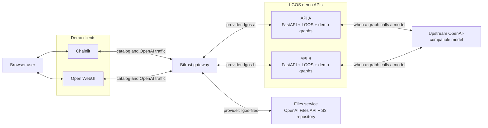
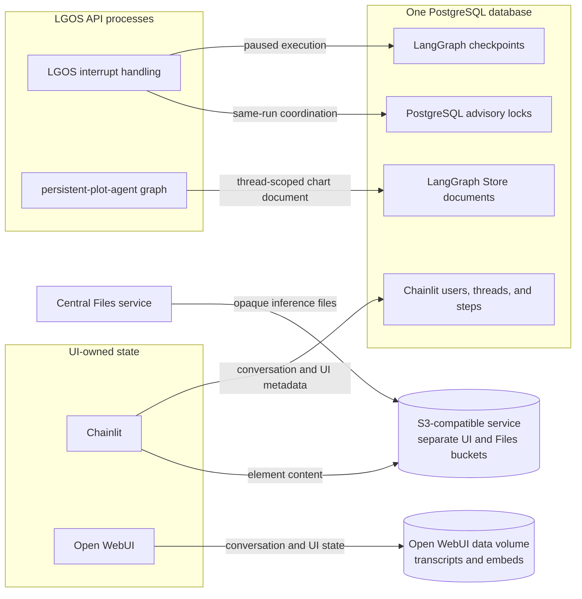

# Demo Architecture

The Docker demo puts two independently addressable LGOS API containers and one
logical central Files service behind Bifrost. Chainlit and Open WebUI are
OpenAI-compatible clients of that gateway; neither UI imports
`langgraph-openai-serve`. See
[Package Architecture](../explanation/architecture.md) for what happens inside
each API process.

## Request Path

Bifrost exposes one provider-qualified model catalog. The UIs split a selected
ID such as `lgos-a/simple-graph`, put the provider in `x-model-provider`, and
send the native graph name through Bifrost's raw `/openai_passthrough/v1`
route. Bifrost then forwards the request to the matching API container while
preserving LGOS model metadata and streaming extensions.

At startup, Compose waits for PostgreSQL, runs the one-shot API schema setup,
starts both healthy graph APIs and the Files service, and then starts Bifrost
and its UI clients. The diagram shows request traffic rather than those
readiness dependencies. Compose runs one Files process for the demo; production
deployments may run multiple stateless replicas over the same repository.

## State Ownership

The UIs own their conversations. The API stores only paused interrupt execution
and explicit graph data; it does not copy either UI transcript into LGOS.

Both API containers run the same image and graph set, but Bifrost
treats them as separate providers. They share PostgreSQL for durable LangGraph
checkpoints, thread-scoped data, and interrupt-run coordination. Chainlit
uses the same database for UI metadata and S3 for element bodies. Open WebUI
keeps its state in its bind-mounted data directory. Detailed ownership and
recovery behavior live in [Persistent Plot Agent](graphs/persistent-plot-agent.md) and
[Interruptible Human Review](graphs/interruptible-approval.md). When
`LGOS_ENABLE_LANGFUSE=true`, each API adds the Langfuse callback to graph runs
and exports observations directly to the configured Langfuse service. Langfuse
is not a Compose service or a proxy in the request path.

The optional Compose overlay adds a separate telemetry path without changing
request or state ownership. Its complete signal flow and operational boundary
are documented in [Demo OpenTelemetry Overlay](opentelemetry.md).
