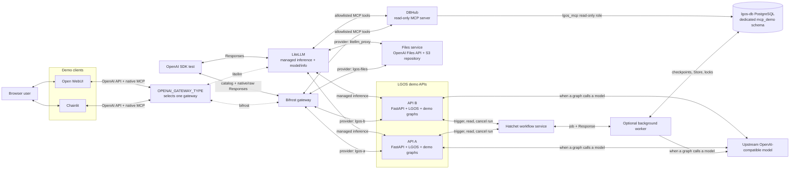
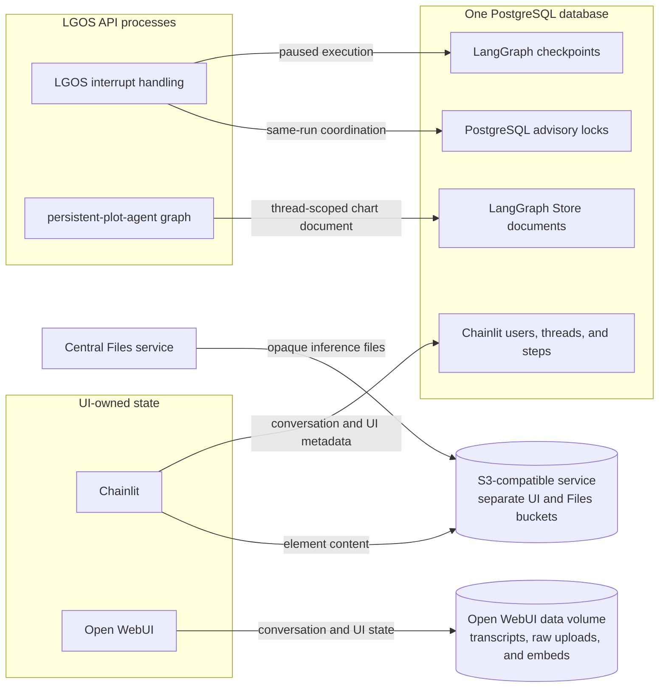

# Demo Architecture

The Docker demo runs two independently addressable LGOS API containers and one
logical central Files service. `OPENAI_GATEWAY_TYPE=litellm|bifrost` selects a
first-class OpenAI-compatible edge for both Chainlit and Open WebUI. LiteLLM
uses managed Responses and Bifrost uses native Responses. Both use normal
Files routing. LiteLLM serves metadata from native `/model/info`; Bifrost uses
catalog-detail pass-through. No UI
connects directly to an upstream container, and neither UI imports
`langgraph-openai-serve`. See
[Package Architecture](../explanation/architecture.md) for what happens inside
each API process.

!!! warning "Managed gateway normalization boundaries"

    The bundled Bifrost native Responses route preserves standard fields, file
    input, commentary, `phase`, and `store: false`; normalized model detail and
    error metadata remain lossy. Its raw pass-through route
    preserves successful-request contracts, while virtual-key governance
    rejects an unknown model before its upstream error can pass through. The
    bundled `homeserver-litellm` image preserves native streaming and
    commentary; error metadata remains rewritten.
    The UIs exercise the selected gateway's managed/native inference path;
    only Bifrost model-detail lookup uses a lossless pass-through. See
    [Docker Compose](docker.md#demo-services) and [Bifrost Gateway](bifrost.md).

## Request Path

With LiteLLM selected, the UIs read native `/model/info`, use `model_info.lgos`
for capabilities and settings, and send `model_name` unchanged through managed
Responses routing. With Bifrost selected, they discover provider-qualified IDs through
its aggregate catalog, use raw pass-through only for model detail, and send
Responses through native routing with `x-model-provider`. Both choices upload
attachments through normal gateway Files routing before sending the returned
`file_id` to a graph. This preserves descriptions and runtime capabilities
without allowing UI inference to bypass the gateway's normal data plane.
For `mcp-postgres`, the clients also discover and execute the gateway's native
MCP tools; DBHub and the database credential remain behind that gateway. See
[PostgreSQL Through Native MCP](graphs/mcp-postgres.md).

The [LGOS-owned sync command](litellm-sync.md) registers concrete models and full
metadata in LiteLLM's database. Run it after graph changes; the gateway needs no
LGOS-specific code. LiteLLM exposes no demo pass-through routes. Protocol tests
compare its managed stream with the direct LGOS endpoint; UI clients never
make that direct connection.

Background-capable models use the selected gateway's normal Responses
lifecycle. Chainlit and Open WebUI discover the capability, create a non-streaming
background Response, and poll or cancel through the OpenAI SDK. Hatchet runs
each job and stores its status and Response, which every API replica reads.

At startup, Compose waits for PostgreSQL and runs the one-shot API schema setup
and Chainlit schema migrations. The idempotent MCP setup then creates the
reporting views, role, and grants before DBHub starts. Both healthy graph APIs
and the Files service start before the selected gateway and UI clients. The
diagram shows request traffic rather than those readiness dependencies.
Compose runs one Files process for the demo; production deployments may run
multiple stateless replicas over the same repository.

## State Ownership

The UIs own their conversations. The API stores paused interrupt execution
and explicit graph data, and Hatchet stores background runs; neither copies
either UI transcript into LGOS.

Both API containers run the same image and graph set, but Bifrost
treats them as separate providers. They share PostgreSQL for durable LangGraph
checkpoints, thread-scoped data, and interrupt-run coordination. Chainlit
uses the same database for UI metadata and S3 for element bodies. Open WebUI
keeps its state and native raw-upload copy in its bind-mounted data directory;
the central Files service owns the separate inference copy. Detailed ownership
and recovery behavior live in
[Persistent Plot Agent](graphs/persistent-plot-agent.md) and [Interruptible
Human Review](graphs/interruptible-approval.md). Background execution is
described in [Background Mock](graphs/background-mock.md);
`advanced-graph` runs in the same worker when a client requests background
mode. When
`LGOS_ENABLE_LANGFUSE=True`, each API adds the Langfuse callback to graph runs
and exports observations directly to the configured Langfuse service. Langfuse
is not a Compose service or a proxy in the request path.

The optional Compose overlay adds a separate telemetry path without changing
request or state ownership. Its complete signal flow and operational boundary
are documented in [Demo OpenTelemetry Overlay](opentelemetry.md).
