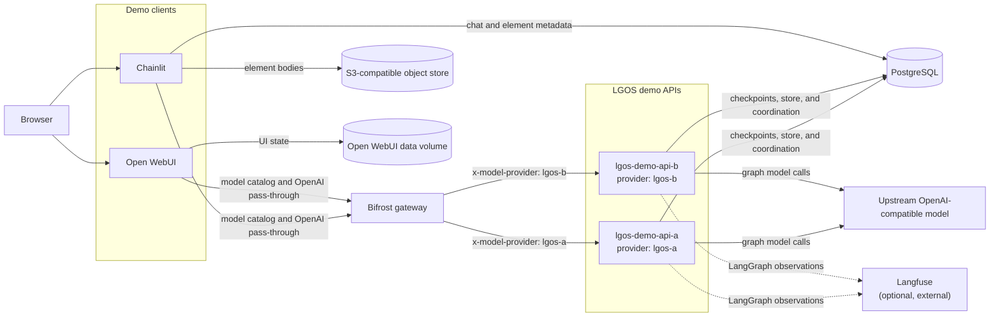
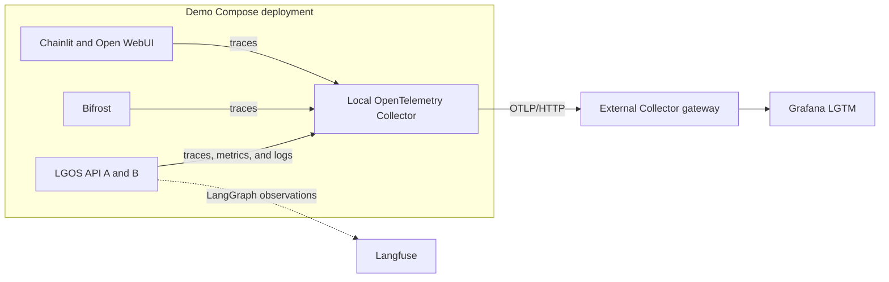

# Demo Architecture

The Docker demo puts two independently addressable LGOS API containers behind
one Bifrost gateway. Chainlit and Open WebUI are OpenAI-compatible clients of
that gateway; neither UI imports `langgraph-openai-serve`.

Bifrost exposes one provider-qualified model catalog. The UIs split a selected
ID such as `lgos-a/simple-graph`, put the provider in `x-model-provider`, and
send the native graph name through Bifrost's raw `/openai_passthrough/v1`
route. Bifrost then forwards the request to the matching API container while
preserving LGOS model metadata and streaming extensions.

At startup, Compose waits for PostgreSQL, runs the one-shot API schema setup,
starts both healthy API containers, and then starts Bifrost and its UI clients.
The diagram shows runtime traffic rather than those readiness dependencies.

Both API containers currently run the same image and graph set, but Bifrost
treats them as separate providers. They share PostgreSQL for durable LangGraph
checkpoints, thread-scoped data, and cross-worker run coordination. Chainlit
uses the same database for UI metadata and S3 for element bodies. Open WebUI
keeps its state in its bind-mounted data directory. When
`LGOS_ENABLE_LANGFUSE=true`, each API adds the Langfuse callback to graph runs
and exports observations directly to the configured Langfuse service. Langfuse
is not a Compose service or a proxy in the request path.

## OpenTelemetry Overlay

The optional Compose overlay sends application telemetry through one local
Collector while keeping Langfuse on its separate native export path.

The local Collector filters, enriches, and forwards standard OTLP signals; the
external platform stores and displays them. Configuration and operational
details live in
[Production OpenTelemetry](../how-to-guides/production-otel.md).
