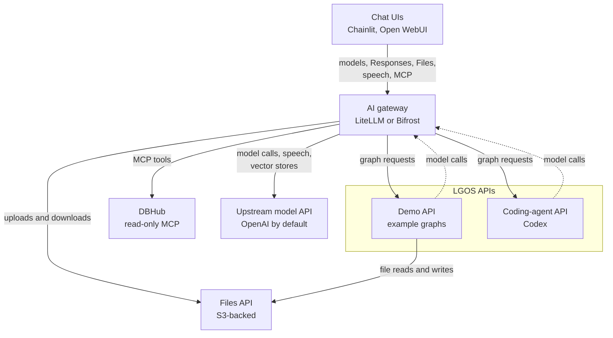
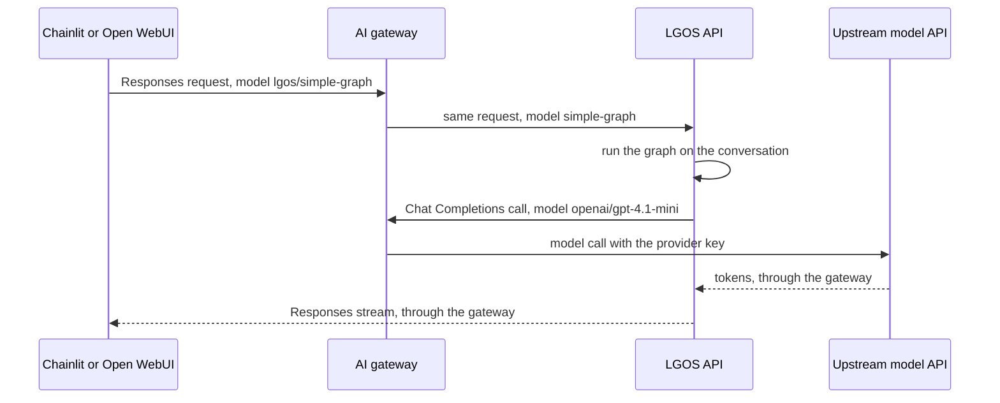

# Demo Architecture

The demo is a complete deployment of `langgraph-openai-serve` (LGOS): two chat
UIs, an AI gateway, two LGOS APIs, and the services they share. It is shaped
like a production system on purpose. Every component is an independent
application, and the request path between them is OpenAI-compatible HTTP and
MCP, so you can replace a UI, the gateway, or an LGOS API without changing the
others.

This page explains how the parts work together, from the outside in. For what
happens inside one LGOS API process, see
[Package Architecture](../explanation/architecture.md).

Three ideas shape the whole stack:

- **One gateway in, one gateway out.** Every UI request and every model call
  passes the gateway. It authenticates callers, owns the model catalog, and
  holds the only upstream provider key.
- **Graphs are models.** Each LGOS API publishes its LangGraph graphs as
  OpenAI models, so a UI selects a graph the same way it selects a model.
- **Clients own conversations.** The UIs store transcripts. LGOS stores only
  paused runs and the data a graph saves on purpose.

## Components

```mermaid
flowchart TB
  uis["Chat UIs<br/>Chainlit, Open WebUI"]
  gateway["AI gateway<br/>LiteLLM or Bifrost"]

  subgraph lgos["LGOS APIs"]
    direction LR
    api["Demo API<br/>example graphs"]
    coding["Coding-agent API<br/>Codex"]
  end

  files["Files API<br/>S3-backed"]
  dbhub["DBHub<br/>read-only MCP"]
  upstream["Upstream model API<br/>OpenAI by default"]

  uis -->|"models, Responses, Files,<br/>speech, MCP"| gateway
  gateway -->|"graph requests"| api & coding
  api & coding -.->|"model calls"| gateway
  gateway -->|"uploads and downloads"| files
  gateway -->|"MCP tools"| dbhub
  gateway -->|"model calls, speech,<br/>vector stores"| upstream
  api -->|"file reads and writes"| files
```

Solid arrows are client requests. Dotted arrows are the model calls a graph
makes while it runs; they return to the same gateway as separate requests. The
optional background worker and Hatchet are shown in
[Background Mock](graphs/background-mock.md#topology).

| Component | Compose service | Responsibility | Details |
| --- | --- | --- | --- |
| Chainlit | `lgos-chainlit` | Chat UI built on `chainlit-utils`. | [Chainlit Client](chainlit.md) |
| Open WebUI | `lgos-openwebui` | Chat UI whose synced Generic Function sends each chat to the gateway. Workspace Models expose each graph and its settings. | [Open WebUI Functions](open-webui.md) |
| AI gateway | `lgos-litellm` or `lgos-bifrost` | Authenticates callers, routes graph models to their API, serves the catalog with LGOS metadata, routes Files and MCP, and forwards model, speech, and vector-store calls upstream. | [Bifrost Gateway](bifrost.md), [LiteLLM Model Sync](litellm-sync.md) |
| Demo API | `lgos-demo-api` | One image running `lgos serve` with the demo graph registry. It runs alongside the independent coding-agent API behind one gateway. | [Run the Demo API](api.md), [Example Graphs](graphs/index.md) |
| Coding-agent API | `lgos-api-coding-agent` | An LGOS app that serves Codex as one graph and edits a shared workspace directory. | [Coding Agent](graphs/coding-agent.md) |
| Background worker | `lgos-background-worker` | `lgos worker` with the demo registry. Runs background Responses delivered by Hatchet. Enabled by the `background` profile. | [Background Mock](graphs/background-mock.md) |
| Files API | `lgos-files-api` | OpenAI Files API over S3, giving every graph API one file namespace. | [Run the Files API](files-api.md) |
| DBHub | `lgos-postgres-mcp` | Read-only MCP server with six fixed reports. `lgos-mcp-db-setup` creates its database role and views. | [PostgreSQL Through Native MCP](graphs/mcp-postgres.md) |
| PostgreSQL | `lgos-db` | Shared database for the LGOS apps, Chainlit, LiteLLM, and the MCP reporting views. | [State Ownership](#state-ownership) |
| Catalog sync | `lgos-model-sync`, `lgos-bifrost-catalog`, `lgos-bifrost-sync` | Publish each graph's description, features, and settings into the gateway catalog. | [Model Catalog](#model-catalog) |

The optional [OpenTelemetry overlay](opentelemetry.md) adds a collector for
traces, metrics, and logs without changing these paths.

## External Services

The stack relies on these services outside Compose:

| External service | Used by | Needed for |
| --- | --- | --- |
| Upstream OpenAI-compatible API | AI gateway | LLM-backed graphs, the coding agent, speech, and vector stores |
| S3-compatible storage | Files API, Chainlit | Attachments, generated files, and Chainlit elements |
| Hatchet | Demo APIs, background worker | Background Responses only |
| SearXNG or Degoog | `server-tool`, `advanced-graph` | Self-hosted web search only |
| Langfuse, OpenTelemetry collector | LGOS APIs, telemetry overlay | Optional observability |
| OAuth provider | Chainlit | OAuth login only |

## How Requests Flow

```mermaid
sequenceDiagram
  participant UI as Chainlit or Open WebUI
  participant GW as AI gateway
  participant API as LGOS API
  participant LLM as Upstream model API

  UI->>GW: Responses request, model lgos/simple-graph
  GW->>API: same request, model simple-graph
  API->>API: run the graph on the conversation
  API->>GW: Chat Completions call, model openai/gpt-4.1-mini
  GW->>LLM: model call with the provider key
  LLM-->>API: tokens, through the gateway
  API-->>UI: Responses stream, through the gateway
```

The `lgos/` prefix identifies graph models. Gateway routing maps each graph
to its API without exposing the deployment name in the public model ID. The
API runs the graph and streams standard Responses events: text, status
updates, citations, and tool calls. When the graph needs an LLM, it calls the
same gateway with an `openai/*` model ID, so the API never holds a provider
key.

Feature flows build on this path and live with their graphs:

- File attachments: [File Input](graphs/file-input.md#request-flow)
- Gateway MCP tools: [PostgreSQL Through Native MCP](graphs/mcp-postgres.md#request-flow)
- Background Responses: [Background Mock](graphs/background-mock.md#request-flow)
- Human review: [Interruptible Human Review](graphs/interruptible-approval.md#request-flow)

## Model Catalog

The UIs learn about graphs from the gateway catalog, not from the APIs. At
startup, the catalog sync copies each LGOS API's `/v1/models` metadata into the
gateway's native catalog, and the UIs use it to show settings forms, enable
attachments, and connect MCP tools. See [LiteLLM Model Sync](litellm-sync.md) and
[Bifrost metadata](bifrost.md#declarative-model-metadata); each gateway's
routes are listed in [Docker Compose](docker.md#demo-services).

## State Ownership

| Owner | State | Stored in |
| --- | --- | --- |
| Chainlit | Users, threads, and steps | PostgreSQL |
| Chainlit | Element bodies, such as attachments and charts | S3, UI bucket |
| Open WebUI | Transcripts, raw uploads, and embeds | Open WebUI data volume |
| LGOS APIs and worker | Paused interrupt runs and same-run locks | PostgreSQL checkpoints and advisory locks |
| `persistent-plot-agent` graph | Thread-scoped chart document | PostgreSQL, LangGraph Store |
| Files API | Files used for inference | S3, Files bucket |
| Hatchet | Background runs and their Responses | Hatchet |
| Coding-agent API | Workspace files and Codex threads | Bind-mounted directories |
| LiteLLM | Synced graph models and Admin UI data | PostgreSQL, `litellm` schema |
| Bifrost | Configuration and catalog | Ephemeral SQLite, rebuilt at every start |

Recovery behavior lives in
[Persistent Plot Agent](graphs/persistent-plot-agent.md) and
[Interruptible Human Review](graphs/interruptible-approval.md).

## From Demo To Production

Every component runs the way it would in production. The demo takes a few
shortcuts that a real deployment replaces:

| Area | Demo shortcut | Production |
| --- | --- | --- |
| Gateway access | One static key shared by the UIs and the graph APIs; Bifrost's admin API has no authentication | Per-user or per-service credentials or SSO, an authenticated admin API, and TLS |
| UI login | Chainlit mock login | OAuth; see [Chainlit production notes](chainlit.md#production-notes) |
| LGOS APIs | No authentication; demo API host port published for direct tests | Reachable only from the gateway, or behind authentication middleware |
| PostgreSQL | One container shared by every owner | Managed PostgreSQL with backups, monitoring, and failover; see [Docker Compose](docker.md#demo-services) |
| Scaling | Demo API, coding-agent API, and one Files API process | More API and worker replicas behind the gateway; Files API replicas over the same bucket |
| Provider keys | `OPENAI_UPSTREAM_API_KEY` on the bundled gateway | Unchanged: only the gateway holds provider keys |
