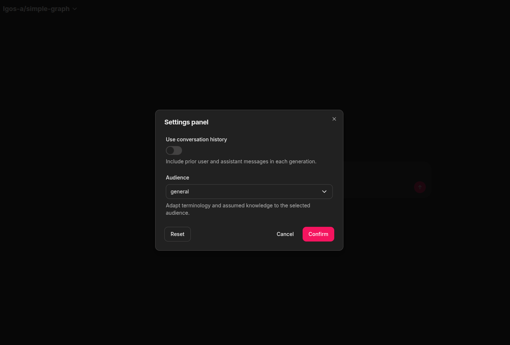

# Chainlit Client

The included Chainlit UI is an optional OpenAI client of LGOS. It does not add
routes or change the server contract.

The Chainlit project intentionally does not install or import the
`langgraph-openai-serve` Python package. It demonstrates that a UI integration
needs only the OpenAI wire contract. Its local declarations cover only the LGOS
response extensions it consumes and link to their authoritative source files.

## Run The UI

Create the local environment file and a Chainlit signing secret:

```bash
cd demo
cp .env.example .env
uv run --directory ui/chainlit_ui --locked chainlit create-secret
```

Put the generated value in `CHAINLIT_AUTH_SECRET`. Chainlit also requires an
existing S3-compatible bucket: replace the example `BUCKET_NAME`,
`APP_AWS_ACCESS_KEY`, `APP_AWS_SECRET_KEY`, `APP_AWS_REGION`, and
`DEV_AWS_ENDPOINT` values before starting the UI.

=== "Compose"

    ```bash
    make run-chainlit
    ```

=== "Local processes"

    Start PostgreSQL and the API using
    [Run the Demo API](api.md#start-postgresql-and-the-api).

    In another terminal from `demo/`:

    ```bash
    make run-chainlit-local
    ```

Both modes apply pending Chainlit schema migrations before the UI starts. Open
`http://localhost:3002`. See [Docker Compose](docker.md#demo-services)
for container endpoints.

In direct mode, profile discovery reads each
`langgraph_openai_serve.description` from the model list. In Bifrost mode, the
catalog discovers providers and provider-qualified IDs, then one pass-through
list request per discovered provider supplies the native model metadata. The
demo API owns these required descriptions; Chainlit marks a model as **Limited
functionality** when an endpoint omits or strips one.

## Runtime Settings

After a profile is selected, Chainlit:

1. Retrieves the detailed model through the configured OpenAI client and reads
   `langgraph_openai_serve.client_settings`.
2. Renders supported JSON Schema properties as Chainlit Chat Settings.
3. Restores saved values that still match the supported widget type or choice.
4. Compares the selected values with the advertised defaults.
5. Sends changed values as JSON text in
   `metadata.langgraph_runtime_settings` on every completion.

Booleans become switches, inline string enums become selects, and strings
become text inputs. Other schema shapes are not rendered. The adapter checks
only boolean/string types and select membership when restoring the UI; it does
not interpret general JSON Schema constraints. LGOS remains the validation
authority. If the required LGOS model extension is unavailable, Chainlit hides
the controls, uses server defaults, and shows a transient **Limited
functionality** warning after selection. Profile discovery itself stays
list-only because descriptions arrive with the list response. Standard Chat
Completions remain available.



*Runtime settings discovered from `lgos-a/simple-graph` and rendered as native
Chainlit controls.*

Chainlit may restore UI selections with a saved thread, but LGOS does not
persist runtime settings. The adapter resends non-default values for every
request that needs them. The underlying contract is documented in
[LangGraph Runtime Settings](../how-to-guides/langgraph-runtime-settings.md).

## Persistence And Login

Chainlit's PostgreSQL data layer stores users, threads, steps, and feedback.
Opening a stored thread restores its role/content transcript and continues with
the same login identity. The adapter also sends Chainlit's stable thread ID as
`metadata.session_id` on every completion, allowing Langfuse to group the
thread's per-request traces into one session. The `persistent-plot` demo also
combines that value with the authenticated OpenAI `user` to scope its LangGraph
chat document. The transcript remains owned and resent by Chainlit; no chat
history is added to LGOS. See the
[persistent plot ownership flow](graphs/persistent-plot.md#ownership-boundaries)
for the API Store, Chainlit PostgreSQL, and S3 boundaries.

=== "Mock login (default)"

    `DEMO_CHAINLIT_LOGIN_TYPE=mock` accepts any non-empty username and password
    and maps every session to the shared `demo-user`. This is for local use only.

=== "PocketID OAuth"

    Set `DEMO_CHAINLIT_LOGIN_TYPE=oauth` and provide the generic OAuth settings
    listed below. `OAUTH_GENERIC_USER_IDENTIFIER=sub` uses PocketID's stable
    subject as the Chainlit user identifier.

    Register `http://localhost:3002/auth/oauth/PocketID/callback` for local use.
    Behind a reverse proxy, set `CHAINLIT_URL` to the external HTTPS origin and
    register `${CHAINLIT_URL}/auth/oauth/${OAUTH_GENERIC_NAME}/callback`.

Browser login is separate from bearer-token protection for the LGOS `/v1` API.
See [Authentication](../how-to-guides/authentication.md).

## Interrupt Demo

Run the dedicated approval UI:

```bash
DEMO_CHAINLIT_UI_FILE=hitl make run-chainlit-local
```

Initial requests need no interrupt metadata. The HITL client implements the
[canonical batch replay](../explanation/openai-compatibility.md#canonical-batch-replay):
it asks for every decision, sends no partial batch, and repeats when the graph
pauses again. The bundled model demonstrates this with two consecutive dialogs
from parallel nested subgraphs: refund approval and customer-notification
approval. The client sees only one standard OpenAI tool-call batch and does not
depend on the graph topology.

!!! note "Reconnect recovery and its boundary"

    The adapter stores the exact assistant tool-call batch on the same
    model-context-excluded Chainlit message that displays the current approval.
    Its
    [`on_chat_resume`](https://docs.chainlit.io/api-reference/lifecycle-hooks/on-chat-resume)
    hook restores the newest pending batch and reattaches **Approve** and
    **Reject** to that message after the pinned Chainlit host hydrates the
    displayed thread. Refreshing abandons only the old live actions; it neither
    duplicates the prompt nor rejects or resumes the graph.
    Chainlit queues data-layer writes asynchronously, with no public flush API,
    so a process crash can still occur before that message reaches PostgreSQL.
    Once stored, cancellation, reload, or worker loss before the resume request
    does not require API-side chat history.

    The demo does not durably cache a terminal response or a later interrupt
    response that has not yet reached Chainlit. If the API accepts a resume but
    the worker loses the following response, replaying the older ledger fails
    safely as stale; the completed output or newer batch cannot be reconstructed
    from that old ledger. Applications requiring recovery across that window
    need a durable result/pending-response handoff in their UI boundary. They
    must also define retention for abandoned pending runs; the demo has no
    expiry worker.

## Streaming, Events, And Citations

Clicking **Stop** closes the OpenAI stream. Partial assistant text remains
visible but is excluded from later model context because it is incomplete.

The UI renders Markdown links and images from assistant content. It does not
consume structured OpenAI citation annotations. The bundled adapter opts into
LGOS client stream events only when model retrieval advertises
`client_events`. Portable status updates render as a native Chainlit
[`TaskList`](https://docs.chainlit.io/api-reference/elements/tasklist). Other
events render as one live-updating Chainlit
[custom element](https://docs.chainlit.io/api-reference/elements/custom) per
completion. The panel shows event type, namespace, progress, and artifact
details, with a JSON fallback for other payload shapes. Its host message is
excluded from model context. A versioned `kind=plotly` artifact instead renders
with Chainlit's native
[`Plotly`](https://docs.chainlit.io/api-reference/elements/plotly) element.
The official data layer stores its metadata in PostgreSQL and figure JSON in
the configured S3-compatible bucket, allowing the native chart to return with
the thread. The packaged botocore configuration uses Signature V4 and path-style
addressing for S3-compatible endpoints. Unknown extension versions are ignored.

To see native status rendering, select `lgos-a/status-events` in Compose or
`status-events` in local-process mode, then ask **Prepare the media workflow.**
Each new status completes the previous task, and the final `done=True` update
marks the list done. The task list is live UI state and is not restored from
persisted chat history.

Select `lgos-b/custom-event-showcase` in Compose or `custom-event-showcase`
locally, then ask **Build the compatibility report** to see the separate
activity panel render progress and an artifact while assistant text streams
independently.

Select `lgos-b/persistent-plot` in Compose or `persistent-plot` locally and ask
**Show the chart**, then **Set Q3 to 250**. The second request loads and updates
the canonical document in the API's PostgreSQL store while Chainlit continues
to own the visible conversation and native chart elements. Ask **Which quarter
is highest?** in a later turn to exercise a fresh graph call over the stored
data. Chainlit discovers **Chart type**, **Currency**, and **Show legend** as
native Chat Settings and resends them with each request; those presentation
choices are not stored with the chart data. A different thread gets a separate
chart document.

Behind Bifrost, Chainlit discovers providers from the catalog URL and uses the
raw pass-through URL for metadata-bearing model lists, detailed retrieval, and
inference. A schema-normalizing route may still stream the answer while
stripping both capability metadata and event-only chunks; Chainlit displays the
limited-mode warning when model retrieval reveals that condition. See
[proxy compatibility](../how-to-guides/openai-proxies.md#client-event-compatibility).

When a catalog URL is configured, the adapter keeps models owned by
`langgraph-openai-serve`, discovers their providers, and sends the provider as
`x-model-provider` for pass-through listing, retrieval, and chat. Its code has
no provider list. The upstream model ID remains opaque, including any
additional `/` characters.

Without a catalog URL, Chainlit follows the standard OpenAI path: it lists once
and reuses every returned model ID verbatim. Use that default for a direct LGOS
API or another OpenAI-compatible endpoint. If the endpoint strips the LGOS
model extension, the profile remains usable and Chainlit warns after it is
selected. Chainlit never infers routing behavior from the base URL.

## Settings Reference

LGOS endpoint settings:

| Setting | Default | Notes |
| --- | --- | --- |
| `DEMO_CHAINLIT_OPENAI__BASE_URL` | `http://localhost:3004/v1` | Endpoint used for retrieval and inference. Direct mode also lists from it. |
| `DEMO_CHAINLIT_OPENAI__CATALOG_BASE_URL` | unset | Optional Bifrost model catalog endpoint; setting it enables provider-qualified pass-through routing. |
| `DEMO_CHAINLIT_OPENAI__API_KEY` | `DUMMY` | OpenAI API or gateway key. |
| `DEMO_CHAINLIT_HITL_MODEL` | `interruptible-approval` | Model selected by the HITL UI. |
| `DEMO_CHAINLIT_UI_FILE` | `simple` | Chainlit target: `simple` or `hitl`. |
| `DEMO_CHAINLIT_LOGIN_TYPE` | `mock` | Browser login: `mock` or `oauth`. |
| `CHAINLIT_UTILS_MIGRATIONS_TABLE` | `_lgos_chainlit_schema_migrations` | Migration ledger retained for existing demo databases. |
| `CHAINLIT_UTILS_MODEL_CONTEXT_EXCLUDED_KEY` | `lgos_chainlit.exclude_from_model_context` | Persisted metadata key for UI-only messages. |

See the bundled [Bifrost gateway](bifrost.md) for the Compose endpoint and
adapter behavior.

Native Chainlit settings:

| Setting | Default | Notes |
| --- | --- | --- |
| `DATABASE_URL` | required | PostgreSQL data-layer URL. |
| `CHAINLIT_AUTH_SECRET` | required | Browser-session signing secret. |
| `CHAINLIT_APP_ROOT` | `src/lgos_chainlit` | Tracked UI configuration and welcome Markdown. |
| `BUCKET_NAME` | required | S3-compatible bucket for native elements. |
| `APP_AWS_ACCESS_KEY` | required | S3 access key. |
| `APP_AWS_SECRET_KEY` | required | S3 secret key. |
| `APP_AWS_REGION` | required | S3 signing region. |
| `DEV_AWS_ENDPOINT` | required | Custom S3-compatible endpoint URL. |
| `STORAGE_EXPIRY_TIME` | `3600` | Lifetime in seconds for resumed element URLs. |
| `CHAINLIT_URL` | request origin | External origin for OAuth callbacks. |
| `OAUTH_GENERIC_CLIENT_ID` | required for `oauth` | OAuth client ID. |
| `OAUTH_GENERIC_CLIENT_SECRET` | required for `oauth` | OAuth client secret. |
| `OAUTH_GENERIC_AUTH_URL` | required for `oauth` | Authorization endpoint. |
| `OAUTH_GENERIC_TOKEN_URL` | required for `oauth` | Token endpoint. |
| `OAUTH_GENERIC_USER_INFO_URL` | required for `oauth` | User-info endpoint. |
| `OAUTH_GENERIC_SCOPES` | required for `oauth` | Space-separated scopes. |
| `OAUTH_GENERIC_NAME` | `generic` | Provider ID used in the callback path. |
| `OAUTH_GENERIC_USER_IDENTIFIER` | `email` | User identifier claim. |

The element bucket must allow browser CORS `GET` and `HEAD` requests from the
Chainlit origin. CORS only permits the cross-origin response; the object still
requires Chainlit's time-limited presigned URL. See
[Amazon S3's CORS guide](https://docs.aws.amazon.com/AmazonS3/latest/userguide/cors.html).

The demo requires Chainlit 2.11.1 or newer. Review Chainlit's migration guidance
when updating it because the PostgreSQL schema is release-specific.

## Production Notes

- Use OAuth or another real callback; mock mode provides no access control or
  user isolation.
- Keep OAuth, signing, and object-storage secrets outside source control.
- Restrict `allow_origins` to the deployed HTTPS origin.
- Configure session affinity for multiple UI workers. The demo keeps user file
  uploads disabled but requires object storage for native Plotly persistence.
- Run `lgos-chainlit-setup` before starting or replacing workers.

See Chainlit's documentation for
[password callbacks](https://docs.chainlit.io/authentication/password),
[OAuth](https://docs.chainlit.io/authentication/oauth),
[PostgreSQL persistence](https://docs.chainlit.io/data-layers/official), and
[deployment](https://docs.chainlit.io/deploy/overview).
