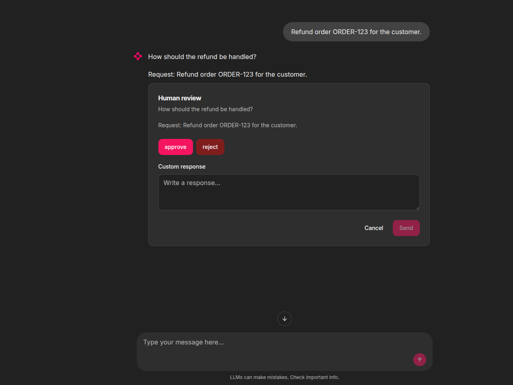

# Chainlit Client

The included Chainlit UI is an optional OpenAI client of LGOS. It does not add
routes or change the server contract.

The Chainlit project intentionally does not install or import the
`langgraph-openai-serve` Python package. It demonstrates that a UI integration
needs only the OpenAI wire contract. Its local declarations cover only LGOS
model metadata and link to their authoritative source files.

!!! info "Select one first-class gateway"

    Set `OPENAI_GATEWAY_TYPE=litellm|bifrost` once for both demo UIs. LiteLLM
    uses managed Responses; Bifrost uses native Responses. Files also use the
    selected gateway's normal route. Pass-through is limited to catalog detail
    so LGOS descriptions and settings survive gateway normalization. Chainlit
    never connects directly to the LGOS or Files containers and remains
    Responses-only.

## Run The UI

Create the local environment file and a Chainlit signing secret:

```bash
cd demo
cp .env.example .env
uv run --directory ui/chainlit_ui --locked chainlit create-secret
```

Put the generated value in `CHAINLIT_AUTH_SECRET`. Configure Chainlit's native
element storage with `BUCKET_NAME`, `APP_AWS_*`, and `DEV_AWS_ENDPOINT`.
Separately configure the central Files API with `DEMO_API_FILES_BUCKET`,
`DEMO_API_FILES_S3_ENDPOINT`, and `DEMO_API_FILES_AWS_*`. Replace every example
value before starting the UI; neither service reads the other's S3 settings.

=== "Compose"

    ```bash
    make run-chainlit
    ```

=== "Local processes"

    Start the selected gateway and its API and Files dependencies from one
    terminal:

    === "LiteLLM"

        ```bash
        make run-litellm
        ```

    === "Bifrost"

        ```bash
        make run-bifrost
        ```

    Then start Chainlit from a second terminal:

    ```bash
    make run-chainlit-local
    ```

Both modes apply pending Chainlit schema migrations before the UI starts. Open
`http://localhost:3002`. See [Docker Compose](docker.md#demo-services)
for container endpoints.

With LiteLLM selected, profile discovery reads each graph's description and
features from the `lgos-a` and `lgos-b` catalog pass-throughs, keeps the
corresponding prefix, and sends the qualified model to managed
`/v1/responses`. With Bifrost selected, aggregate discovery finds each
provider, catalog detail uses `/openai_passthrough/v1` with
`x-model-provider`, and inference uses native `/openai/v1/responses` with the
same provider header. The demo API owns the descriptions and capabilities.
Chainlit keeps the Responses model usable for plain text but marks it as
**Limited functionality** when an endpoint omits or strips them.

LiteLLM's managed `/v1/models` response contains only the standard model
fields, so it is not the UI catalog. The pass-through base URL forwards
`GET /models` and `GET /models/{model}` to LGOS unchanged; Chainlit therefore
receives `GraphConfig.description`, features, and detailed client-settings
schemas while all network traffic still terminates at LiteLLM.

The gateway selector owns routing; users configure only the gateway type and
optional root URL.

## File Attachments

The UI uploads every file attached to the current user message through
`client.files.create(..., purpose="user_data")`. It then replaces the attachment
with a native Responses `input_file` part containing the returned `file_id`.
Files requests use the selected gateway's normal `/v1` route. Bifrost assigns
them to its fixed `lgos-files` provider, while LiteLLM assigns them to its
configured `litellm_proxy` Files provider. Responses continue to use the
selected model provider. The demo therefore has one file namespace shared by
both inference providers.

The attachment button appears only for profiles that advertise `file_inputs`
and accepts up to five files of 10 MiB each per message. Select
`file-input` to process an attachment with the dedicated demo graph. Selecting
Bifrost instead exposes `lgos-a/file-input` and its `lgos-b` equivalent.
If an OpenAI API caller sends a native file part to a
general graph such as `simple-graph`, LGOS preserves it, but that graph does not
resolve its central ID.

!!! note "Chainlit 2.11.1 upload validation"

    Chainlit applies profile overrides to the browser and WebSocket session,
    but its pinned [`/project/file` validator](https://github.com/Chainlit/chainlit/blob/2.11.1/backend/chainlit/server.py#L1649-L1661)
    reads the global setting. The demo therefore leaves that route globally
    enabled, hides the attachment control through native
    [`ChatProfile.config_overrides`](https://docs.chainlit.io/api-reference/chat-profiles),
    and checks the effective session profile before uploading to the central
    Files API. Remove this workaround once Chainlit's upload route validates
    against the effective session configuration.

Chainlit's native S3 persistence remains responsible for restoring UI elements.
The OpenAI Files upload is the separate inference contract; the adapter does
not wait for a Chainlit persistence URL or put one in `file_data`. See
[Accept And Display Files](../how-to-guides/file-inputs.md).

## Runtime Settings

After a profile is selected, Chainlit:

1. Retrieves the detailed model through the configured OpenAI client and reads
   `langgraph_openai_serve.client_settings`.
2. Renders supported JSON Schema properties as Chainlit Chat Settings.
3. Restores saved values that still match the supported widget type or choice.
4. Compares the selected values with the advertised defaults.
5. Sends changed values as JSON text in
   `metadata.langgraph_runtime_settings` on every Responses request.

Booleans become switches, inline string enums become selects, and strings
become text inputs. Other schema shapes are not rendered. The adapter checks
only boolean/string types and select membership when restoring the UI; it does
not interpret general JSON Schema constraints. LGOS remains the validation
authority. If the required LGOS model extension is unavailable, Chainlit hides
the controls, uses server defaults, and shows a transient **Limited
functionality** warning after selection. Profile discovery itself stays
list-only because descriptions and features arrive with the list response.


*Runtime settings discovered from `lgos-a/simple-graph` and rendered as native
Chainlit controls.*

The same panel includes a Chainlit-owned **Stream response** switch for every
profile. It defaults to enabled and selects `responses.stream` or
`responses.create`; it is not included in `langgraph_runtime_settings`. With
streaming disabled, Chainlit waits for the complete response and sends the
answer once.

Chainlit may restore UI selections with a saved thread, but LGOS does not
persist runtime settings. The adapter resends non-default values for every
request that needs them. The underlying contract is documented in
[LangGraph Runtime Settings](../how-to-guides/langgraph-runtime-settings.md).

## Persistence And Login

Chainlit's PostgreSQL data layer stores users, threads, steps, and feedback.
Opening a stored thread restores its role/content transcript and continues with
the same login identity. The adapter also sends Chainlit's stable thread ID as
`metadata.session_id` on every Responses request, allowing Langfuse to group the
thread's per-request traces into one session. The `persistent-plot-agent` demo also
combines that value with the authenticated OpenAI `user` to scope its LangGraph
chart document. The transcript remains owned and resent by Chainlit; no chat
history is added to LGOS. See the
[persistent plot agent ownership flow](graphs/persistent-plot-agent.md#ownership-boundaries)
for the API Store, Chainlit PostgreSQL, and S3 boundaries.

=== "Mock login (default)"

    `DEMO_CHAINLIT_LOGIN_TYPE=mock` accepts any non-empty username and password
    and maps every session to the shared `demo-user`. This is for local use only.

=== "PocketID OAuth"

    Set `DEMO_CHAINLIT_LOGIN_TYPE=oauth` and provide the generic OAuth settings
    listed below. `OAUTH_GENERIC_USER_IDENTIFIER=sub` uses PocketID's stable
    subject as the Chainlit user identifier.

    Register `http://localhost:3002/auth/oauth/PocketID/callback` for local use.
    Behind a reverse proxy, set `CHAINLIT_URL` to the external HTTPS origin and
    register `${CHAINLIT_URL}/auth/oauth/${OAUTH_GENERIC_NAME}/callback`.

Browser login is separate from bearer-token protection for the LGOS `/v1` API.
See [Authentication](../how-to-guides/authentication.md).

## Interrupt Demo

Run the dedicated HITL UI:

```bash
DEMO_CHAINLIT_UI_FILE=hitl make run-chainlit-local
```

Initial requests need no interrupt metadata. The HITL client implements the
[canonical batch replay](../explanation/openai-compatibility.md#canonical-batch-replay):
it asks for every response, sends no partial batch, and repeats when the graph
pauses again. Each response is shown with Chainlit's native
[`AskElementMessage`](https://docs.chainlit.io/api-reference/ask/ask-for-element)
and a small custom element. Choice buttons and the allowed free-text field submit
one `{resume: ...}` value, so the client depends only on the standard tool-call
batch, not the graph topology. See the shared
[interrupt walkthrough](graphs/interruptible-approval.md).



*Chainlit renders the LangGraph interrupt as native choices with an optional
custom response field.*

!!! note "Reconnect recovery and its boundary"

    The adapter stores the exact Responses function-call batch on the same
    model-context-excluded Chainlit message that displays the current prompt.
    Its
    [`on_chat_resume`](https://docs.chainlit.io/api-reference/lifecycle-hooks/on-chat-resume)
    hook restores the newest pending batch and reattaches its custom review form,
    including the free-text field when allowed, after the pinned Chainlit host
    hydrates the displayed thread. Refreshing abandons only the old live prompt;
    it neither duplicates the persisted message nor rejects or resumes the graph.
    Chainlit queues data-layer writes asynchronously, with no public flush API,
    so a process crash can still occur before that message reaches PostgreSQL.
    Once stored, cancellation, reload, or worker loss before the resume request
    does not require API-side chat history.

    The demo does not durably cache a terminal response or a later interrupt
    response that has not yet reached Chainlit. If the API accepts a resume but
    the worker loses the following response, replaying the older ledger fails
    safely as stale; the completed output or newer batch cannot be reconstructed
    from that old ledger. Applications requiring recovery across that window
    need a durable result/pending-response handoff in their UI boundary. See
    [Interruptible Human Review](graphs/interruptible-approval.md#postgresql-runtime)
    for server-side checkpoint retention.

## Streaming, Events, And Citations

Both bundled Chainlit clients use OpenAI Responses. In the general client's
streaming mode, the SDK stream manager owns event accumulation and supplies
the terminal `Response`; the adapter streams
answer text into the assistant message. Messages without the optional `phase`
field are also treated as answers. It maps completed
`phase="commentary"` items to a native
[`TaskList`](https://docs.chainlit.io/api-reference/elements/tasklist), completing
each prior task when the next status arrives and completing the list when the
full response succeeds. Clicking **Stop** marks the active task as failed and
closes the Responses stream; incomplete assistant text remains visible but is
excluded from later model context. Both streaming and non-streaming requests
require a completed Response before displaying files or accepting a successful
turn. Failed interrupt resumes leave the saved pending ledger intact.

Transcript replay labels assistant answers as `final_answer` and preserves
explicit phase values, following OpenAI's
[assistant phase guidance](https://developers.openai.com/api/docs/guides/reasoning#phase-parameter).

The persistent plot graph returns a standard `display_file` function call.
Chainlit downloads the Plotly JSON through the OpenAI Files API, reconstructs
the figure with `plotly.io.from_json`, and persists a native
[`Plotly`](https://docs.chainlit.io/api-reference/elements/plotly) element with
interactive hover, zoom, and legend controls. It returns the matching
`function_call_output` before requesting the final answer. Image files still
use the native `Image` element.
Each continuation retains the original input, including instructions and file
references, then appends the complete Response output and matching tool results.
Streaming and non-streaming modes retain final-answer text from every call in
that exchange and exclude commentary from the answer.
The official data layer stores the element in the configured S3-compatible
bucket, so it returns with the thread.

The UI renders Markdown links, images, and inline citation markers from
assistant content. Shared prompts and graph behavior are documented under
[Events And Citations](graphs/events-and-citations.md#try-it) and
[Persistent Plot Agent](graphs/persistent-plot-agent.md#try-it). A schema-normalizing proxy
must preserve standard Responses items and events.

## Settings Reference

Gateway settings:

| Setting | Default | Notes |
| --- | --- | --- |
| `OPENAI_GATEWAY_TYPE` | `litellm` | Gateway used by both demo UIs: `litellm` or `bifrost`. |
| `DEMO_CHAINLIT_OPENAI__GATEWAY_BASE_URL` | selected local gateway | Optional gateway-root override; defaults to port 3007 for LiteLLM or 3000 for Bifrost. |
| `DEMO_CHAINLIT_OPENAI__API_KEY` | `sk-lgos-litellm-demo` | Gateway key; replace the demo value outside local use. |
| `DEMO_CHAINLIT_HITL_MODEL` | `interruptible-approval` | Model selected by the HITL UI. |
| `DEMO_CHAINLIT_UI_FILE` | `simple` | Chainlit target: `simple` or `hitl`. |
| `DEMO_CHAINLIT_LOGIN_TYPE` | `mock` | Browser login: `mock` or `oauth`. |
| `CHAINLIT_UTILS_MIGRATIONS_TABLE` | `_lgos_chainlit_schema_migrations` | Chainlit-utils schema migration ledger. |
| `CHAINLIT_UTILS_MODEL_CONTEXT_EXCLUDED_KEY` | `lgos_chainlit.exclude_from_model_context` | Persisted metadata key for UI-only messages. |

See the bundled [Bifrost gateway](bifrost.md) for the Compose endpoint and
adapter behavior.

Native Chainlit settings:

| Setting | Default | Notes |
| --- | --- | --- |
| `DATABASE_URL` | required | PostgreSQL data-layer URL. |
| `CHAINLIT_AUTH_SECRET` | required | Browser-session signing secret. |
| `CHAINLIT_APP_ROOT` | `src/lgos_chainlit` | Tracked UI configuration and welcome Markdown. |
| `BUCKET_NAME` | required | S3-compatible bucket for native elements. |
| `APP_AWS_ACCESS_KEY` | required | S3 access key. |
| `APP_AWS_SECRET_KEY` | required | S3 secret key. |
| `APP_AWS_REGION` | required | S3 signing region. |
| `DEV_AWS_ENDPOINT` | required | Custom S3-compatible endpoint URL. |
| `STORAGE_EXPIRY_TIME` | `3600` | Lifetime in seconds for resumed element URLs. |
| `CHAINLIT_URL` | request origin | External origin for OAuth callbacks. |
| `OAUTH_GENERIC_CLIENT_ID` | required for `oauth` | OAuth client ID. |
| `OAUTH_GENERIC_CLIENT_SECRET` | required for `oauth` | OAuth client secret. |
| `OAUTH_GENERIC_AUTH_URL` | required for `oauth` | Authorization endpoint. |
| `OAUTH_GENERIC_TOKEN_URL` | required for `oauth` | Token endpoint. |
| `OAUTH_GENERIC_USER_INFO_URL` | required for `oauth` | User-info endpoint. |
| `OAUTH_GENERIC_SCOPES` | required for `oauth` | Space-separated scopes. |
| `OAUTH_GENERIC_NAME` | `generic` | Provider ID used in the callback path. |
| `OAUTH_GENERIC_USER_IDENTIFIER` | `email` | User identifier claim. |

The element bucket must allow browser CORS `GET` and `HEAD` requests from the
Chainlit origin. CORS only permits the cross-origin response; the object still
requires Chainlit's time-limited presigned URL. See
[Amazon S3's CORS guide](https://docs.aws.amazon.com/AmazonS3/latest/userguide/cors.html).

The demo requires Chainlit 2.11.1 or newer. Review Chainlit's migration guidance
when updating it because the PostgreSQL schema is release-specific.

## Production Notes

- Use OAuth or another real callback; mock mode provides no access control or
  user isolation.
- Keep OAuth, signing, and object-storage secrets outside source control.
- Restrict `allow_origins` to the deployed HTTPS origin.
- Configure session affinity for multiple UI workers and object storage for
  native file and chart persistence. File-capable profiles enable attachments.
- Run `lgos-chainlit-setup` before starting or replacing workers.

See Chainlit's documentation for
[password callbacks](https://docs.chainlit.io/authentication/password),
[OAuth](https://docs.chainlit.io/authentication/oauth),
[PostgreSQL persistence](https://docs.chainlit.io/data-layers/official), and
[deployment](https://docs.chainlit.io/deploy/overview).
