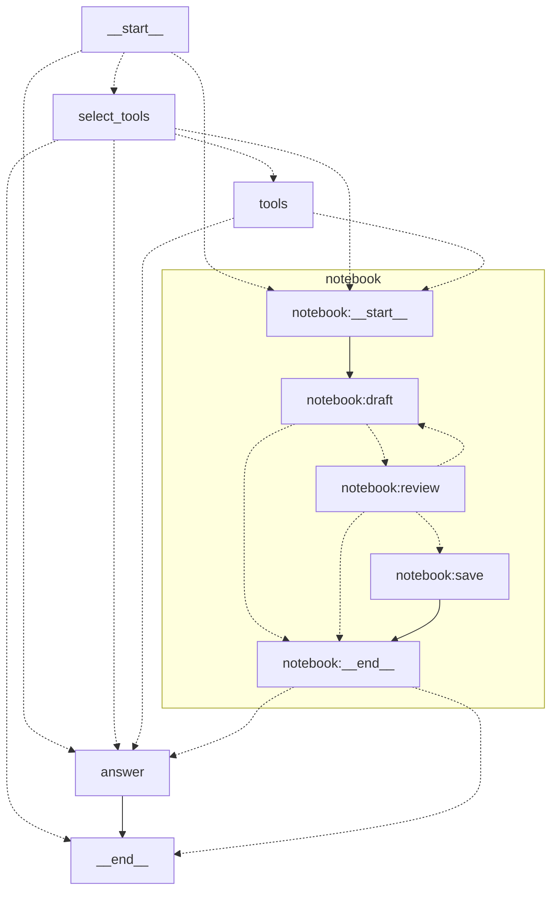

# Advanced Graph

`advanced-graph` is the production-style demo: it researches public web pages
and a private document library, streams a cited answer, and can pause for human
approval before saving a Markdown note. It uses ordinary LangGraph nodes and one
note-writing subgraph rather than `create_agent`.

The graph is available only through the Responses API because interrupts cannot
be represented by LGOS's Chat Completions endpoint. Its model calls use the
Responses API with streaming enabled.

## Request Flow

1. `select_tools` makes one tool-selection pass. The private
   `knowledge_search` tool is available when a vector store is configured;
   `web_search` is available only when the request includes
   `{"type":"web_search"}`.
2. `tools` runs the selected searches in parallel through LangGraph's
   `ToolNode`. Web results retain URL metadata. Document results use stable
   `[K#]`, filename, and file-ID labels.
3. With `save_note=true`, the `notebook` subgraph drafts a Markdown note and
   pauses at `interrupt()`. `approve` uploads the exact reviewed bytes,
   `reject` saves nothing, and free text revises the draft before another review.
4. `answer` is the only model node exposed to token streaming. Earlier nodes
   emit short status messages as Responses commentary. Provider refusals and
   token-limit outcomes remain native refusal or incomplete Responses outcomes.

Client function tools keep their normal LGOS behavior: the final model step can
return function calls for the client to execute. `tool_choice="none"` disables
search and client tools, while note review remains an explicit graph setting.
The bundled Chainlit and Open WebUI clients expose **Web search** separately
from **Save a research note** and translate it to the standard Responses tool.

## LangGraph Topology

Generated with `get_graph(xray=True).draw_mermaid(with_styles=False)`. Mermaid-
unsafe qualified node IDs are aliased; labels preserve LangGraph's names.

## Storage Boundaries

The graph depends on a small `KnowledgeBase` protocol. Its included adapter uses
OpenAI-compatible Files and vector-store endpoints, but the base URL and API key
are independent from the model provider. That boundary allows a future LGOS
vector-store service to replace OpenAI without changing the graph or LGOS's
public Responses schema.

| Data | Owner |
| --- | --- |
| Documents and vector index | Configured OpenAI-compatible vector service |
| Pending review and resume position | PostgreSQL LangGraph checkpointer |
| Upload ID, digest, and indexing status | PostgreSQL LangGraph Store |
| Conversation history | Responses client; LGOS requires `store=false` |

The Store receipt prevents an automatic second upload after an uncertain
failure. It does not duplicate note contents. A file is reported as searchable
only after indexing completes; the bounded indexing wait otherwise reports the
file as uploaded but not yet searchable.

An `input_file.file_id` belongs to the Files API configured by
`DEMO_API_FILES_BASE_URL`. The graph resolves its bytes only for each model call,
so checkpoints retain the file ID rather than a base64 copy. It is not a
vector-service file ID and is not indexed automatically.

The configured vector store is a shared workspace, not an authorization
boundary. Production deployments must add authentication, tenant isolation,
retention, and document deletion appropriate to their data. Retrieved snippets
are sent to the configured model provider as answer context. Tool selection
happens before either search returns, so results retrieved during a run cannot
influence that run's public web query.

See the official OpenAI-compatible endpoint shapes for
[file search](https://developers.openai.com/api/docs/guides/tools-file-search)
and [vector-store search](https://developers.openai.com/api/reference/resources/vector_stores/methods/search),
and LangGraph's guidance for
[subgraphs](https://docs.langchain.com/oss/python/langgraph/use-subgraphs) and
[interrupts](https://docs.langchain.com/oss/python/langgraph/interrupts).

## Try It

Follow [Advanced Research And Note Review](../api.md#advanced-research-and-note-review)
for the environment settings and a minimal Responses request. No document is
uploaded until a user approves the review interrupt.
