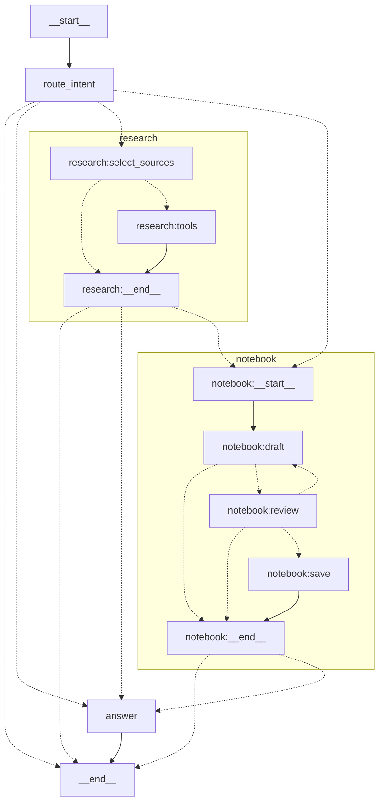

# Advanced Graph

`advanced-graph` is the production-style showcase: a general chatbot that can
talk naturally, understand uploaded files, route source-backed questions to
research, and pause before saving a durable note. It uses ordinary LangGraph
nodes plus small research and notebook subgraphs rather than `create_agent`.

The graph is available only through the Responses API. Its upstream model calls
also use Responses; only the final `answer` node contributes token deltas to the
client stream.

## Configuration

The model is required. File input, public web search, and shared knowledge use
independent endpoints so each service can be replaced without changing the
graph or its public Responses contract.

```dotenv title="Advanced graph settings in demo/.env"
DEMO_API_OPENAI_BASE_URL=https://api.openai.com/v1
DEMO_API_OPENAI_API_KEY=...
DEMO_API_OPENAI_MODEL=gpt-5.4-mini

DEMO_API_FILES_BASE_URL=http://localhost:3006/v1

DEMO_API_WEB_SEARCH_BACKEND=http
DEMO_API_WEB_SEARCH_URL=https://searxng.example.com/search

DEMO_API_VECTOR_STORE_BASE_URL=https://api.openai.com/v1
DEMO_API_VECTOR_STORE_API_KEY=...
DEMO_API_VECTOR_STORE_BIFROST_KEY_NAME=
DEMO_API_VECTOR_STORE_ID=vs_...
```

Set `DEMO_API_WEB_SEARCH_BACKEND=openai` to execute the upstream model's native
Responses web-search tool; in that mode `DEMO_API_WEB_SEARCH_URL` is unused.
The `http` mode uses the configured SearXNG- or Degoog-compatible JSON endpoint.

Omitting the vector base URL reuses the model endpoint and key. An explicit
vector base URL uses its own key, or `DUMMY` when the key is blank. Set the
Bifrost key name only when a Bifrost passthrough must pin these stateful calls to
one managed OpenAI key. Without `DEMO_API_VECTOR_STORE_ID`, chat, files, and web
search still work; shared-knowledge search is unavailable and save requests
truthfully report that nothing was stored.

Use [Run The Demo API](../api.md#start-postgresql-and-the-api) for the shortest
startup path, or start the complete stack with `just demo/compose --dev`.

## Request Flow

1. `route_intent` classifies the latest turn as `chat`, `research`, `save`, or
   `research_and_save` with a private structured tool call. It receives
   conversation text and an attachment marker, not downloaded file bytes.
2. Normal conversation, writing, reasoning, coding, and attached-file questions
   go directly to `answer`. Files are resolved through the configured Files API
   only when a model node needs their contents.
3. Source-backed requests enter the `research` subgraph. `select_sources` can
   choose the private `knowledge_search` tool and, only when the request includes
   `{"type":"web_search"}`, the server-owned `web_search` tool. LangGraph's
   `ToolNode` executes the selected searches.
4. An explicit request to remember or save information enters the `notebook`
   subgraph. It drafts a Markdown note and pauses at `interrupt()`. `approve`
   saves the exact reviewed bytes, `reject` saves nothing, and free text revises
   the draft before another review. A combined intent researches first.
5. Internal nodes emit short Responses commentary status events. Provider
   refusals and output-limit failures remain native refusal or incomplete
   outcomes. The final answer attaches URL citations for exact links returned by
   web search and retains stable `[K#]`, filename, and file-ID labels for private
   results.

Enabling Web search makes the tool available; it does not force an ordinary chat
turn through research. Standard `tool_choice` rules remain authoritative, and
client function tools are returned for the client to execute. Persistence has no
custom request flag: users ask for it in normal language.

## LangGraph Topology

Generated from the compiled graph with
`get_graph(xray=True).draw_mermaid(with_styles=False)`. Mermaid-unsafe qualified
node IDs are aliased below; labels preserve LangGraph's names.



## Storage Boundaries

The graph depends on a small `KnowledgeBase` protocol. Its included adapter uses
OpenAI-compatible Files and vector-store endpoints, but the endpoint and key are
independent from the model provider. A future LGOS-compatible vector service can
replace OpenAI without changing the graph or LGOS's public Responses contract.

| Data | Owner |
| --- | --- |
| User attachments | Configured central Files API |
| Searchable documents and vector index | Configured OpenAI-compatible vector service |
| Pending review and resume position | PostgreSQL LangGraph checkpointer |
| Upload ID, digest, and indexing status | PostgreSQL LangGraph Store |
| Upstream response retention | Disabled with `store=false` |

The Store receipt prevents an automatic second upload after an uncertain
failure and does not duplicate note contents. A file is reported as searchable
only after indexing completes; a bounded wait otherwise reports it as uploaded
but not yet searchable.

An `input_file.file_id` belongs to the Files API configured by
`DEMO_API_FILES_BASE_URL`. The graph stores the file ID in state and resolves
bytes only for a model call, so checkpoints never contain a base64 copy. An
uploaded attachment is not automatically added to the knowledge base; saving is
always a separate reviewed action.

The configured vector store is a shared workspace, not an authorization
boundary. Production deployments must add authentication, tenant isolation,
retention, and deletion appropriate to their data. Retrieved snippets and file
contents are sent to the configured model provider as context. Source selection
happens before a search returns, so private results cannot influence that run's
public query.

See the official OpenAI-compatible endpoint shapes for
[file search](https://developers.openai.com/api/docs/guides/tools-file-search)
and [vector-store search](https://developers.openai.com/api/reference/resources/vector_stores/methods/search),
and LangGraph's guidance for
[graphs](https://docs.langchain.com/oss/python/langgraph/graph-api),
[subgraphs](https://docs.langchain.com/oss/python/langgraph/use-subgraphs),
[persistence](https://docs.langchain.com/oss/python/langgraph/persistence), and
[interrupts](https://docs.langchain.com/oss/python/langgraph/interrupts).

## Try It

Run the setup once in a Python process, then try the focused examples below.
They all use the same public `POST /v1/responses` contract. The direct demo keeps
the graph API and Files API independently addressable; the maintained UIs route
both through the configured gateway automatically.

```python title="Shared setup"
import json

from openai import OpenAI

MODEL = "advanced-graph"
WEB_SEARCH = [{"type": "web_search"}]

client = OpenAI(base_url="http://localhost:3004/v1", api_key="DUMMY")
files = OpenAI(base_url="http://localhost:3006/v1", api_key="DUMMY")


def run(input_items, **options):
    """Stream final text, show commentary statuses, and return the Response."""
    phases = {}
    with client.responses.stream(
        model=MODEL,
        input=input_items,
        store=False,
        **options,
    ) as stream:
        for event in stream:
            if (
                event.type == "response.output_item.added"
                and event.item.type == "message"
            ):
                phases[event.output_index] = event.item.phase
            elif (
                event.type == "response.output_text.delta"
                and phases.get(event.output_index) == "final_answer"
            ):
                print(event.delta, end="", flush=True)
            elif (
                event.type == "response.output_text.done"
                and phases.get(event.output_index) == "commentary"
            ):
                print(f"\n[status] {event.text}")
        response = stream.get_final_response()
    print(f"\n[{response.status}]")
    return response


def replay(response):
    """Keep the stateless input ledger required for a later chat turn."""
    items = []
    for item in response.output:
        value = item.model_dump(mode="json", exclude_none=True)
        value.pop("parsed_arguments", None)  # SDK-only streaming convenience field
        items.append(value)
    return items


def url_citations(response):
    return [
        annotation.url
        for item in response.output
        if item.type == "message"
        for part in item.content
        if part.type == "output_text"
        for annotation in part.annotations
        if annotation.type == "url_citation"
    ]
```

### Generic Chat And Intent Routing

Supplying Web search makes it available but does not force an ordinary request
through research. LGOS is stateless after a completed response, so the client
owns the conversation ledger and replays prior output on the next turn.

```python
history = [
    {
        "role": "user",
        "content": "Compare Python lists and tuples in three concise bullets.",
    }
]
first = run(history, tools=WEB_SEARCH)

history.extend(replay(first))
history.append({"role": "user", "content": "Now show one short example of each."})
second = run(history, tools=WEB_SEARCH)
```

Use `tool_choice="none"` with the same request to disable both public and
private search. Use `previous_response_id` only for the paused HITL continuation
shown below, not for ordinary chat history.

### File Input

Upload once to the configured Files API and send only its opaque ID to the
Responses endpoint. The graph downloads the file only in a node that needs its
contents and does not copy its Base64 bytes into checkpoint state.

```python
uploaded = files.files.create(
    file=("brief.txt", b"The project marker is FILE_INPUT_OK."),
    purpose="user_data",
)
try:
    result = run(
        [
            {
                "role": "user",
                "content": [
                    {
                        "type": "input_text",
                        "text": "Summarize this file and repeat its marker exactly.",
                    },
                    {"type": "input_file", "file_id": uploaded.id},
                ],
            }
        ]
    )
finally:
    files.files.delete(uploaded.id)
```

Uploading a file does not add it to shared knowledge. Persistence always uses
the separate reviewed flow.

### Server-Side Web Search, Status, And Citations

This request forces the registered server tool. The stream prints research
statuses before answer tokens, and the final Response contains a
`web_search_call` plus standard `url_citation` annotations when the backend
returns a usable source.

```python
result = run(
    "Search the current official LangGraph documentation for interrupts. "
    "Explain interrupt() in one sentence and cite the exact source URL.",
    tools=WEB_SEARCH,
    tool_choice="required",
)
print("citations:", url_citations(result))
print("items:", [item.type for item in result.output])
```

With the default `tool_choice="auto"`, the research subgraph can select public
web search, private `knowledge_search`, or both. Private search remains an
implementation detail; clients never send a non-standard file-search tool.

### Client-Owned Function Tools

The graph binds client function definitions to the answer model but never
executes them. Execute the returned call locally, append its output to the same
ledger, and resend the prior Response items in their accepted wire form.

```python
SUM_TOOL = [
    {
        "type": "function",
        "name": "calculate_sum",
        "description": "Add a list of integers.",
        "parameters": {
            "type": "object",
            "properties": {
                "numbers": {"type": "array", "items": {"type": "integer"}}
            },
            "required": ["numbers"],
            "additionalProperties": False,
        },
        "strict": True,
    }
]
ledger = [{"role": "user", "content": "Add 12, 30, and 5."}]
called = run(
    ledger,
    tools=SUM_TOOL,
    tool_choice={"type": "function", "name": "calculate_sum"},
)
call = next(item for item in called.output if item.type == "function_call")
arguments = json.loads(call.arguments)
print("arguments:", arguments)

# The client owns and executes the function.
ledger.extend(replay(called))
ledger.append(
    {
        "type": "function_call_output",
        "call_id": call.call_id,
        "output": json.dumps({"total": sum(arguments["numbers"])}),
    }
)
completed = run(ledger, tools=SUM_TOOL)
```

### HITL, Subgraphs, And Persistent Knowledge

The combined request traverses both subgraphs: research runs first, then the
notebook drafts exact Markdown and returns `lgos_interrupt`. The pause is
checkpointed, so the response can be resumed after an API restart. No note is
uploaded before approval. Leave `tool_choice` at its default here so intent
routing can select the combined path; `tool_choice="required"` deliberately
forces the public Web-search path for that request.

```python
def interrupt_calls(response):
    return [
        item
        for item in response.output
        if item.type == "function_call" and item.name == "lgos_interrupt"
    ]


def resume_review(response, decision, **options):
    calls = interrupt_calls(response)
    return run(
        [
            {
                "type": "function_call_output",
                "call_id": call.call_id,
                "output": decision,
            }
            for call in calls
        ],
        previous_response_id=response.id,
        **options,
    )


pending = run(
    "Research the official LangGraph interrupts page. Then save a concise "
    "cited note to shared knowledge and ask me to approve it before writing.",
    tools=WEB_SEARCH,
)
for call in interrupt_calls(pending):
    print(json.dumps(json.loads(call.arguments), indent=2))

# Free text requests a revision and produces another interrupt.
pending = resume_review(
    pending,
    "Keep only the durability rule and its exact source URL.",
    tools=WEB_SEARCH,
)

# Use "reject" here instead to finish without writing anything.
completed = resume_review(
    pending,
    "approve",
    tools=WEB_SEARCH,
)

# A later request searches the indexed note through the private subgraph tool.
readback = run(
    "What does shared knowledge say about LangGraph interrupt durability?"
)
```

!!! warning "Approval writes durable shared data"

    Run the approval example against a disposable vector store unless you want
    to retain the note. The configured store is shared and is not a tenant or
    authorization boundary.

### Refusal And Incomplete Outcomes

The graph does not use magic prompts or mock results to manufacture these
outcomes. If any upstream model step returns refusal content or an incomplete
status, LGOS preserves it in the final Response. Inspect every result rather
than assuming `output_text` is present:

```python
def inspect_outcome(response):
    print("status:", response.status)
    if response.incomplete_details is not None:
        print("incomplete reason:", response.incomplete_details.reason)
    for item in response.output:
        if item.type != "message":
            continue
        for part in item.content:
            if part.type == "refusal":
                print("refusal:", part.refusal)


inspect_outcome(result)
```

A refusal is message content and can accompany a completed Response; an
incomplete run instead ends with `status="incomplete"` and
`incomplete_details`. HTTP and provider failures remain errors rather than being
rewritten as either outcome.
