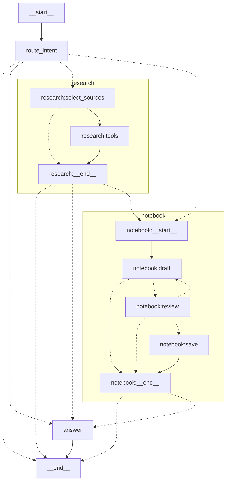

# Advanced Graph

`advanced-graph` is the demo's production-style, all-in-one, model-backed
chatbot. Use it like a normal assistant: chat, ask it to reason or write, attach
a file, request source-backed research, or explicitly ask it to remember
something. The graph routes only the turns that need research or durable
storage into small LangGraph subgraphs. Its implementation is an explicit
`StateGraph` with ordinary nodes, not a prebuilt `create_agent` loop.

Clients call it as the model `advanced-graph` through `POST /v1/responses`.
This model does not support Chat Completions or a graph-specific request
envelope. Its upstream model calls also use the Responses API, and all searches
and writes use real configured services rather than fixtures or mock results.

## At A Glance

The intent router chooses one of four paths from the user's latest request:

| What the user asks for | Intent | Graph path |
| --- | --- | --- |
| Conversation, reasoning, writing, coding, or attached-file Q&A | `chat` | Answer directly |
| Current, externally verified, cited, or shared-knowledge information | `research` | Select and search sources, then answer |
| “Remember,” “save,” or “add this to shared knowledge” | `save` | Draft a note, pause for review, then save or discard it |
| Research followed by durable storage | `research_and_save` | Run research, then the same reviewed save flow |

The intent is internal graph state, not a request field that clients set.
Normal chat is the default. Enabling Web search only makes it available; it
does not turn every message into a research request. Likewise, the graph never
saves information merely because it may be useful later—the user must ask.

## Quick Tour

After configuring `demo/.env`, start the [complete demo stack](../docker.md#compose-modes)
with `just demo/compose --dev`. Select `lgos-a/advanced-graph` in Chainlit or
**LGOS / lgos-a/advanced-graph** in Open WebUI, then try these in order:

| Feature | What to do | What to expect |
| --- | --- | --- |
| Generic chat | Ask `Explain why idempotency matters in two short paragraphs.` | A normal streamed answer; no research or write |
| File understanding | Attach a text or Markdown file, then ask `Summarize the attached file and repeat every identifier marked IMPORTANT exactly.` | The UI uploads the file to the central Files API; the graph reads it by `file_id` |
| Web search, status, and citations | Enable **Web search**, then ask `Search the current official LangGraph documentation for interrupt durability. Summarize it and cite the exact source URL.` | Live search status, a server-side search, and clickable citations |
| Subgraphs and human review | Keep Web search enabled and ask `Research the official LangGraph interrupt guidance, then save a concise cited note to shared knowledge. Ask me before writing.` | Research runs first, then an approval card shows the exact proposed note |
| Revision and persistence | Enter feedback such as `Keep only the durability rule and its source URL.`, then approve the revised note | Another review appears before the approved bytes are indexed |
| Knowledge retrieval | Ask `What does shared knowledge say about LangGraph interrupt durability?` | The research subgraph searches the saved note and cites its `[K#]`, filename, and file ID |

Choose **Reject** on any review to prove that the graph writes nothing before
approval. The [Python examples](#try-it) cover client-owned function calls and
native refusal or incomplete outcomes, which are less convenient to exercise
from a chat UI. UI-specific upload and review behavior remains documented in
[Chainlit](../chainlit.md) and [Open WebUI](../open-webui.md).

## Configuration

The capabilities use independent services. Configure the rows you plan to
exercise:

| Capability | Required service |
| --- | --- |
| All requests | Responses-capable model and the demo PostgreSQL runtime |
| Attached-file Q&A | Central OpenAI-compatible Files API |
| Public research | Configured HTTP search endpoint or upstream Responses web search |
| Shared-knowledge search and saving | OpenAI-compatible Files and vector-store service plus a vector-store ID |

??? info "Complete advanced-graph settings"

    Configure these values in `demo/.env`:

    ```dotenv
    DEMO_API_OPENAI_BASE_URL=https://api.openai.com/v1
    DEMO_API_OPENAI_API_KEY=...
    DEMO_API_OPENAI_MODEL=gpt-5.4-mini

    DEMO_API_FILES_BASE_URL=http://localhost:3006/v1

    DEMO_API_WEB_SEARCH_BACKEND=http
    DEMO_API_WEB_SEARCH_URL=https://searxng.example.com/search

    DEMO_API_VECTOR_STORE_BASE_URL=https://api.openai.com/v1
    DEMO_API_VECTOR_STORE_API_KEY=...
    DEMO_API_VECTOR_STORE_BIFROST_KEY_NAME=
    DEMO_API_VECTOR_STORE_ID=vs_...
    ```

    Set `DEMO_API_WEB_SEARCH_BACKEND=openai` to use the upstream model's native
    Responses web-search tool; `DEMO_API_WEB_SEARCH_URL` is then unused. The
    `http` backend accepts the configured SearXNG- or Degoog-compatible JSON
    endpoint.

    If `DEMO_API_VECTOR_STORE_BASE_URL` is blank, the adapter reuses the model
    endpoint and key. If it is set, the adapter uses its own key or `DUMMY` when
    that key is blank. `DEMO_API_VECTOR_STORE_BIFROST_KEY_NAME` is needed only
    when a Bifrost passthrough must pin stateful requests to one managed key.

Without `DEMO_API_VECTOR_STORE_ID`, chat, file input, and web search continue to
work. Knowledge search is unavailable, and a save request clearly reports that
nothing was stored. See [Run The Demo API](../api.md#start-postgresql-and-the-api)
for setup, or start the complete stack with `just demo/compose --dev`.

## Request Flow

One request moves through the graph as follows:

1. LGOS validates `POST /v1/responses`, converts the standard input items to
   LangChain messages, and places request tools and tool choice in runtime
   context.
2. `route_intent` uses a private structured model call to classify the latest
   turn. It sees recent conversation text and an attachment marker, not the
   downloaded file bytes.
3. `chat` goes to `answer`. `research` enters the research subgraph, where the
   model selects from the sources actually available for this request.
   `save` enters the notebook subgraph, and `research_and_save` runs both.
4. File content is resolved from the central Files API only inside a model node
   that needs it. Research uses LangGraph's `ToolNode`; saving uses
   `interrupt()` before any upload.
5. The `answer` node produces the only streamed answer tokens. LGOS maps the
   graph result, tool activity, status, citations, and terminal outcome back to
   standard Responses items and events.

`tool_choice` remains authoritative. `none` disables searches and client
functions; `required` with the public Web-search tool forces the research path;
a named client function forces the answer path. Client functions are returned
to the caller to execute—they never run inside this graph.

### What The Client Sees

| Graph behavior | Responses representation |
| --- | --- |
| Progress such as source selection or indexing | Streaming message with `phase="commentary"` |
| Chatbot answer | Message with `phase="final_answer"`; token deltas come only from `answer` |
| Public search | `web_search_call` plus `url_citation` annotations on supported answer text |
| Client function or human review | `function_call`; the next request sends matching `function_call_output` items |
| Model refusal | Native `refusal` message content |
| Output limit reached | `status="incomplete"` with `incomplete_details` |

The OpenAI SDK's `response.output_text` convenience property can concatenate
commentary and final text. Streaming clients should use each message's `phase`,
as the helper in [Try It](#try-it) does.

## LangGraph Topology

Generated from the compiled graph with
`get_graph(xray=True).draw_mermaid(with_styles=False)`. Mermaid-unsafe qualified
node IDs are aliased below; labels preserve LangGraph's names.



## Storage Boundaries

The graph deliberately separates conversation state, file transport, paused
execution, and durable knowledge:

| Data | Source of truth | Lifetime |
| --- | --- | --- |
| Completed conversation ledger | Calling client or UI | Defined by the client |
| User attachments | Configured central Files API | Defined by that service |
| Pending review and resume position | PostgreSQL LangGraph checkpointer | Across API restarts |
| Approved note contents and vector index | Configured OpenAI-compatible vector service | Until deleted there |
| Upload ID, digest, and indexing status | PostgreSQL LangGraph Store | Durable save receipt |
| Upstream model Response | Not retained (`store=false`) | One upstream call |

For ordinary chat, the client replays its conversation ledger. Only a paused
human-review turn uses `previous_response_id` to find its checkpoint. A file
attachment stays in the Files API: the graph checkpoints its opaque `file_id`
and resolves bytes only when a model node needs them. Attaching a file never
adds it to shared knowledge; that requires a separate, explicit, reviewed save.

The checkpointer stores graph execution snapshots; the LangGraph Store holds
small application records outside that state. The graph talks to durable
knowledge through a small `KnowledgeBase` interface (`vector_store_id`,
`search`, `upload`, and `index`). Its included adapter uses OpenAI-compatible
Files and vector-store endpoints, with credentials independent from the model
provider. Another compatible service can replace it without changing the graph
or the public Responses contract.

??? warning "Production storage and failure details"

    The LangGraph Store holds only a receipt, not a second copy of the note. The
    receipt prevents an automatic duplicate upload after an uncertain failure.
    A note is reported as searchable only after indexing completes; a bounded
    wait otherwise reports it as uploaded but not yet searchable.

    The configured vector store is a shared workspace, not an authorization
    boundary. Production deployments must add authentication, tenant isolation,
    retention, and deletion appropriate to their data. Retrieved snippets and
    attached-file contents are sent to the configured model provider as context.
    Source selection happens before search results return, so private results
    cannot influence that run's public query.

See the official OpenAI-compatible endpoint shapes for
[file search](https://developers.openai.com/api/docs/guides/tools-file-search)
and [vector-store search](https://developers.openai.com/api/reference/resources/vector_stores/methods/search),
and LangGraph's guidance for
[graphs](https://docs.langchain.com/oss/python/langgraph/graph-api),
[subgraphs](https://docs.langchain.com/oss/python/langgraph/use-subgraphs),
[persistence](https://docs.langchain.com/oss/python/langgraph/persistence), and
[interrupts](https://docs.langchain.com/oss/python/langgraph/interrupts).

## Try It

These Python examples expose the same `POST /v1/responses` behavior as the UI
tour. Copy the shared setup once, then expand only the feature you want to test.
The direct demo keeps the graph API and Files API independently addressable;
the maintained UIs route both through the configured gateway automatically.

??? example "Shared Python setup"

    The helper prints commentary as status and streams only the final answer.
    It also keeps prior output items in the wire form accepted on a later turn.

    ```python
    import json

    from openai import OpenAI

    MODEL = "advanced-graph"
    WEB_SEARCH = [{"type": "web_search"}]

    client = OpenAI(base_url="http://localhost:3004/v1", api_key="DUMMY")
    files = OpenAI(base_url="http://localhost:3006/v1", api_key="DUMMY")


    def run(input_items, **options):
        """Stream final text, show commentary statuses, and return the Response."""
        phases = {}
        with client.responses.stream(
            model=MODEL,
            input=input_items,
            store=False,
            **options,
        ) as stream:
            for event in stream:
                if (
                    event.type == "response.output_item.added"
                    and event.item.type == "message"
                ):
                    phases[event.output_index] = event.item.phase
                elif (
                    event.type == "response.output_text.delta"
                    and phases.get(event.output_index) == "final_answer"
                ):
                    print(event.delta, end="", flush=True)
                elif (
                    event.type == "response.output_text.done"
                    and phases.get(event.output_index) == "commentary"
                ):
                    print(f"\n[status] {event.text}")
            response = stream.get_final_response()
        print(f"\n[{response.status}]")
        return response


    def replay(response):
        """Keep the stateless input ledger required for a later chat turn."""
        items = []
        for item in response.output:
            value = item.model_dump(mode="json", exclude_none=True)
            value.pop("parsed_arguments", None)  # SDK-only streaming convenience field
            items.append(value)
        return items


    def url_citations(response):
        return [
            annotation.url
            for item in response.output
            if item.type == "message"
            for part in item.content
            if part.type == "output_text"
            for annotation in part.annotations
            if annotation.type == "url_citation"
        ]
    ```

### Generic Chat And Intent Routing

Supplying Web search makes it available but does not force an ordinary request
through research. LGOS is stateless after a completed response, so the client
owns the conversation ledger and replays prior output on the next turn.

??? example "Run a two-turn chat"

    ```python
    history = [
        {
            "role": "user",
            "content": "Compare Python lists and tuples in three concise bullets.",
        }
    ]
    first = run(history, tools=WEB_SEARCH)

    history.extend(replay(first))
    history.append({"role": "user", "content": "Now show one short example of each."})
    second = run(history, tools=WEB_SEARCH)
    ```

Use `tool_choice="none"` with the same request to disable both public and
private search. Use `previous_response_id` only for the paused HITL continuation
shown below, not for ordinary chat history.

### File Input

Upload once to the configured Files API and send only its opaque ID to the
Responses endpoint. The graph downloads the file only in a node that needs its
contents and does not copy its Base64 bytes into checkpoint state.

??? example "Upload, ask, and delete"

    ```python
    uploaded = files.files.create(
        file=("brief.txt", b"The project marker is FILE_INPUT_OK."),
        purpose="user_data",
    )
    try:
        result = run(
            [
                {
                    "role": "user",
                    "content": [
                        {
                            "type": "input_text",
                            "text": "Summarize this file and repeat its marker exactly.",
                        },
                        {"type": "input_file", "file_id": uploaded.id},
                    ],
                }
            ]
        )
    finally:
        files.files.delete(uploaded.id)
    ```

Uploading a file does not add it to shared knowledge. Persistence always uses
the separate reviewed flow.

### Server-Side Web Search, Status, And Citations

This request forces the registered server tool. The stream prints research
statuses before answer tokens, and the final Response contains a
`web_search_call` plus standard `url_citation` annotations when the backend
returns a usable source.

??? example "Force public Web search"

    ```python
    result = run(
        "Search the current official LangGraph documentation for interrupts. "
        "Explain interrupt() in one sentence and cite the exact source URL.",
        tools=WEB_SEARCH,
        tool_choice="required",
    )
    print("citations:", url_citations(result))
    print("items:", [item.type for item in result.output])
    ```

With the default `tool_choice="auto"`, the research subgraph can select public
web search, private `knowledge_search`, or both. Private search remains an
implementation detail; clients never send a non-standard file-search tool.

### Client-Owned Function Tools

The graph binds client function definitions to the answer model but never
executes them. Execute the returned call locally, append its output to the same
ledger, and resend the prior Response items in their accepted wire form.

??? example "Execute a client function and continue"

    ```python
    SUM_TOOL = [
        {
            "type": "function",
            "name": "calculate_sum",
            "description": "Add a list of integers.",
            "parameters": {
                "type": "object",
                "properties": {
                    "numbers": {"type": "array", "items": {"type": "integer"}}
                },
                "required": ["numbers"],
                "additionalProperties": False,
            },
            "strict": True,
        }
    ]
    ledger = [{"role": "user", "content": "Add 12, 30, and 5."}]
    called = run(
        ledger,
        tools=SUM_TOOL,
        tool_choice={"type": "function", "name": "calculate_sum"},
    )
    call = next(item for item in called.output if item.type == "function_call")
    arguments = json.loads(call.arguments)
    print("arguments:", arguments)

    # The client owns and executes the function.
    ledger.extend(replay(called))
    ledger.append(
        {
            "type": "function_call_output",
            "call_id": call.call_id,
            "output": json.dumps({"total": sum(arguments["numbers"])}),
        }
    )
    completed = run(ledger, tools=SUM_TOOL)
    ```

### HITL, Subgraphs, And Persistent Knowledge

Human-in-the-loop (HITL) review is the point where the graph pauses for a user
decision. This combined request traverses both subgraphs: research runs first,
then the notebook drafts exact Markdown and returns `lgos_interrupt`. The pause
is checkpointed, so the response can be resumed after an API restart. No note
is uploaded before approval. Leave `tool_choice` at its default here so intent
routing can select the combined path; `tool_choice="required"` deliberately
forces the public Web-search path for that request.

??? example "Research, revise, approve, and retrieve"

    ```python
    def interrupt_calls(response):
        return [
            item
            for item in response.output
            if item.type == "function_call" and item.name == "lgos_interrupt"
        ]


    def resume_review(response, decision, **options):
        calls = interrupt_calls(response)
        return run(
            [
                {
                    "type": "function_call_output",
                    "call_id": call.call_id,
                    "output": decision,
                }
                for call in calls
            ],
            previous_response_id=response.id,
            **options,
        )


    pending = run(
        "Research the official LangGraph interrupts page. Then save a concise "
        "cited note to shared knowledge and ask me to approve it before writing.",
        tools=WEB_SEARCH,
    )
    for call in interrupt_calls(pending):
        print(json.dumps(json.loads(call.arguments), indent=2))

    # Free text requests a revision and produces another interrupt.
    pending = resume_review(
        pending,
        "Keep only the durability rule and its exact source URL.",
        tools=WEB_SEARCH,
    )

    # Use "reject" here instead to finish without writing anything.
    completed = resume_review(
        pending,
        "approve",
        tools=WEB_SEARCH,
    )

    # A later request searches the indexed note through the private subgraph tool.
    readback = run(
        "What does shared knowledge say about LangGraph interrupt durability?"
    )
    ```

!!! warning "Approval writes durable shared data"

    Run the approval example against a disposable vector store unless you want
    to retain the note. The configured store is shared and is not a tenant or
    authorization boundary.

### Refusal And Incomplete Outcomes

The graph does not use magic prompts or mock results to manufacture these
outcomes. If any upstream model step returns refusal content or an incomplete
status, LGOS preserves it in the final Response. Inspect every result rather
than assuming `output_text` is present:

??? example "Inspect terminal outcomes"

    ```python
    def inspect_outcome(response):
        print("status:", response.status)
        if response.incomplete_details is not None:
            print("incomplete reason:", response.incomplete_details.reason)
        for item in response.output:
            if item.type != "message":
                continue
            for part in item.content:
                if part.type == "refusal":
                    print("refusal:", part.refusal)


    inspect_outcome(result)
    ```

A refusal is message content and can accompany a completed Response; an
incomplete run instead ends with `status="incomplete"` and
`incomplete_details`. HTTP and provider failures remain errors rather than being
rewritten as either outcome.
