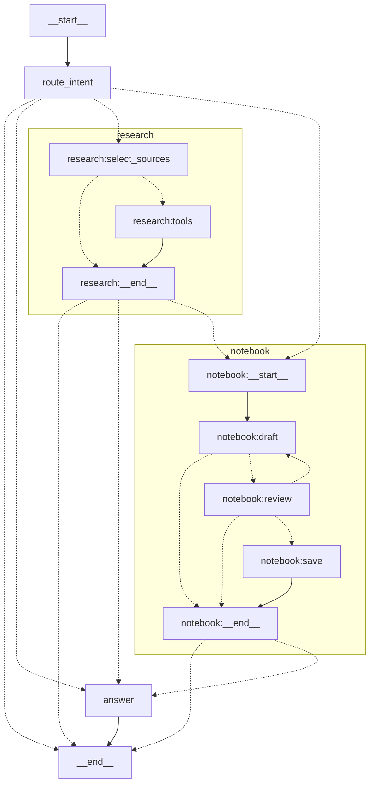
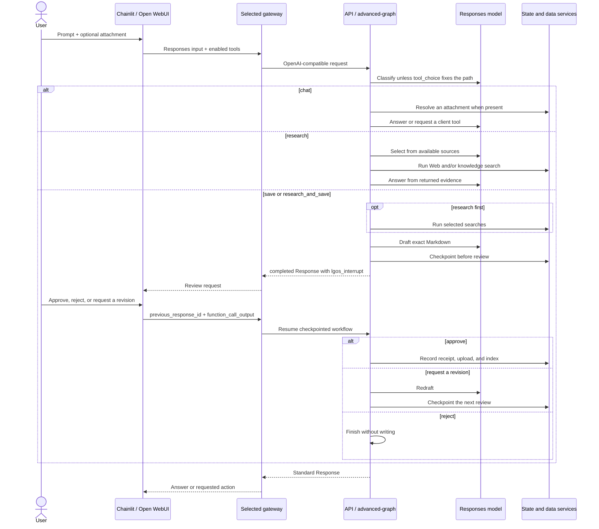

# Advanced Graph

`advanced-graph` is the demo's production showcase: one real model-backed
assistant that combines normal chat, file understanding, gateway MCP tools,
source-backed research, streaming progress, and reviewed durable knowledge.
It uses an explicit LangGraph `StateGraph` so routing, side effects, and
persistence boundaries remain visible.
Other demo graphs isolate individual mechanisms; this graph shows how those
mechanisms compose without changing the OpenAI-facing contract.

Clients use it as the model `advanced-graph` through `POST /v1/responses`.
There is no graph-specific request envelope, and the graph is not available
through Chat Completions because its interrupt workflow requires Responses.
Its upstream model calls also use the Responses API with `store=false`.

The model advertises five LGOS capabilities:

- `background` for running the same agent as a polled background Response;
- `client_events` for streaming status commentary;
- `file_inputs` for Files API attachments;
- `interrupts` for review and resume;
- `mcp_tools` so maintained UIs attach tools authorized by their selected
  gateway.

These capabilities describe the client contract. They do not add a graph-side
connection to a UI, gateway, or MCP server.

## Workflows

The router classifies the latest user request into one of four explicit paths:

| User intent | Path | Result |
| --- | --- | --- |
| Conversation, reasoning, writing, coding, file Q&A, or client tools | `chat` | Answer directly or return a client-owned function call |
| Current public facts or shared knowledge | `research` | Select available sources, search, then answer from evidence |
| Explicitly remember or save information | `save` | Draft a Markdown note and pause before writing it |
| Research and then remember the result | `research_and_save` | Research first, then run the same reviewed save workflow |

Chat is the default. Making Web search available does not force research, and
the graph never infers a save merely because information could be useful later.
The user must ask for persistence explicitly.

OpenAI `tool_choice` remains authoritative:

- a named client function selects the chat path;
- `required` with Web search available selects the research path;
- `none` disables client functions and both public and private search.

## LangGraph Topology

This is the compiled graph's native `xray=True` topology. Qualified node IDs
are aliased only where Mermaid cannot render them safely.



The research subgraph makes one source-selection pass, executes the returned
calls, and exits without a tool loop. The notebook subgraph keeps every
mutation after review: feedback returns to `draft`, reject ends without a
write, and approval alone reaches `save`.

## Request Flow

The graph's chat, research, and reviewed-save routes are the same in both
execution modes. Request delivery differs:

| Mode | Where the graph runs | How the UI receives the result |
| --- | --- | --- |
| Foreground | API process | The create request returns the result, optionally with streaming and commentary |
| **Run in background** enabled | Independent Hatchet worker | Create returns a queued Response ID; the UI polls until it receives an answer or review call |

The diagram below shows **foreground delivery**, including a review and its
continuation. A review completes its Response while the graph stays paused at
a checkpoint. For background delivery, follow the
[create, poll, and cancel diagram](background-mock.md#request-flow) and the
[interrupt/resume diagram](background-interrupt.md#request-flow), using
`advanced-graph` as the model. The [Background Execution](#background-execution)
section explains how those lifecycles apply to reviewed saves.



For each initial request, the graph runs these steps in the API process or
background worker:

1. LGOS validates the standard Responses request, converts input items to
   LangChain messages, and supplies normalized tools and `tool_choice` as
   request-scoped context.
2. `route_intent` first honors a forced `tool_choice`; otherwise it classifies
   recent conversation text plus an attachment marker. It does not download
   attachment bytes.
3. The selected path runs. Files are resolved only inside a model node that
   needs them; research and note drafting use private
   `ChatOpenAI(disable_streaming=True)` calls.
4. With foreground streaming enabled, `answer` is the only token-streaming model
   call. Research and notebook status events appear as commentary. Background
   clients receive the polled result without streaming or commentary.
5. LGOS maps the result to standard Responses messages, tool calls, citations,
   terminal status, or an interrupt continuation.

### Tool Ownership

The showcase deliberately exercises different tool lifecycles without hiding
them behind one agent loop:

| Tool or action | Execution owner | Continuation |
| --- | --- | --- |
| Gateway MCP or another client function | Calling UI or client | LGOS returns `function_call`; the client executes it and sends `function_call_output` in a new request |
| Public `web_search` | Graph runtime | The research subgraph executes it and returns `web_search_call` in the same Response |
| Private `knowledge_search` | Research subgraph | It is selected and executed internally; clients never send or receive its tool definition |
| `lgos_interrupt` review | Graph and client | The graph checkpoints the pause; the client resumes it with `previous_response_id` and `function_call_output` |

MCP discovery, credentials, and execution stay in the UI and gateway. The
graph receives ordinary client function schemas and treats returned values as
untrusted evidence. It does not know which MCP server supplied a tool. See
[PostgreSQL Through Native MCP](mcp-postgres.md) for the specialized,
allowlisted database example.

Public and private searches are chosen in one selection step before either
result returns, so private knowledge results cannot shape that run's public
query. The selector is also instructed not to put private document text,
credentials, or personal data into a Web search query. This is model guidance,
not an authorization boundary.

## Persistence And Ownership

| Data | Source of truth | Lifetime |
| --- | --- | --- |
| Conversation and rendered UI elements | Chainlit or Open WebUI | Defined by the client |
| MCP server catalog and authorization | Selected gateway | Gateway configuration and credential grant |
| MCP client session and execution | Chainlit or Open WebUI | UI session |
| User attachment | Central Files API | Defined by the Files service |
| Pending note review and resume position | LangGraph PostgreSQL checkpointer | Across API restarts until terminal cleanup |
| Approved note and searchable content | Configured Files and vector-store service | Until removed from that service |
| Save receipt: digest, file ID, and index status | LangGraph PostgreSQL Store | Durable application record |
| Same-run coordination lease | PostgreSQL run coordinator | One initial or resume request |
| Each upstream model Response | Not retained (`store=false`) | One model call |

Completed conversations remain stateless at LGOS: the client replays the input
ledger needed for another turn. `previous_response_id` is reserved for resuming
a paused review; it is not conversation storage. See
[Stateless item continuation](../../explanation/openai-compatibility.md#stateless-item-continuation)
for the shared wire contract.

The run coordinator holds a lease only while an initial or resume request is
executing, not while a person reviews the note. Competing work for the same
paused run is rejected; unrelated runs remain independent. Terminal execution
cleans up its checkpoint.

Attachments remain opaque Files API IDs in checkpoint state and are resolved
only when needed. Attaching a file does not add it to shared knowledge. A save
request drafts the exact Markdown first, then:

1. review pauses before any upload;
2. feedback redrafts under the same note identity and pauses again;
3. reject completes without uploading;
4. approve records a content digest, uploads the approved bytes, and indexes
   the resulting file;
5. an uncertain upload is not repeated blindly on retry.

The Store keeps only the receipt, not another copy of the note. Indexing is
bounded; if it does not complete, the final answer reports the non-indexed
status instead of claiming that the note is searchable.

!!! warning "Shared knowledge is not an authorization boundary"

    The configured vector store is shared. A production deployment must add
    authenticated tenant isolation, authorization, retention, and deletion at
    the application and storage boundaries. Caller-provided IDs are
    correlation values, not proof of identity. Attachment and retrieved
    contents are sent to the configured model as context.

## Background Execution

Send `background=true`, or enable **Run in background** in either UI, to run the
same agent in the independently deployed Hatchet worker and poll it by Response
ID. The worker builds the graph with the same model, knowledge, files, and
PostgreSQL checkpointer and Store as the API. In background mode:

- the final Response carries the answer, tool items, and citations; streaming
  and status commentary are not delivered;
- a request that reaches the save-note approval completes with the same
  `lgos_interrupt` call as a foreground turn; the graph remains checkpointed
  while both UIs show the review;
- each review answer creates a new background Response ID while **Run in
  background** stays enabled. Approval runs the save, rejection finishes without
  writing, and revision feedback can complete with another review call.

Stop requests cancellation of the active Response being polled. At a review,
choose **Reject** to finish without saving; cancelling the already completed
review Response leaves the graph paused. See the
[cancellation-by-stage diagram](background-interrupt.md#cancellation).
Cancellation cannot undo an upload or indexing operation that already succeeded.

The linked background examples exercise these lifecycles deterministically
without model calls.

## Output And Failure Behavior

| Graph behavior | Responses representation |
| --- | --- |
| Streamed progress | Completed message with `phase="commentary"` |
| Assistant answer | Message with `phase="final_answer"`; token deltas come only from `answer` |
| Supported public citation | `url_citation` annotation whose URL came from Web search output |
| Client tool or review request | `function_call` |
| Provider refusal | Native `refusal` content |
| Provider output limit or filtering | `status="incomplete"` with `incomplete_details` |

Plain chat emits no synthetic commentary. If no research tool runs, the answer
states that no external source returned evidence. If shared knowledge is not
configured, chat, attachments, Web search, and client tools continue to work,
while knowledge search is omitted and save requests report that nothing was
stored. Provider and transport failures remain errors rather than being
rewritten as refusals or incomplete responses.

Web citations are added only when an answer uses an exact URL returned by the
configured search tool. Private results use their `[K#]` label, filename, and
file ID in text instead of pretending to be public URL citations. See
[Citation ownership](../../explanation/openai-compatibility.md#citation-ownership)
and [Responses output](../../explanation/openai-compatibility.md#responses-output)
for the shared API rules.

## Dependencies

| Path | Required service |
| --- | --- |
| Every request | Responses-capable upstream model and demo PostgreSQL runtime |
| File understanding | Central OpenAI-compatible Files API |
| MCP tools | Selected gateway with an MCP server authorized for the UI credential |
| Public research | Configured HTTP search endpoint or upstream Responses Web search |
| Shared-knowledge read and write | OpenAI-compatible Files and vector-store service plus a vector-store ID |

??? example "Relevant `demo/.env` values"

    Start from the checked-in `demo/.env.example`. These are the values users
    typically choose for the complete `advanced-graph` showcase:

    ```dotenv
    LGOS_GATEWAY_PORT=3000
    OPENAI_GATEWAY_TYPE=bifrost
    OPENAI_GATEWAY_API_KEY=sk-bf-replace-me

    DEMO_API_OPENAI_BASE_URL=https://api.openai.com/v1
    DEMO_API_OPENAI_API_KEY=replace-me
    DEMO_API_OPENAI_MODEL=gpt-5.4-mini
    DEMO_API_WEB_SEARCH_BACKEND=openai

    DEMO_API_VECTOR_STORE_BASE_URL=
    DEMO_API_VECTOR_STORE_API_KEY=
    DEMO_API_VECTOR_STORE_ID=vs_replace_me
    ```

    Set `OPENAI_GATEWAY_TYPE=litellm` to use LiteLLM with the same gateway
    credential. A blank vector-store ID disables only shared-knowledge search
    and saving. The full [settings reference](../reference.md#demo-api-settings)
    covers a separate vector provider and the HTTP search backend.

The graph depends on a small knowledge interface for search, upload, and
indexing. The included adapter uses OpenAI-compatible Files and vector-store
endpoints; another compatible implementation can replace it without changing
the graph or public Responses contract.

Complete defaults and startup instructions remain in their canonical owners:
[Docker Compose](../docker.md#compose-modes), the
[Demo API settings](../reference.md#demo-api-settings), and the [graph
dependency matrix](index.md). The graph follows LangGraph's documented
[StateGraph](https://docs.langchain.com/oss/python/langgraph/graph-api),
[subgraph](https://docs.langchain.com/oss/python/langgraph/use-subgraphs),
[persistence](https://docs.langchain.com/oss/python/langgraph/persistence), and
[interrupt](https://docs.langchain.com/oss/python/langgraph/interrupts)
semantics.

## Try It

With the [complete demo stack](../docker.md#demo-services) running, use either
maintained UI:

=== "Chainlit"

    Open `http://localhost:3002` and select `lgos-a/advanced-graph` or
    `lgos-b/advanced-graph`. Enable **Web search** for public research. Before
    the MCP prompt, open the MCP menu and click **Connect** beside
    `lgos-gateway`.

=== "Open WebUI"

    Open `http://localhost:3003` and select
    **LGOS / lgos-a/advanced-graph** or **LGOS / lgos-b/advanced-graph**.
    Enable the **Web search** Chat Variable for public research. The gateway MCP
    connection is already attached to the generated Workspace Model.

Try these paths:

| Path | Prompt or action | Expected behavior |
| --- | --- | --- |
| Chat | `Explain why idempotency matters in two short paragraphs.` | A normal streamed answer without research status |
| Gateway MCP | `How many Chainlit users do I have? How many conversations does each of them have?` | The UI executes read-only reports through the selected gateway and returns the evidence to the graph |
| File understanding | Attach a text or Markdown file, then ask `Summarize this file and repeat every identifier marked IMPORTANT exactly.` | The graph reads the attachment through its Files API ID |
| Public research | `Search the current official LangGraph documentation for interrupt durability. Summarize it and cite the exact source URL.` | Source-selection and search status followed by a cited answer |
| Research and review | `Research the official LangGraph interrupt guidance, then save a concise cited note to shared knowledge. Ask me before writing.` | Research runs, then an approval card shows the exact proposed note |
| Revision | Enter `Keep only the durability rule and its source URL.` | The graph redrafts and asks for approval again without writing |
| Persistence | Approve the revision, then ask `What does shared knowledge say about LangGraph interrupt durability?` | The approved bytes are indexed and a later turn can retrieve them |

Choose **Reject** at review to verify that no note is uploaded. UI-specific
upload, MCP, and interrupt rendering details belong to the
[Chainlit](../chainlit.md) and [Open WebUI](../open-webui.md) guides.

### Python SDK

These examples use the bundled LiteLLM gateway to keep the demo focused on one
runnable path. Start the stack with `OPENAI_GATEWAY_TYPE=litellm`. Bifrost can
serve the same graph, but its native routing details are kept in the
[Bifrost gateway guide](../bifrost.md).

Every tab reuses one OpenAI client and the same gateway credential as the UIs.

```python title="LiteLLM gateway setup"
import json
import os

from openai import OpenAI

gateway_url = f"http://localhost:{os.getenv('LGOS_GATEWAY_PORT', '3000')}/v1"
client = OpenAI(
    base_url=gateway_url,
    api_key=os.environ["OPENAI_GATEWAY_API_KEY"],
)
model = "lgos-a/advanced-graph"
files_query = {"provider": "litellm_proxy"}


def respond(input_items, **options):
    return client.responses.create(
        model=model,
        input=input_items,
        store=False,
        **options,
    )
```

These calls use standard Responses and Files fields. They do not create an MCP
session; use Chainlit or Open WebUI for native gateway MCP. The client-function
tab shows the same function-call continuation those UIs use after executing an
MCP tool.

=== "Chat"

    ```python
    response = respond("Explain why idempotency matters in two short paragraphs.")
    print(response.output_text)
    ```

=== "File input"

    ```python
    uploaded = client.files.create(
        file=("brief.txt", b"The project marker is FILE_INPUT_OK."),
        purpose="user_data",
        extra_query=files_query,
    )
    try:
        response = respond(
            [
                {
                    "role": "user",
                    "content": [
                        {"type": "input_text", "text": "Summarize this file."},
                        {"type": "input_file", "file_id": uploaded.id},
                    ],
                }
            ]
        )
        print(response.output_text)
    finally:
        client.files.delete(uploaded.id, extra_query=files_query)
    ```

=== "Web research"

    ```python
    response = respond(
        "Find the current LangGraph interrupt guidance and cite it.",
        tools=[{"type": "web_search"}],
        tool_choice="required",
    )
    citations = [
        annotation.url
        for item in response.output
        if item.type == "message"
        for part in item.content
        if part.type == "output_text"
        for annotation in part.annotations
        if annotation.type == "url_citation"
    ]
    print(response.output_text)
    print(citations)
    ```

=== "Client function"

    ```python
    tool = {
        "type": "function",
        "name": "calculate_sum",
        "description": "Add a list of integers.",
        "parameters": {
            "type": "object",
            "properties": {
                "numbers": {"type": "array", "items": {"type": "integer"}}
            },
            "required": ["numbers"],
            "additionalProperties": False,
        },
        "strict": True,
    }
    ledger = [{"role": "user", "content": "Add 12, 30, and 5."}]
    called = respond(
        ledger,
        tools=[tool],
        tool_choice={"type": "function", "name": "calculate_sum"},
    )
    call = next(item for item in called.output if item.type == "function_call")
    arguments = json.loads(call.arguments)

    ledger.extend(called.output)
    ledger.append(
        {
            "type": "function_call_output",
            "call_id": call.call_id,
            "output": json.dumps({"total": sum(arguments["numbers"])}),
        }
    )
    completed = respond(ledger, tools=[tool])
    print(completed.output_text)
    ```

=== "Reviewed save"

    ```python
    pending = respond("Remember this exact note: retries need idempotency keys.")
    review = next(
        item
        for item in pending.output
        if item.type == "function_call" and item.name == "lgos_interrupt"
    )
    print(json.loads(review.arguments))

    completed = respond(
        [
            {
                "type": "function_call_output",
                "call_id": review.call_id,
                "output": "approve",  # Or "reject" or revision feedback.
            }
        ],
        previous_response_id=pending.id,
    )
    print(completed.output_text)
    ```

For a background save, follow the
[background review SDK example](background-interrupt.md#python-sdk) with this
page's gateway client and `advanced-graph` model name. Use a prompt that explicitly
asks to save a note, omit the mock-specific `delay_seconds` metadata, and inspect
the returned review content before approving. Approval uploads and indexes the
actual note. The shared [polling helper](../api.md#background-python-client)
works with either client;
background calls use `client.responses.create` directly with `background=True`
and `store=True`.

For the complete client contract, including streaming commentary and terminal
events, see [OpenAI Clients](../../tutorials/openai-clients.md).
