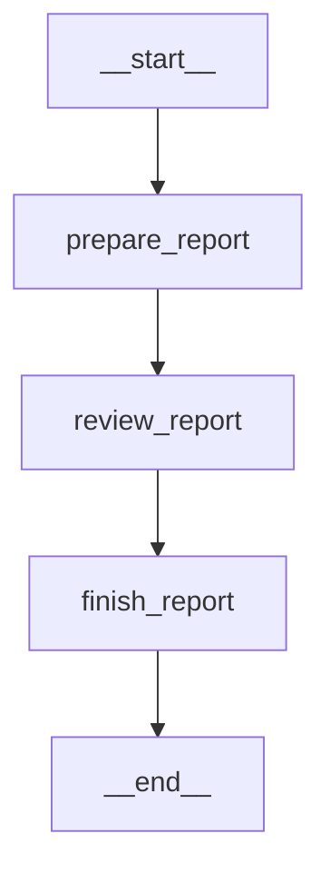
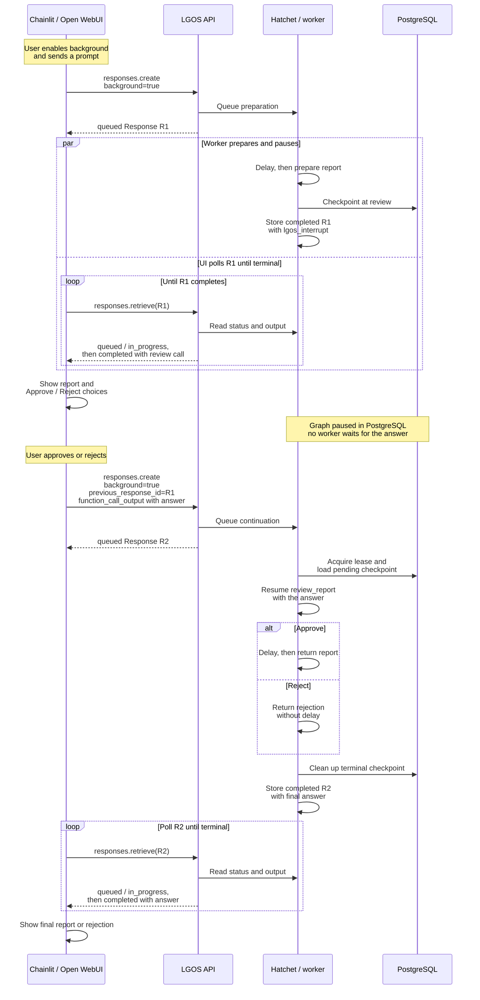
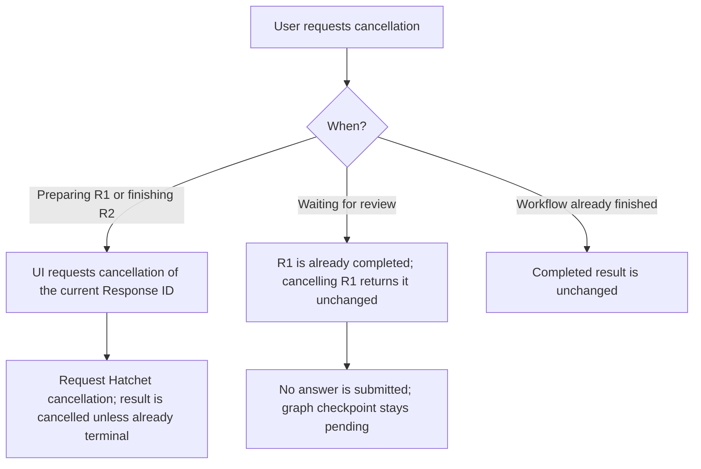

# Background Interrupt

`background-interrupt` demonstrates deterministic background execution, human
review, and background resumption. It prepares a mock report, always asks for
approval, and finishes only after approval. It calls no model and performs no
external action. Hatchet executes background requests; PostgreSQL preserves the
paused graph and coordinates execution across the API and worker processes.

Use [`background-mock`](background-mock.md) for basic polling and cancellation,
or [`advanced-graph`](advanced-graph.md#background-execution) for a real agent
that combines background execution with reviewed work.

## LangGraph Topology



## Request Flow

Select `background-interrupt` and enable **Run in background** before sending
the prompt. Keep the switch enabled when answering the review so the
continuation also runs in the worker. Selecting the model alone does not enable
background execution.

The UI's API calls below pass through the selected gateway. **Hatchet / worker**
combines the job service and its independent worker. `R1` and `R2` label two
different Response IDs belonging to one graph workflow.



At review, **R1 is completed while the graph is paused**. Resuming creates R2;
polling R1 again continues to return the original review call. There is no
separate paused Response status. The answer uses the exact `call_id` from R1
in a `function_call_output` item. For the exact SDK fields, see
[Python SDK example](#python-sdk).

### Cancellation

The outcome depends on whether a background Response is still active:



For active work, Stop sends a best-effort `responses.cancel` request for the ID
currently being polled: R1 during preparation or R2 during continuation.
Cancelling R1 after R2 has started cannot stop R2. The
[Background Mock cancellation flow](background-mock.md#cancellation) owns the
shared cancellation and completion-race details.

At review, choose **Reject** to resume and finish the workflow without approving
the report. Dismissing or cancelling a review without sending an answer leaves
the checkpoint pending. Open WebUI's review-card **Cancel** has this behavior;
see [Open WebUI human review](../open-webui.md#interrupt-input) and
[Chainlit human review](../chainlit.md#interrupt-demo) for each UI's controls
and saved-review recovery.

### Delay And Review Settings

`delay_seconds` defaults to 5 and accepts integers from 0 to 300. It controls
preparation on the initial request and finishing on an approved continuation.
It is a per-request setting: send it on each request when overriding the default.
Both maintained UIs expose it in the model settings. SDK clients use:

```python
metadata={"lgos_settings": '{"delay_seconds": 10}'}
```

The review accepts only `approve` or `reject`, ignoring case and surrounding
whitespace. It does not offer free-text revisions. An invalid answer raises an
error; a background continuation then fails.

## Persistence And Ownership

The graph declares `BACKGROUND` and `INTERRUPTS` and is registered under the
same model ID in the API and worker. Both use the shared PostgreSQL checkpointer
and run coordinator. The prepared report survives a process restart while
review is pending; LGOS cleans up the checkpoint after terminal execution.

Preparation has its own node because LangGraph restarts an interrupted node
when resuming. Only the review node restarts after an answer; preparation does
not run again on normal resumption. See the official
[interrupt rules](https://docs.langchain.com/oss/python/langgraph/interrupts#rules-of-interrupts).

Hatchet stores each background Response independently of the graph checkpoint.
The client owns the saved Response ID and exact function call needed to resume;
LGOS does not store UI conversation history. This graph uses no LangGraph Store
and does not upload or publish the report.

The same graph can run and resume through foreground Responses. Its interrupt
capability requires Responses; Chat Completions cannot invoke it. For the shared
continuation and cleanup rules, see
[Resuming an interrupt](../../explanation/openai-compatibility.md#resuming-an-interrupt).

## Try It

Start the background services described in
[Docker Compose](../docker.md#demo-services), including PostgreSQL, Hatchet, the
API, and the background worker. After syncing the gateway model catalog, select
`background-interrupt` in [Chainlit](../chainlit.md) or
[Open WebUI](../open-webui.md) and enable **Run in background**.

Send `Quarterly risks`. After the preparation delay, approve the report to watch
a second background run finish with `Background report for: Quarterly risks`.
Start another request and choose **Reject** to see the rejection result.
Keep **Run in background** enabled while answering the review.

The live gateway suite covers background approval and resumption:

```bash
just demo/test-background-gateway --editable
```

General polling, cancellation, deployment wiring, and gateway requirements
remain in [Run Responses In The Background](../../how-to-guides/background-responses.md).

The implementation is in
`demo/api/src/lgos_demo_api/graphs/background_interrupt.py`.
Both background demos share their report generation and delay settings in
`background_report.py`.

### Python SDK

Run the shared [background Python client setup](../api.md#background-python-client)
first. This example prepares the report, prints the review, and approves it in a
second background Response:

```python
model = "background-interrupt"
metadata = {"lgos_settings": '{"delay_seconds": 5}'}

with client:
    pending = poll(client.responses.create(
        model=model,
        input="Quarterly risks",
        background=True,
        metadata=metadata,
    ))
    reviews = [
        item for item in pending.output
        if item.type == "function_call" and item.name == "lgos_interrupt"
    ]
    for review in reviews:
        print(review.arguments)

    completed = poll(client.responses.create(
        model=model,
        previous_response_id=pending.id,
        input=[
            {
                "type": "function_call_output",
                "call_id": review.call_id,
                "output": "approve",
            }
            for review in reviews
        ],
        background=True,
        metadata=metadata,
    ))
    print(completed.output_text)
```

Change `approve` to `reject` to skip finishing. The first Response completes
with a review call; the second has its own ID and final result. Each request
resends the delay setting. To stop active work, cancel the ID currently being
polled as shown in [Background Mock](background-mock.md#python-sdk).
