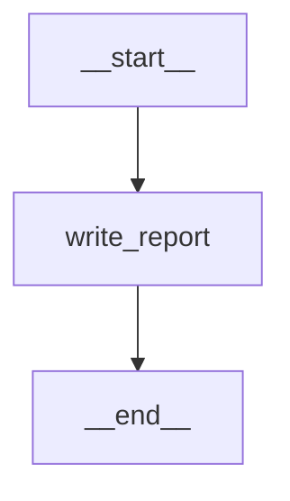
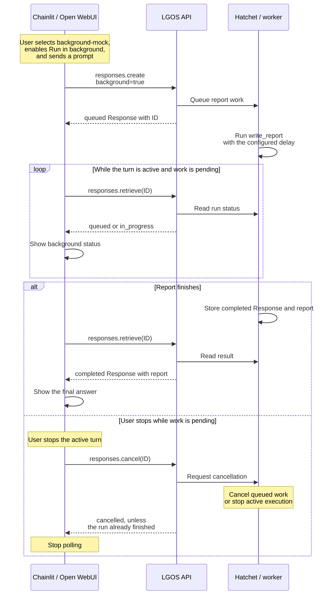

# Background Mock

`background-mock` is a deterministic, polling-only background graph that
shows background execution working. It calls no model, so it needs no provider.
Its one node waits for a configurable delay, which leaves time to watch the
Response move from queued to in progress and to cancel it. For deterministic
human review and background resumption, use
[`background-interrupt`](background-interrupt.md). For a real agent
running in the background, use
[`advanced-graph`](advanced-graph.md#background-execution).

The graph declares `GraphFeature.BACKGROUND`. The API submits the request to
Hatchet; an independently deployed worker executes the graph, and Hatchet
stores the resulting Response.

## Topology



`write_report` waits for the `delay_seconds` setting, then replies with a fixed
report that quotes the caller's last message.

`delay_seconds` is a public graph setting: 5 seconds by default, from 0 to 300.
Chainlit and Open WebUI show it with the model's other settings, and SDK
clients send it in `metadata.lgos_settings`:

```python
metadata={"lgos_settings": '{"delay_seconds": 30}'}
```

## Request Flow

Selecting a background-capable model makes **Run in background** available.
Enable it before sending the prompt. The UI then creates a background Response
and polls its ID; selecting the model alone does not enable background execution.
The UI's API calls below pass through the selected LiteLLM or Bifrost gateway.
**Hatchet / worker** combines the job service and its independent worker.



A run that raises fails its Response; create a new one to try again. Hatchet
reassigns a run whose worker dies, and that run starts over.

### Cancellation

The UI makes a best-effort cancellation request when a polling turn is stopped.
SDK clients can call `responses.cancel(response_id)` directly and retrieve the
same ID to check its status. If work finishes before cancellation takes effect,
its terminal result is kept. Cancelling an already finished Response returns it
unchanged. Cancellation does not undo completed side effects; this mock performs
none. See the shared [background client contract](../../how-to-guides/background-responses.md#client-contract).

This graph never pauses for review. The
[Background Interrupt request flow](background-interrupt.md#request-flow) shows
how a completed review Response leads to a new background continuation, and
[its cancellation diagram](background-interrupt.md#cancellation) distinguishes
stopping active work from leaving a review unanswered.

## Run It

Start the stack with the worker as described under **Background Worker** in
[Docker Compose](../docker.md#demo-services), then run the live gateway test:

```bash
just demo/test-background-gateway --editable
```

The live test selects LiteLLM's `/v1` route and synced model, or Bifrost's
`/openai/v1` route and unqualified model, from `OPENAI_GATEWAY_TYPE`.

Open Chainlit on port 3002 or Open WebUI on port 3003, select a
`background-mock` model, and enable **Run in background**. The UI shows
queued and in-progress states, polls the Response ID, and renders the normal
final answer. Stopping the active turn requests Responses cancellation.

For local processes, run the API, worker, and Hatchet service separately:

```bash
just demo/api --editable
just demo/background-worker --editable
```

The graph's advertised model entry exists even when the background runtime is
disabled, but `background=true` creation then fails explicitly because no
backend is configured.

See [Run Responses In The Background](../../how-to-guides/background-responses.md)
for a polling client, deployment wiring, cancellation, and gateway
requirements.

### Python SDK

Run the shared [background Python client setup](../api.md#background-python-client)
first, then choose an example. Both call this graph through the direct API.

=== "Create and poll"

    ```python
    with client:
        created = client.responses.create(
            model="background-mock",
            input="Quarterly risks",
            background=True,
            metadata={"lgos_settings": '{"delay_seconds": 5}'},
        )
        print(created.id, created.status)
        completed = poll(created)
        print(completed.output_text)
    ```

    The final text is `Background report for: Quarterly risks`.

=== "Cancel"

    ```python
    with client:
        created = client.responses.create(
            model="background-mock",
            input="Cancel this report",
            background=True,
            metadata={"lgos_settings": '{"delay_seconds": 30}'},
        )
        cancelled = client.responses.cancel(created.id)
        print(cancelled.status)
        final = client.responses.retrieve(created.id)
        print(final.id, final.status)
    ```

    The delay leaves time to cancel. The same ID normally becomes `cancelled`;
    a run that already finished retains its terminal result.

## Boundaries

This graph has no tools and does not demonstrate UI conversation persistence.
The UIs poll only while the current turn is active; they do not persist a
background Response ID across a browser refresh. SDK clients can persist the ID
and resume polling through either tested gateway route documented in the
[proxy guide](../../how-to-guides/openai-proxies.md).

The implementation lives in
`demo/api/src/lgos_demo_api/graphs/background_mock.py`. The API-side backend
is in `demo/api/src/lgos_demo_api/background/components.py`;
`demo/api/src/lgos_demo_api/background/worker.py` provides the separately
deployed worker.
