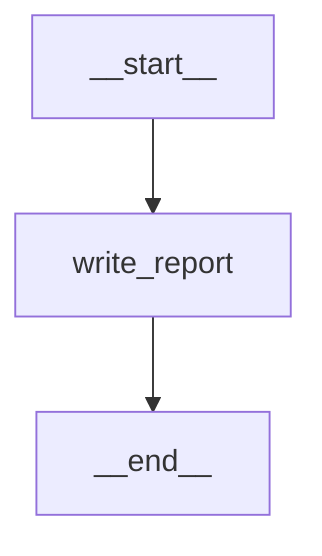
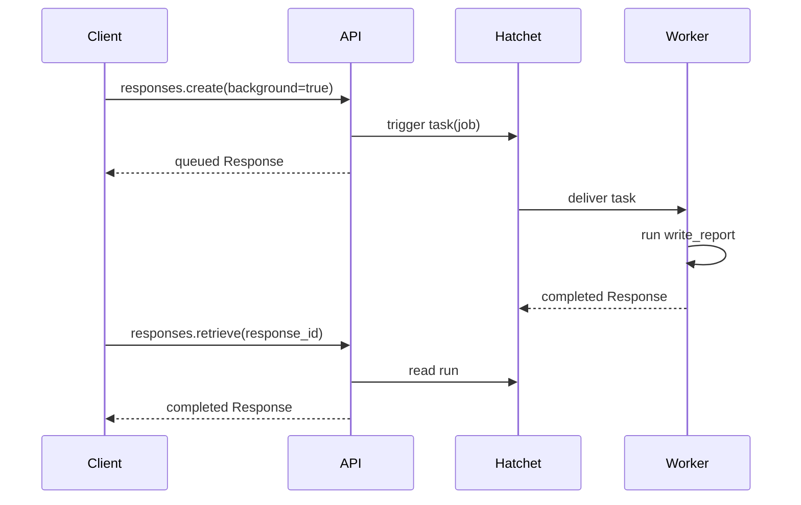

# Background Report Agent

`background-report-agent` is a deterministic, polling-only background graph that
shows background execution working. It calls no model, so it needs no provider.
Its one node waits for a configurable delay, which leaves time to watch the
Response move from queued to in progress and to cancel it. For a real agent
running in the background, use
[`advanced-graph`](advanced-graph.md#background-execution).

The graph declares `GraphFeature.BACKGROUND`. The API submits the request to
Hatchet; an independently deployed worker executes the graph, and Hatchet
stores the resulting Response.

## Topology



`write_report` waits for the `delay_seconds` setting, then replies with a fixed
report that quotes the caller's last message.

`delay_seconds` is a public graph setting: 5 seconds by default, from 0 to 300.
Chainlit and Open WebUI show it with the model's other settings, and SDK
clients send it in `metadata.lgos_settings`:

```python
metadata={"lgos_settings": '{"delay_seconds": 30}'}
```

## Lifecycle



A run that raises fails its Response; create a new one to try again. Hatchet
reassigns a run whose worker dies, and that run starts over.

## Run It

Start the stack with the worker as described under **Background Worker** in
[Docker Compose](../docker.md#demo-services), then run the live gateway test:

```bash
just demo/test-background-gateway --editable
```

The live test selects LiteLLM's `/v1` route and synced model, or Bifrost's
`/openai/v1` route and unqualified model, from `OPENAI_GATEWAY_TYPE`.

Open Chainlit on port 3002 or Open WebUI on port 3003, select a
`background-report-agent` model, and enable **Run in background**. The UI shows
queued and in-progress states, polls the Response ID, and renders the normal
final answer. Stopping the active turn requests Responses cancellation.

For local processes, run the API, worker, and Hatchet service separately:

```bash
just demo/api --editable
just demo/background-worker --editable
```

The graph's advertised model entry exists even when the background runtime is
disabled, but `background=true` creation then fails explicitly because no
backend is configured.

See [Run Responses In The Background](../../how-to-guides/background-responses.md)
for a polling client, deployment wiring, cancellation, and gateway
requirements.

## Boundaries

This graph has no tools and does not demonstrate UI conversation persistence.
The UIs poll only while the current turn is active; they do not persist a
background Response ID across a browser refresh. SDK clients can persist the ID
and resume polling through either tested gateway route documented in the
[proxy guide](../../how-to-guides/openai-proxies.md).

The implementation lives in
`demo/api/src/lgos_demo_api/graphs/background_report.py`. The API-side backend
is in `demo/api/src/lgos_demo_api/background/components.py`;
`demo/api/src/lgos_demo_api/background/worker.py` provides the separately
deployed worker.
