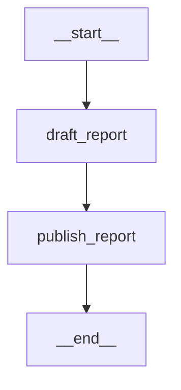
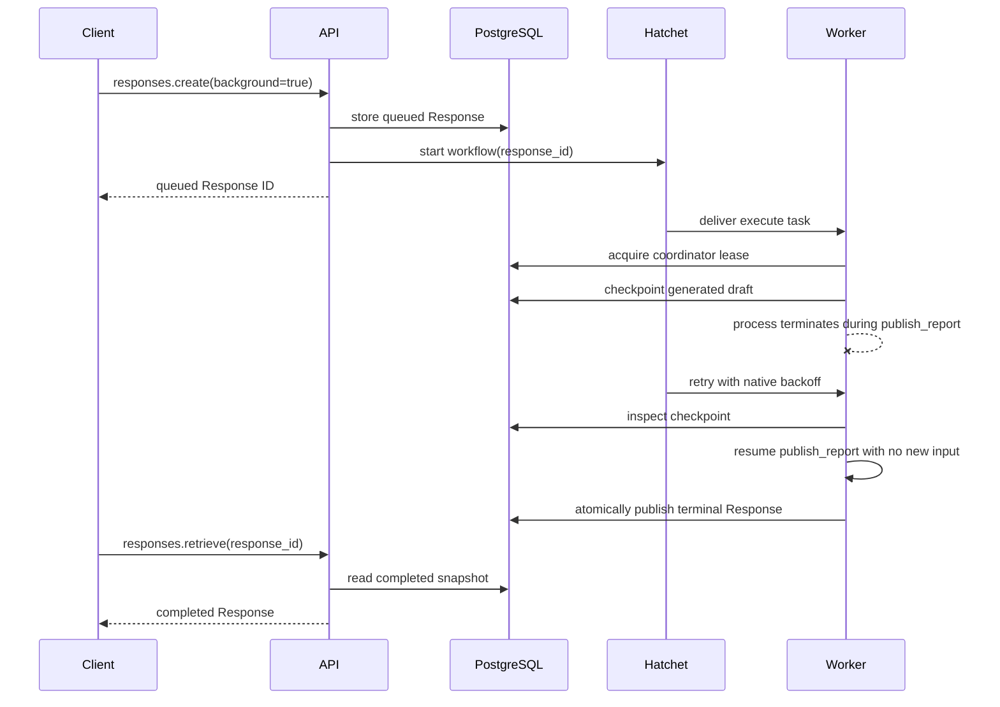

# Background Report Agent

`background-report-agent` is the demo's model-backed, polling-only background
graph. It makes the recovery boundary visible: one node generates and
checkpoints a draft, then a second node waits briefly before publishing that
durable draft as the final assistant message.

The graph is registered with `GraphConfig.background_version`, a PostgreSQL
checkpointer, and a PostgreSQL run coordinator. The API persists the public
Response and starts its Hatchet workflow; an independently deployed worker
executes the graph. PostgreSQL remains authoritative for both the public
lifecycle and graph recovery.

## Topology



| Node | Role | Durable boundary |
| --- | --- | --- |
| `draft_report` | Calls the configured `ChatOpenAI` model with a report-writing system instruction and the caller's messages. | Its `AIMessage` is stored in the `draft` state field at the node checkpoint. |
| `publish_report` | Waits for the demo-only finalization delay, then copies the checkpointed draft into `messages`. | The completed checkpoint can be rendered again if terminal Response publication must be retried. |

The five-second default delay in `publish_report` is intentional. It provides
a repeatable window for terminating a worker after the expensive draft is
durable but before the Response is published. It is a demonstration aid, not a
recommended production latency.

## Recovery Behavior



If the process stops before the `draft_report` checkpoint commits, Hatchet may
redeliver and the model call can run again. If it stops after that checkpoint,
LGOS resumes at `publish_report`; it does not resubmit the original graph input
or call the model again. Work performed inside any unfinished node may repeat,
so production side effects still need their own idempotency design.

The worker runs the graph with synchronous checkpoint durability. Terminal
publication and checkpoint deletion are ordered separately: LGOS first commits
the completed, failed, incomplete, or cancelled Response; cleanup occurs only
after execution is quiescent and can be retried independently.

## Run It

Configure the upstream model and Hatchet in `demo/.env`, select either gateway,
and enable the worker profile:

```dotenv
# Choose litellm or bifrost.
OPENAI_GATEWAY_TYPE=litellm
COMPOSE_PROFILES=${OPENAI_GATEWAY_TYPE},background
DEMO_API_BACKGROUND_ENABLED=True
HATCHET_CLIENT_TOKEN=...
```

Then start the UI stack and worker:

```bash
just demo/compose --dev
just demo/test-background-gateway --editable
```

The live test selects LiteLLM's `/v1` route and synced model, or Bifrost's
`/openai/v1` route and unqualified model, from `OPENAI_GATEWAY_TYPE`.

Open Chainlit on port 3002 or Open WebUI on port 3003, select a
`background-report-agent` model, and enable **Run in background**. The UI shows
queued and in-progress states, polls the Response ID, and renders the normal
final answer. Stopping the active turn requests Responses cancellation.

For local processes, run the API, worker, and Hatchet service separately:

```bash
just demo/api --editable
just demo/background-worker --editable
```

The graph's advertised model entry exists even when the background runtime is
disabled, but `background=true` creation then fails explicitly because no
backend is configured. Ordinary foreground use is not the purpose of this
example.

See [Run Responses In The Background](../../how-to-guides/background-responses.md)
for a polling client, deployment wiring, retention, cancellation, and gateway
requirements.

## Reproduce A Worker Crash

1. Create a background Response and retain its public Response ID.
2. Inspect the worker logs or checkpoint state until `draft_report` has
   completed and `publish_report` is in its configured delay.
3. Terminate the exact worker process without allowing graceful task cleanup.
4. Restart the Hatchet worker and continue polling the original Response ID.

Hatchet detects the lost task and applies its configured native retry policy.
The PostgreSQL coordinator session is released when the dead worker's database
connection closes, and the retry resumes from the durable checkpoint.

## Boundaries

This graph has no tools and does not demonstrate UI conversation persistence.
The UIs poll only while the current turn is active; they do not persist a
background Response ID across a browser refresh. SDK clients can persist the ID
and resume polling through either tested gateway route documented in the
[proxy guide](../../how-to-guides/openai-proxies.md).

The implementation lives in
`demo/api/src/lgos_demo_api/graphs/background_report.py`. Shared API/worker
wiring is in `demo/api/src/lgos_demo_api/background/components.py`;
`demo/api/src/lgos_demo_api/background/worker.py` provides the separately
deployed worker.
