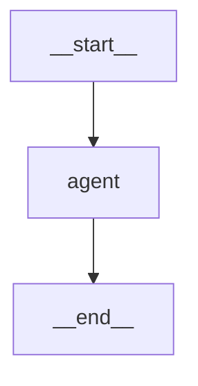
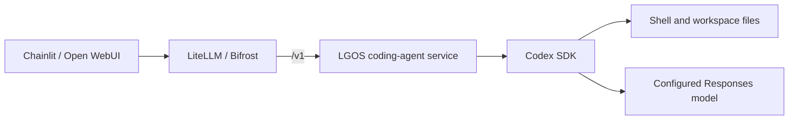

# Coding Agent

`coding-agent` showcases how LGOS can serve a coding agent that inspects and
edits files, runs shell commands and tests, and explains the results. The
independent `demo/api-coding-agent` service exposes the graph through LGOS; both
demo UIs reach it through LiteLLM or Bifrost.

Codex is the current implementation, using the official
[Codex Python SDK](https://learn.chatgpt.com/docs/codex-sdk) and a configurable,
persistent workspace. The service and public graph names are independent of
that implementation. The graph accepts a LangChain `BaseChatModel`, with
Codex-specific events and runtime ownership in `codex_model.py` and
`codex_runtime.py`. No other coding-agent implementation is included yet.

Every request goes directly to Codex, which can answer from conversation context
or use its tools as needed. For example, “Explain Python decorators” can be
answered directly; “Explain the decorators used in this repository” requires
inspecting files. Both use the same graph and runtime.

## LangGraph Topology



## Request Flow



1. The UI submits its text conversation history with model
   `lgos-api-coding-agent/coding-agent`, its user identifier as OpenAI `user`,
   and its thread or chat identifier as `metadata.conversation_id`. The gateway
   forwards it directly to the coding-agent service's `/v1` API.
2. A LangChain chat adapter starts a fresh Codex runtime in `/workspace`. It
   resumes the Codex thread of that conversation and sends only the latest
   message. A conversation's first request, or one without both values,
   starts a thread from the supplied history as a JSON transcript with explicit
   roles. Codex's native agent loop chooses commands, edits, and verification.
3. Codex calls the configured model through the selected gateway's
   `/v1/responses` route using its native
   [custom provider settings](https://learn.chatgpt.com/docs/config-file/config-advanced#custom-model-providers).
4. The adapter streams answer text through LangChain and progress through
   LGOS `status_event()`. LGOS returns standard Responses events to the UI.
5. Completion, failure, timeout, or disconnection closes the request's runtime
   before releasing the workspace lock. Edits remain available for the next request.

The demo reuses its existing LiteLLM model sync and Bifrost provider/catalog
configuration. There is one coding-agent service and no additional proxy or gateway
credential provisioning job; its model calls use the shared gateway key.

## Streaming and State

Codex owns the memory of a conversation. The service names each Codex thread
with a hash of `user` and `metadata.conversation_id` and
[resumes](https://github.com/openai/codex/blob/main/sdk/python/docs/getting-started.md)
it on later requests, so Codex keeps its own record of the commands it ran and
their output. The history the UI sends is then used only to start a thread.
Editing or regenerating an earlier message in the UI does not change what Codex
remembers. A request without both values runs on a thread that is discarded
when it ends.

Threads are files in Codex's home, the host directory
`demo/docker/volumes/lgos-codex`. They survive container restarts and are not
removed when the UI deletes its conversation. The graph has no checkpointer.

When a conversation already has assistant turns but no Codex thread, because
the thread was removed or the conversation began with another model, the
service starts a thread from the UI's history instead of failing. Codex then
has no record of the earlier commands. The service says so in a progress status
and logs a warning.

!!! note "Conversation IDs are not authorization"

    `user` and `metadata.conversation_id` are request correlation values. Any
    caller that sends the same pair continues that thread.

Files persist in the mounted workspace across requests and container restarts.
All conversations use the same workspace; the single service process serializes
requests to prevent overlapping edits. Run one worker and one replica for each
workspace.

Codex's [app-server events](https://learn.chatgpt.com/docs/app-server#events)
identify message phases on item lifecycle events. The adapter streams answer
deltas and publishes commentary, each shell command as Codex runs it, and file
changes as progress statuses. A request first reports that it is waiting for
the workspace, then that Codex is working once its turn starts. When the
upstream model supplies no message phase, every assistant message is part of
the answer, separated by blank lines. Raw command output stays inside Codex's
tool loop; its final answer reports relevant results. The token counts of the
request's model calls are summed into LangChain `usage_metadata`, including
cache and reasoning counts; earlier requests of a resumed thread are not counted
again.

See the shared [streaming contract](../../explanation/openai-compatibility.md#streaming).
Streaming Responses can contain both commentary and final-answer messages;
select final-answer items when building conversation history. Non-streaming
Responses and Chat Completions return the answer without progress statuses.

The request timeout starts when the request acquires the workspace lock.
Disconnecting or timing out closes Codex but does not roll back edits already
made. The workspace lock remains held until shutdown finishes, including slow
cleanup or repeated cancellation. Shutdown can exceed the request timeout;
client and gateway request timeouts must allow for coding tasks, queue time, and
cleanup. The bundled Bifrost provider raises its request timeout. While a
request waits for the workspace or runs a long command, LGOS sends
[keepalive comments](../../explanation/openai-compatibility.md#streaming), which
reset the bundled Bifrost provider's stream-idle timer.

## Try It

Configure the [demo stack](../docker.md). Copy the coding-agent settings from
`demo/.env.example` into an existing `demo/.env` when upgrading. Compose sends
Codex's model calls to the selected gateway with `OPENAI_GATEWAY_API_KEY`, and
the model defaults to `DEMO_API_OPENAI_RESPONSES_MODEL`; choose a gateway model that
supports Codex's native Responses requests.

```bash
just demo/compose --dev
```

Omit `--dev` in a standalone copy of `demo/`. The coding-agent image builds locally.
Normal stack startup registers `lgos-api-coding-agent/coding-agent` in the selected
gateway and synchronizes Open WebUI's model list.

In either UI select that model and ask:

> Create a Python calculator with a unittest suite in the workspace. Support
> addition and subtraction, run the tests, and report what changed.

Follow up with “Add division and test division by zero.” The second request
continues the same Codex thread and operates on the files left by the first.
Then ask “Which commands did you run?”

The workspace is the host directory `demo/docker/volumes/lgos-coding-agent`,
which `PUID:PGID` must be able to write. Edits are visible there directly; copy
or clone a project into it to work on existing code. The
image includes Python, uv, Bash, Git, curl, and ripgrep; install project
dependencies in a workspace virtual environment or extend the image for other
language toolchains.

### Python SDK

Use the [shared client setup](../api.md#call-a-graph) with the gateway's Responses
base URL: `/v1` for LiteLLM or `/openai/v1` for Bifrost.

```python
response = client.responses.create(
    model="lgos-api-coding-agent/coding-agent",
    input="Create hello.py, run it with Python, and report its output.",
    store=False,
)
print(response.output_text)
```

Run the live check, which incurs model usage and requires Docker access:

```bash
just demo/test-coding-agent --editable
```

It asks Codex to generate a random token with Python, checks the resulting file
inside the container, then verifies a second request can edit it. The test removes
its own uniquely named directory afterward.

## Execution Boundary

The container runs as a non-root user with a read-only root filesystem, dropped
capabilities, resource limits, and writable workspace and temporary directories.
Codex uses `Sandbox.full_access` and `ApprovalMode.deny_all`: Docker provides the
execution boundary and there is no interactive approval flow. This follows
OpenAI's documented [container isolation option](https://learn.chatgpt.com/docs/agent-approvals-security#run-codex-in-dev-containers)
and avoids a custom seccomp profile for a nested sandbox.

!!! note "Shared coding workspace"

    Use this service with trusted users and repositories. Codex can access the
    mounted workspace, network, and the shared gateway key it uses for model
    calls, which also authorizes the gateway's other demo models and MCP tools. The
    container receives no database or S3 credentials, host Codex login, or
    Docker socket, but it shares the demo network and can reach the other demo
    services. This is one shared workspace, not isolation between tenants or
    conversations.

Inputs are text only. Shell and edit tools run inside Codex; clients do not need
to provide tools. File uploads, downloadable artifacts, and background Responses
are not implemented. `DEMO_CODING_AGENT_TIMEOUT_SECONDS` bounds active request time;
see [coding-agent settings](../reference.md#coding-agent-settings) for all configuration.
