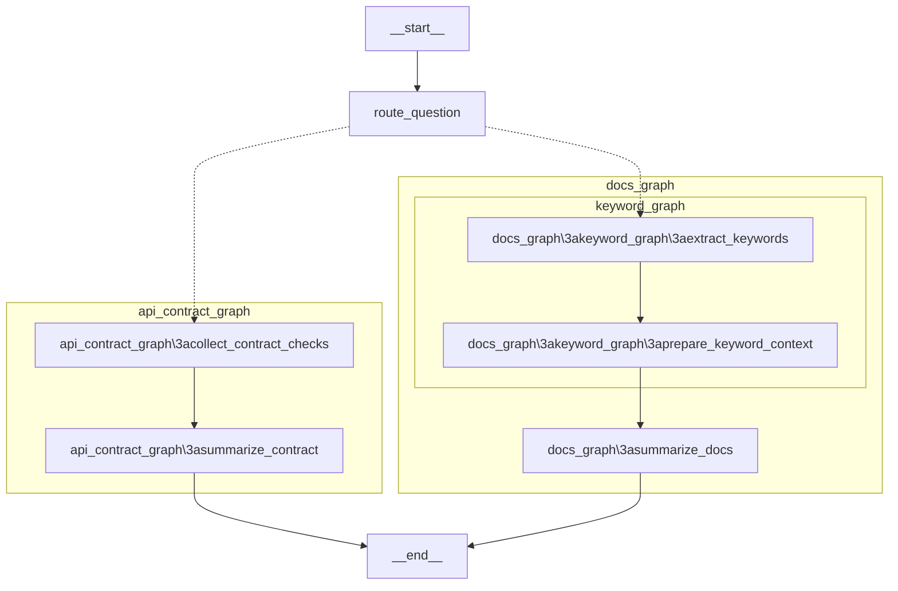
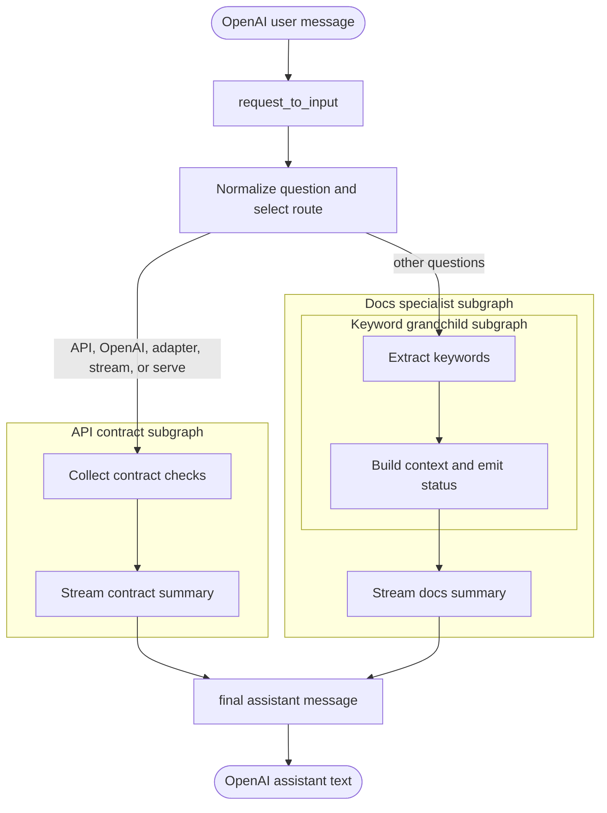

# Complex Subgraphs

`complex-subgraphs` demonstrates a coordinator graph with specialist subgraphs
and one nested grandchild graph. The OpenAI request adapter supplies the final
user message as `question`. The keyword graph keeps its selected terms in graph
state and emits an optional status update. The selected specialist writes the
final assistant message to the shared `messages` channel.

## LangGraph Topology

The native `xray` view expands the specialist and keyword subgraphs.

## Request Flow

LGOS exposes the answer-producing nested nodes `summarize_contract` and
`summarize_docs` as assistant text. The keyword node's selected terms are
available as graph state and, for clients that opt into `client_events`, as a
status update. The final assistant message is identical for streaming and
non-streaming requests. Rich status delivery also requires a streaming request
with `metadata.langgraph_stream_events="v1"`.

The graph is deterministic and has no checkpointer or Store. Its routing,
keywords, checks, and messages exist only for the current request. Any
conversation history must come from messages supplied by the client.

## Try It

| Route | Prompt |
| --- | --- |
| API contract | `Show OpenAI adapter streaming with nested subgraphs.` |
| Documentation | `Show nested subgraph routing docs.` |
