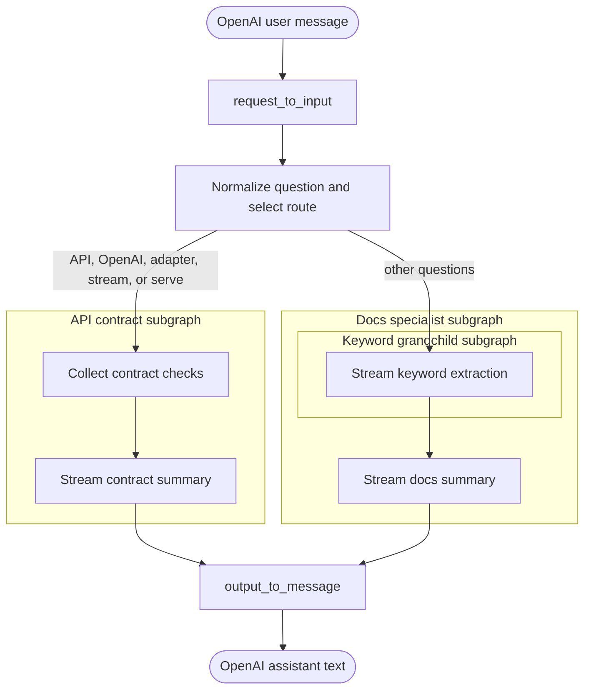

# Complex Subgraphs

`complex-subgraphs` demonstrates a coordinator graph with specialist subgraphs
and one nested grandchild graph. The OpenAI request adapter supplies the final
user message as `question`; the output adapter returns the selected specialist's
`answer` as assistant text.

LGOS exposes only the explicitly configured nested streaming nodes:
`extract_keywords`, `summarize_contract`, and `summarize_docs`. The client does
not need to understand the internal graph hierarchy.
