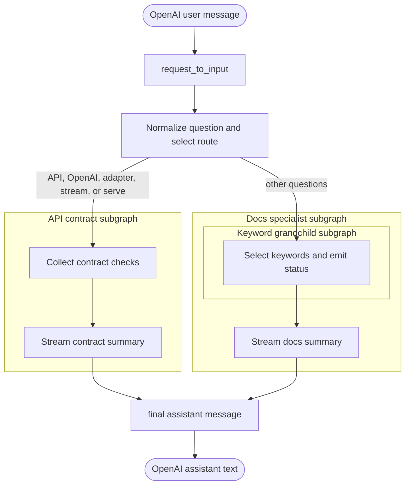

# Complex Subgraphs

`complex-subgraphs` demonstrates a coordinator graph with specialist subgraphs
and one nested grandchild graph. The OpenAI request adapter supplies the final
user message as `question`. The keyword graph keeps its routing result in graph
state and emits an optional status update. The selected specialist writes the
final assistant message to the shared `messages` channel.

LGOS exposes the answer-producing nested nodes `summarize_contract` and
`summarize_docs` as assistant text. The keyword node's selected terms are
available as graph state and, for clients that opt into `client_events`, as a
status update. The final assistant message is identical for streaming and
non-streaming requests.
