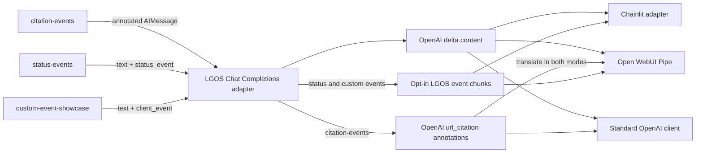

# Events And Citations

Three deterministic graphs show how graph output crosses the OpenAI boundary
without turning UI notifications into tool calls.

| Graph | Public output | Client behavior |
| --- | --- | --- |
| `citation-events` | Markdown links and inline markers plus OpenAI `url_citation` annotations | Chainlit renders the Markdown; Open WebUI resolves markers through native source events |
| `status-events` | Standard assistant text plus opt-in `status` events | Chainlit uses a `TaskList`; Open WebUI persists native status history |
| `custom-event-showcase` | Assistant text interleaved with `progress` and `artifact` events | Chainlit renders its custom activity panel; Open WebUI ignores these unsupported kinds |

Assistant text remains portable. It includes Markdown links and ordered `[n]`
markers, while citations also use the standard OpenAI annotation shape. Passive
status, progress, and artifact updates use LGOS's advertised `client_events`
extension. A client that does not opt into or understand that extension can
still consume the assistant text.

The Open WebUI Pipe translates final annotations to native source events. It
does not forward LGOS annotation chunks to the UI. Open WebUI maps the markers
already present in the content to those ordered sources.

## Try It

| Model | Prompt |
| --- | --- |
| `citation-events` | `Show me a cited answer.` |
| `status-events` | `Prepare the media workflow.` |
| `custom-event-showcase` | `Build the compatibility report.` |

See [Citation Ownership](../../explanation/openai-compatibility.md#citation-ownership)
and [Client Events](../../explanation/openai-compatibility.md#client-stream-events)
for the normative transport contract.
