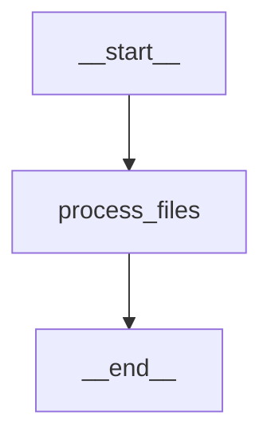
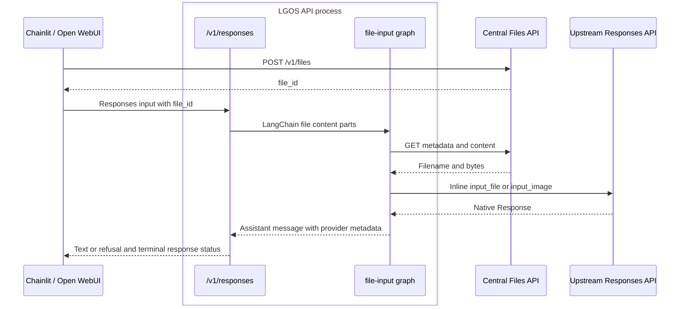

# File Input

`file-input` is a small model-backed graph for trying native Responses
`input_file` parts end to end. It reads each central `file_id`, downloads the
original bytes, and sends them to the configured OpenAI Responses API. It has
no graph persistence.

## LangGraph Topology



## Request Flow

1. Chainlit and Open WebUI upload the current attachments through their
   configured `/v1/files` route to the central demo Files service, then place
   the returned IDs in the user message.
2. LGOS preserves those native `file` content parts in the LangChain
   `HumanMessage`.
3. The graph retrieves the filename and bytes from `DEMO_API_FILES_BASE_URL`.
4. Images become inline `input_image` data URLs. Other files become inline
   `input_file` data URLs with their original filename.
5. LangChain `ChatOpenAI(use_responses_api=True)` calls the Responses API and
   returns the native assistant message, preserving text, refusals, token usage,
   and incomplete-response details.

The Responses API accepts Base64 data in `input_file` items. Supported parsing
depends on the file type; see the official OpenAI
[file input guide](https://developers.openai.com/api/docs/guides/file-inputs).



## Try It

Run either maintained Compose UI, select `file-input`, attach a supported
document or image, and send a request such as:

```text
Summarize this file in three bullets.
```

The demo downloads and forwards the entire attachment for each request. It is
therefore intended for small files, not retrieval over a large corpus. The
central `file_id` is only a reference, not authorization; production services
must enforce file access and retention at their own boundary.
