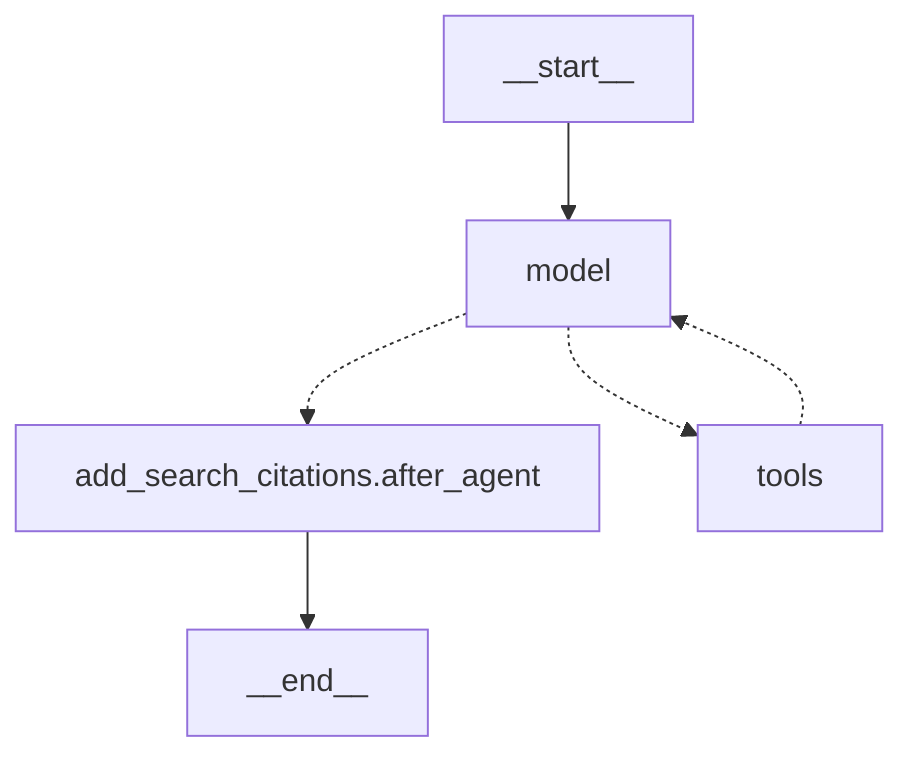
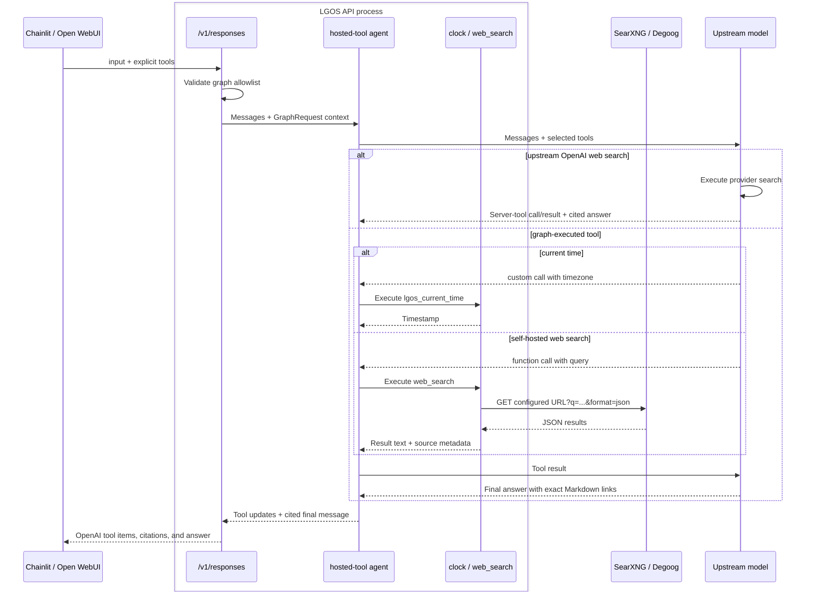

# Hosted Tool

`hosted-tool` demonstrates two client-selected tools executed by LGOS through
one standard Responses request:

- `lgos_current_time` is an OpenAI custom tool backed by Python's system clock.
- `web_search` always uses the standard OpenAI declaration. The graph can run
  it through a self-hosted SearXNG or Degoog endpoint, or pass it to an upstream
  OpenAI Responses model as a native server tool.

The graph is a real model-backed agent with no persistence. Clients own
conversation history and opt in to either tool on each request.

## LangGraph Topology



LangChain's agent owns the model/tool loop. Its `tools` node executes the clock
and the self-hosted search adapter. Upstream OpenAI search executes inside the
model call. The final middleware node adds citation annotations only for exact
self-hosted result links that the model retained in its answer; provider-native
citations pass through LangChain's standard content blocks.

## Request Flow



1. The client includes `{"type":"custom","name":"lgos_current_time"}` and/or
   `{"type":"web_search"}` in `tools`. There is no tool discovery through the
   model endpoint and no automatic server-side enablement.
2. LGOS rejects tools not registered for this graph. `auto` lets the model decide;
   `required` requires one of the supplied tools. A named custom choice can force
   the clock. Omitting a tool, or using `tool_choice="none"`, leaves it unavailable.
3. LangChain's `create_agent` pre-registers the clock and the configured search
   implementation. Middleware filters the model-visible set for each request.
   The client never enters the tool loop.
4. Clock use returns `custom_tool_call`, `custom_tool_call_output`, and a message.
   Search use returns `web_search_call` followed by a message with standard
   URL-citation annotations. Backend-specific calls and payloads remain private.

LGOS subscribes to LangGraph `updates` only when the request selects a
server-side tool. Those completed node updates provide the call/result boundary
needed to build OpenAI output items. The same request does not subscribe to
LangGraph `messages`, so its final answer is sent as one text delta after the
tool loop finishes. Requests without server-side tools retain incremental token
streaming. This avoids merging speculative model preambles with the durable
answer and avoids parsing partial tool calls.

The `http` backend is one JSON `GET` implemented with the demo's existing
`httpx` dependency. Both SearXNG and Degoog return the small `results` shape the
adapter consumes, so there are no provider classes. The adapter validates
HTTP(S) result URLs, removes duplicates, limits the result set, and gives the
model compact title, URL, and snippet text. Search content is treated as
untrusted data. The `openai` backend instead gives LangChain
`{"type":"web_search"}` and consumes its standard `server_tool_call` and
`server_tool_result` blocks.

## Try It

Start the [demo API](../api.md#start-postgresql-and-the-api). The default
`DEMO_API_WEB_SEARCH_BACKEND=http` uses the URL in
`DEMO_API_WEB_SEARCH_URL`. Point it at either endpoint:

```dotenv
# SearXNG (JSON output must be enabled)
DEMO_API_WEB_SEARCH_URL=https://searxng.example.com/search

# Degoog
DEMO_API_WEB_SEARCH_URL=https://degoog.example.com/api/search
```

To use an upstream OpenAI Responses model's native search instead:

```dotenv
DEMO_API_WEB_SEARCH_BACKEND=openai
```

The URL is ignored in `openai` mode. The configured upstream model or gateway
must support the OpenAI Responses `web_search` tool.

```python
from openai import OpenAI

client = OpenAI(base_url="http://localhost:3004/v1", api_key="DUMMY")
response = client.responses.create(
    model="hosted-tool",
    input="What time is it in Istanbul and Tokyo?",
    store=False,
    tools=[{"type": "custom", "name": "lgos_current_time"}],
    tool_choice="required",
    parallel_tool_calls=False,
)
for item in response.output:
    print(item.type)
print(response.output_text)
```

For web search, change the request fields to:

```python
tools=[{"type": "web_search"}],
tool_choice="required",
```

With only `web_search` supplied, `required` forces a search. In Chainlit, select
the `hosted-tool` profile and enable either tool in chat settings. The generated
Open WebUI Workspace Model exposes the same choices as Chat Variable checkboxes.
The declarations are fixed client knowledge; neither UI discovers tool names
from the server.

!!! note "One public contract"

    `custom` describes the clock's freeform model input. `web_search` uses the
    standard built-in declaration and output shape with every backend. The LGOS
    graph chooses where search runs; the client never names SearXNG, Degoog, or
    OpenAI as a provider. See the
    [hosted-tool contract](../../explanation/openai-compatibility.md#hosted-tools).

The implementation uses native [OpenAI custom tools](https://developers.openai.com/api/docs/guides/function-calling#custom-tools),
[web-search response shapes](https://developers.openai.com/api/docs/guides/tools-web-search?api-mode=responses),
LangChain [`create_agent` and tools](https://docs.langchain.com/oss/python/langchain/agents),
LangChain's [OpenAI built-in tools](https://docs.langchain.com/oss/python/integrations/chat/openai#web-search),
the [SearXNG Search API](https://docs.searxng.org/dev/search_api.html),
[Degoog Search API](https://degoog-org.github.io/docs/api.html), and
[Python `zoneinfo`](https://docs.python.org/3/library/zoneinfo.html).
