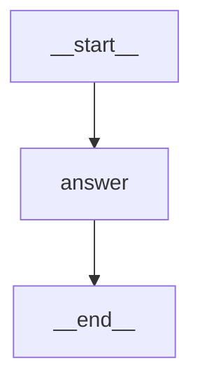
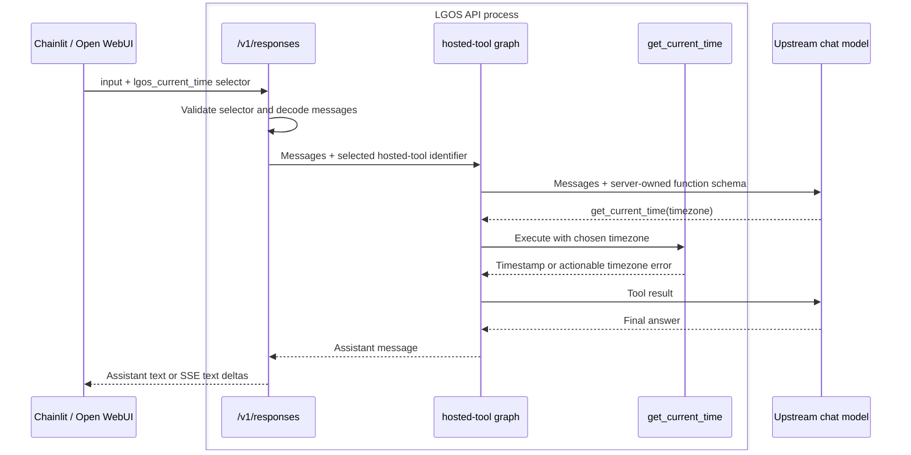

# Hosted Tool

`hosted-tool` answers questions about the current time in different timezones.
The UI enables `lgos_current_time` by identifier. LGOS owns the function schema
and executes the tool using its own clock and Python's IANA timezone database.
A real chat model chooses the arguments and summarizes the result.

## LangGraph Topology



`answer` creates and invokes the native agent loop with the enabled tool.
Its runtime-created model/tools loop is not expanded by LangGraph's static
visualization. The graph has no persistence; clients own conversation history.

## Request Flow



1. Select `hosted-tool` in Chainlit or Open WebUI and ask, “What time is it in
   Istanbul and Tokyo?” Both clients send `tools=[{"type": "custom", "name": "lgos_current_time"}]`.
2. LGOS validates the selector against the graph's `hosted_tools` declaration.
   The request contains no function parameters, description, or executable code.
3. LangChain `create_agent` chooses timezone arguments, executes the native
   `get_current_time` tool on LGOS, and composes the answer.
4. LGOS returns ordinary assistant text, with streaming supported. The UI does
   not execute a function or send a `function_call_output` round trip.

Omitting the selector or setting `tool_choice="none"` disables the tool.
Unknown or unavailable hosted tools fail with HTTP 400 before execution.
The tool returns an ISO 8601 timestamp with its UTC offset; unknown timezone
names return an actionable result so the model can correct them.

## Try It

Start the [demo API](../api.md#start-postgresql-and-the-api) with the existing
model settings. The upstream model must support function calling; the time
lookup needs no additional service or API key.

```python
from openai import OpenAI

client = OpenAI(base_url="http://localhost:3004/v1", api_key="DUMMY")
response = client.responses.create(
    model="hosted-tool",
    input="What time is it in Istanbul and Tokyo?",
    tools=[{"type": "custom", "name": "lgos_current_time"}],
    store=False,
)
print(response.output_text)
```

!!! note "OpenAI Custom Tool"

    `{"type": "custom", "name": "lgos_current_time"}` uses the standard OpenAI
    custom tool shape for Responses. LGOS owns the schema and executes the tool;
    the client enables it by name. Proxies such as Bifrost preserve this standard
    shape across normalized routes. See the
    [hosted-tool contract](../../explanation/openai-compatibility.md#hosted-tools).

The implementation uses native [LangChain tools](https://docs.langchain.com/oss/python/langchain/tools),
[`create_agent`](https://docs.langchain.com/oss/python/langchain/agents), and
[Python `zoneinfo`](https://docs.python.org/3/library/zoneinfo.html).
