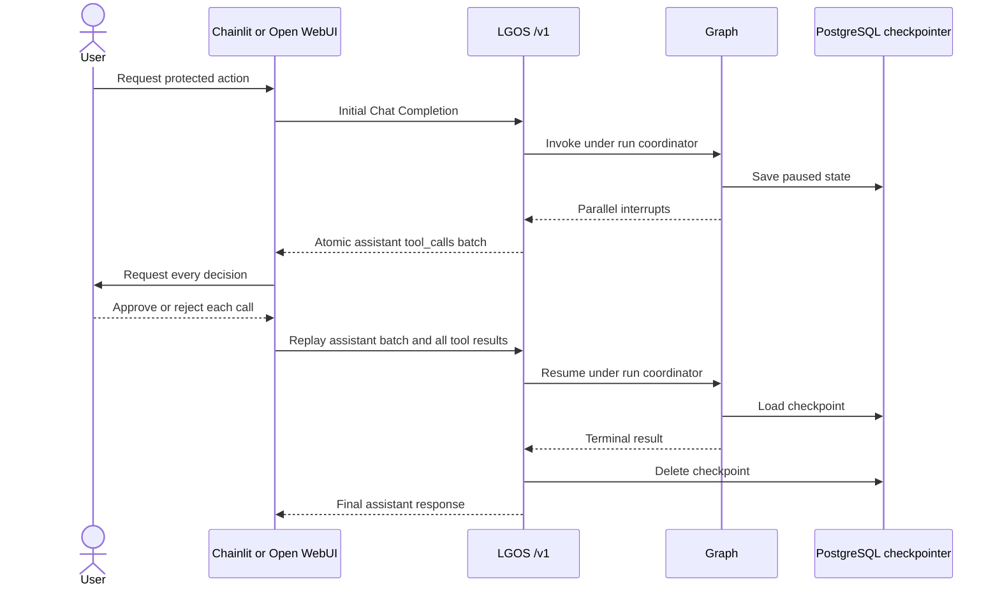

# Interruptible Approval

`interruptible-approval` is the only demo graph that persists API execution
state. The graph runs two instances of one approval subgraph in parallel: one
approves the refund and the other approves notifying the customer. Their
interrupts cross `/v1` as one atomic tool-call batch; clients answer the whole
batch without understanding the graph topology.

The checkpointer stores pending graph state. It does not store ordinary chat
history or the application document used by
[`persistent-plot`](persistent-plot.md). Operation identity, canonical replay,
and retention rules are defined in
[OpenAI Compatibility](../../explanation/openai-compatibility.md#tool-calls-and-interrupts).

Ask the graph to process a refund to trigger the approval batch.

## Interrupt Flow

## PostgreSQL Runtime

Each demo API process opens one PostgreSQL connection pool in its FastAPI
lifespan, waits for the pool before serving, and closes it at shutdown. The
checkpointer, LangGraph Store, and same-run coordinator share that pool.

The coordinator holds a session-level
[PostgreSQL advisory lock](https://www.postgresql.org/docs/current/explicit-locking.html#ADVISORY-LOCKS)
only while validating or advancing a request, never while awaiting human input.
One of the pool's five connections is reserved for persistence I/O; exhausting
the other four coordination slots returns HTTP 409.

The demo uses LGOS's default shared checkpoint scope, so multi-tenant
applications must derive that scope from authenticated server state.

The environment also enables `LANGGRAPH_STRICT_MSGPACK=true`. This selects
LangGraph's strict allowlist policy for checkpoint deserialization; it does not
replace database access controls or integrity monitoring. See the upstream
[LangGraph security advisory](https://github.com/langchain-ai/langgraph/security/advisories/GHSA-g48c-2wqr-h844).

The demo has no expiry worker. Production deployments must reap abandoned
pending runs and follow LangGraph's
[interrupt idempotency rules](https://docs.langchain.com/oss/python/langgraph/interrupts#rules-of-interrupts).
