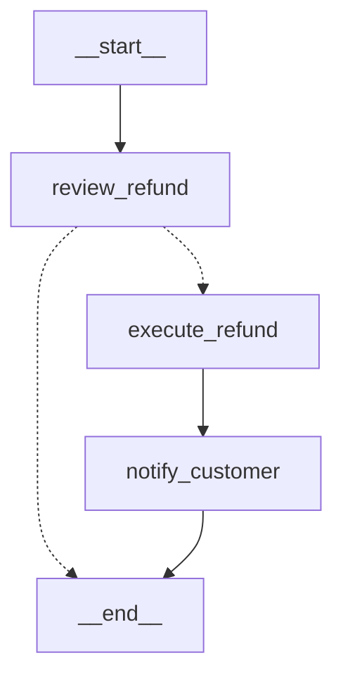
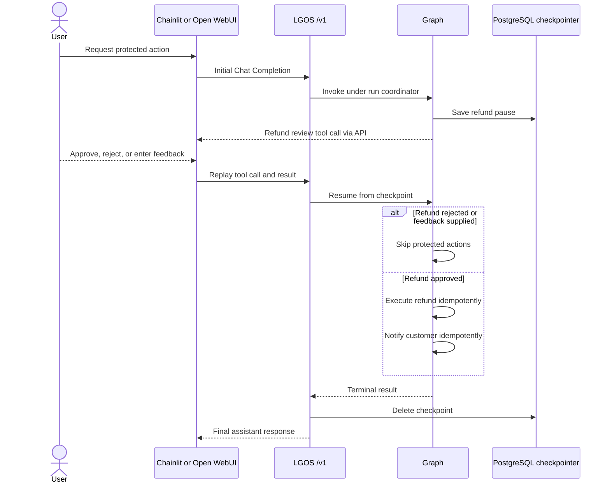

# Interruptible Human Review

`interruptible-approval` is the only demo graph that persists API execution
state. It is a deterministic production-pattern example: a refund rejection
ends the workflow, while approval leads to simulated refund execution and an
automatic customer notification. A custom response records reviewer feedback
without executing either action. The interrupt crosses `/v1` as a standard tool
call, so clients can collect the human response without understanding the graph
topology.

The checkpointer stores pending graph state. It does not store ordinary chat
history or the application document used by
[`persistent-plot-agent`](persistent-plot-agent.md). Operation identity, canonical replay,
and retention rules are defined in
[OpenAI Compatibility](../../explanation/openai-compatibility.md#tool-calls-and-interrupts).

## LangGraph Topology

The generated native graph view keeps human review before every simulated
external effect.

## Interrupt Flow

## PostgreSQL Runtime

The graph receives its PostgreSQL checkpointer and run coordinator from the
API's lifespan-managed runtime. The coordinator lease covers each initial or
resume request, but ends when the graph pauses; no lease is held while the user
decides. The integration test closes and recreates the runtime before resume to
verify that the pause survives runtime replacement.

`execute_refund` and `notify_customer` are intentionally deterministic
simulations. In a real application, replace them with durable operations that
supply a stable idempotency key to each downstream system. Keep external effects
in nodes after the interrupt, and make those nodes idempotent because a crash
can still replay them.

The demo uses LGOS's default shared checkpoint scope, so multi-tenant
applications must derive that scope from authenticated server state.

The demo has no expiry worker. Production deployments must reap abandoned
pending runs and follow LangGraph's
[interrupt idempotency rules](https://docs.langchain.com/oss/python/langgraph/interrupts#rules-of-interrupts).

The application must also authorize and audit the reviewing identity. Interrupt
results are workflow input, not proof of authorization. Applications that must
replay a lost terminal response also need their own result/idempotency store;
LGOS deletes the checkpoint after terminal completion.

See [Docker Compose](../docker.md#demo-services) for schema setup, connection
capacity, advisory-lock requirements, and strict checkpoint deserialization.

## Try It

Send `Refund order ORDER-123` in Chainlit or Open WebUI. Rejecting the refund
finishes without executing an action. Approving it simulates the refund and
customer notification. Choosing the custom-response path records arbitrary
reviewer feedback and also finishes without executing an action.
