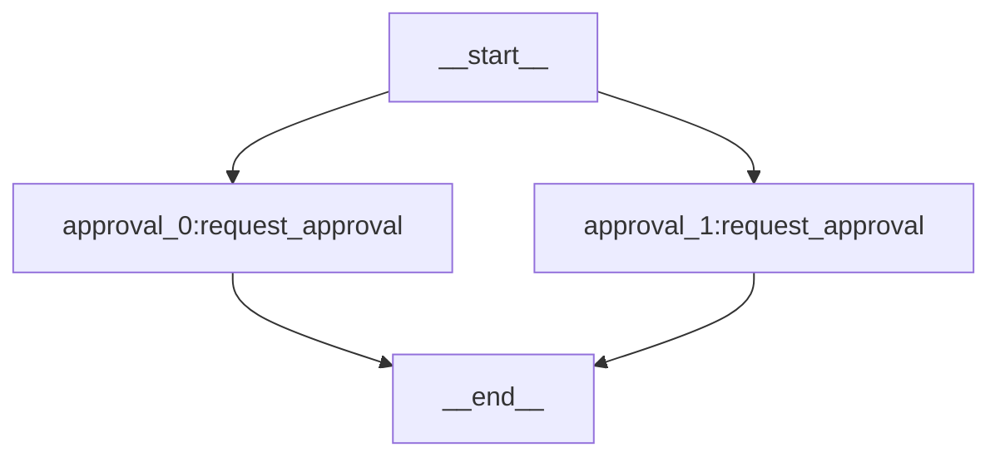
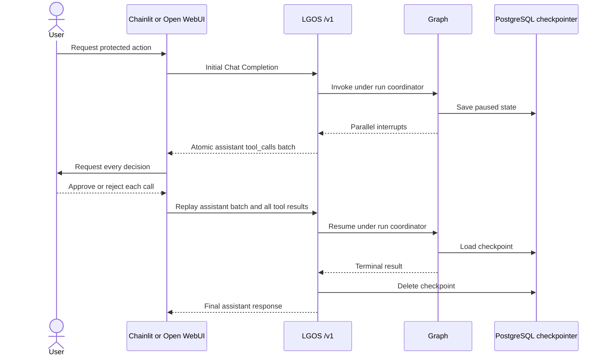

# Interruptible Approval

`interruptible-approval` is the only demo graph that persists API execution
state. The graph runs two instances of one approval subgraph in parallel: one
approves the refund and the other approves notifying the customer. Their
interrupts cross `/v1` as one atomic tool-call batch; clients answer the whole
batch without understanding the graph topology.

The checkpointer stores pending graph state. It does not store ordinary chat
history or the application document used by
[`persistent-plot-agent`](persistent-plot-agent.md). Operation identity, canonical replay,
and retention rules are defined in
[OpenAI Compatibility](../../explanation/openai-compatibility.md#tool-calls-and-interrupts).

## LangGraph Topology

The native `xray` view shows the two parallel approval subgraph instances.

## Interrupt Flow

## PostgreSQL Runtime

The graph receives its PostgreSQL checkpointer and run coordinator from the
API's lifespan-managed runtime. The coordinator lease covers each initial or
resume request, but ends when the graph pauses; no lease is held while the user
decides.

The demo uses LGOS's default shared checkpoint scope, so multi-tenant
applications must derive that scope from authenticated server state.

The demo has no expiry worker. Production deployments must reap abandoned
pending runs and follow LangGraph's
[interrupt idempotency rules](https://docs.langchain.com/oss/python/langgraph/interrupts#rules-of-interrupts).

See [Docker Compose](../docker.md#demo-services) for schema setup, connection
capacity, advisory-lock requirements, and strict checkpoint deserialization.

## Try It

Send `Refund order ORDER-123` in Chainlit or Open WebUI. The UI presents both
approval questions together, sends both decisions in one resume request, and
then renders the final refund and notification results.
