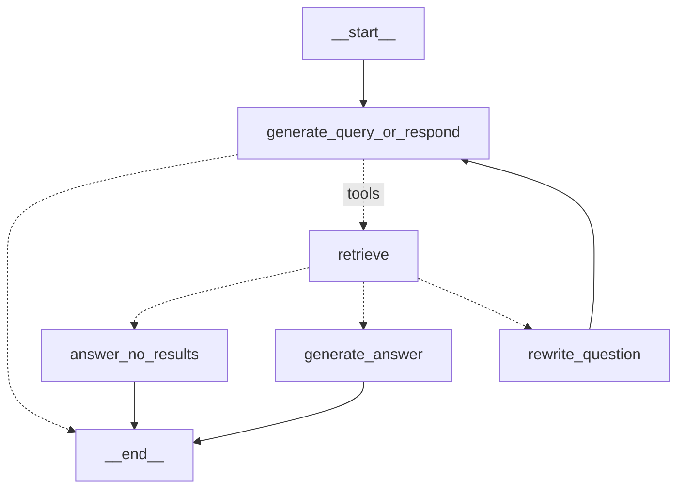
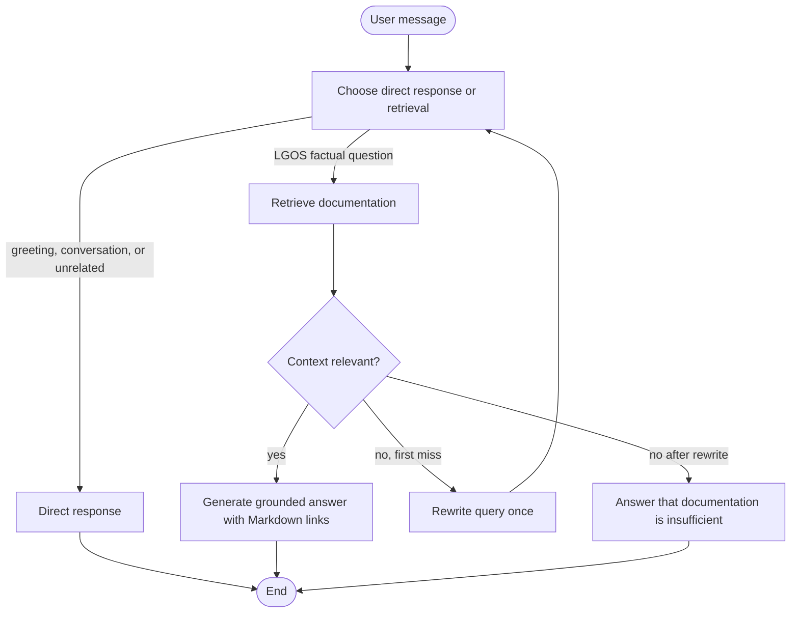

# LGOS RAG

`lgos-rag` is an agentic retrieval graph over the Markdown corpus packaged with
the demo API. It lazily splits and embeds that corpus into a process-local
in-memory vector index, retrieves up to four chunks, and grounds answers with
the source URLs stored on those chunks.

## LangGraph Topology

## Request Flow

The retry is deliberately bounded to one rewrite. Routing, grading, and
rewriting use non-streaming internal model calls; retrieval uses the in-memory
vector index. Direct, grounded, and no-result answers are the user-visible
streamed nodes.

## State And Lifetime

The graph has no checkpointer or LangGraph Store. Any conversation history
comes from messages supplied by the client. Each API process builds its own
vector index lazily on the first retrieval, reuses it for that process lifetime,
and rebuilds it after a restart. This is a demo optimization, not durable
application data.

## Try It

| Path | Prompt |
| --- | --- |
| Direct response | `Who are you?` |
| Retrieval | `How do I configure LGOS runtime settings?` |
