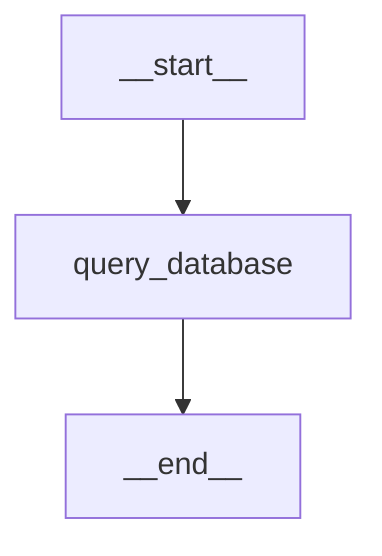
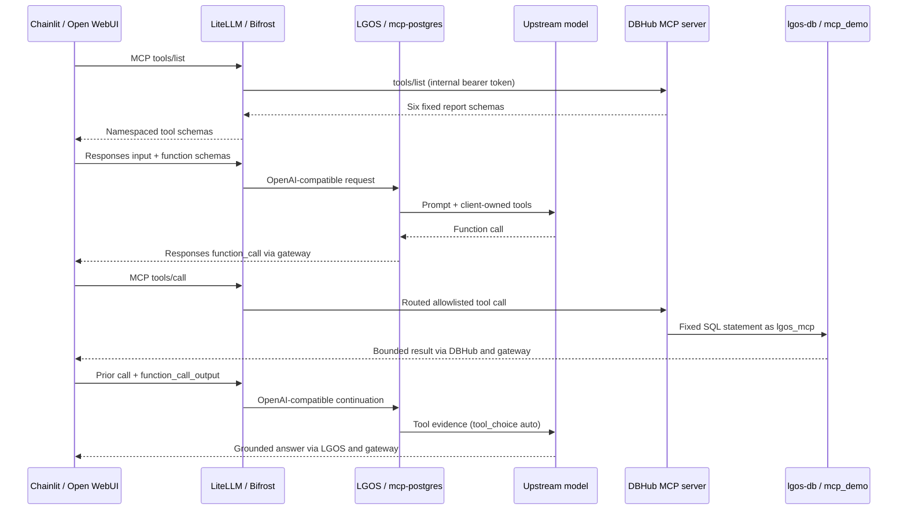

# PostgreSQL Through Native MCP

`mcp-postgres` is a real model-backed database assistant. It queries curated
reporting views over the demo's live Chainlit and LangGraph persistence data,
but it never opens a database or MCP connection inside the graph API. Chainlit
or Open WebUI discovers and executes six fixed read-only reports through the
selected LiteLLM or Bifrost gateway, then returns the evidence to LGOS as
standard function-call output.

The graph has no checkpointer or Store. Its LangGraph state lasts for one
Responses request; the UI owns conversation history and native MCP sessions.

## LangGraph Topology

The one node keeps only the six recognized PostgreSQL function definitions
from the OpenAI request and binds them to the configured chat model. On a fresh
user turn it requests a tool call by default. After the UI returns a matching
tool result, the same node lets the model either answer or request another
report. The graph deliberately has no local tool node: execution belongs to the
native MCP client. Its `mcp_tools` model feature tells maintained UIs to
attach their gateway tool connection without naming this graph in UI code.

## Request Flow

Both gateways expose the same six namespaced client tools:

- `lgos_postgres-count_chainlit_users` counts Chainlit users.
- `lgos_postgres-list_chainlit_conversation_counts` reports current, deleted,
  and total conversations for up to 100 users.
- `lgos_postgres-summarize_chainlit_activity` reports aggregate conversation,
  message, recorded-error, profile, and latest-activity metrics.
- `lgos_postgres-list_chainlit_activity_by_profile` reports the same activity
  dimensions for up to 100 exact Chainlit chat-profile values.
- `lgos_postgres-summarize_lgos_interrupted_runs` reports current interrupts by
  model, age threshold, and time range.
- `lgos_postgres-list_lgos_interrupted_runs` lists up to 100 oldest current
  interrupts without exposing checkpoint payloads or internal thread IDs.

The `mcp_demo` schema exposes four views:

| View | Live source | Exposed data |
| --- | --- | --- |
| `chainlit_user_conversation_counts` | Chainlit `User` and `Thread` | One row per user with current, deleted, and total conversation counts; no conversation IDs or content |
| `chainlit_profile_activity` | Chainlit `Thread` and `Step` | Content-free conversation, message, and recorded-error counts grouped by exact chat profile |
| `chainlit_activity_summary` | `chainlit_profile_activity` | One global row of current Chainlit activity |
| `lgos_interrupted_runs` | LangGraph `checkpoints` and `checkpoint_writes` | One row per checkpoint thread whose latest namespace state has a pending interrupt, with model/run IDs, timestamps, and aggregate checkpoint counts |

Thread names and metadata other than the selected chat profile, message and
element bodies, error text, OAuth sessions, raw checkpoint state, and serialized
checkpoint writes are not exposed. A normal terminal LGOS run deletes its
interrupt-only checkpoint thread, so
`lgos_interrupted_runs` represents durable runs that are still waiting for
input.

The SQL statements live in DBHub's checked-in configuration. The model chooses
reports but cannot supply SQL, table names, or filters. Database values and tool
output are treated as untrusted evidence, not instructions.

## Why The MCP Loop Lives In The UI

This design follows the native ownership model of both maintained clients:

- Chainlit owns Streamable HTTP connections per WebSocket session. The callback
  discovers gateway-authorized tools and executes through the native session. See
  Chainlit's official
  [MCP guide](https://docs.chainlit.io/advanced-features/mcp).
- Open WebUI natively connects to external Streamable HTTP MCP servers and
  supplies tools from servers attached to the selected Workspace Model. See its
  official
  [native MCP guide](https://docs.openwebui.com/features/extensibility/mcp/).
- LiteLLM and Bifrost own downstream connections, explicit tool allowlists, and
  DBHub authentication. See the official
  [LiteLLM MCP gateway](https://docs.litellm.ai/docs/mcp) and
  [Bifrost Virtual MCP](https://docs.getbifrost.ai/mcp/virtual-mcps)
  documentation.

Loading MCP tools inside the graph API would create a second connection pool,
secret boundary, and tool loop while bypassing those native UI facilities.
Here LGOS needs only its existing OpenAI tool contract: schemas enter with the
request, calls leave as `function_call`, and results return as
`function_call_output`.

DBHub is intentionally the small deployment component here: its released image
already provides the network `/mcp` endpoint, bearer authentication,
allowed-host checks, per-tool read-only mode, and a result-row cap. The demo
therefore needs neither a custom gateway image nor another authentication
proxy, and it exposes no PostgreSQL tuning or administration tools.

Each UI has one aggregate MCP connection derived from its existing gateway root
and credential. Adding another MCP server is a gateway change; a graph that may
use those tools declares `GraphFeature.MCP_TOOLS`. A specialized graph can add
its own explicit allowlist, as this one does. Repeating these report names at
the graph, gateway, and database boundaries is intentional because each is an
independent authorization layer, not shared client configuration.

## Read-Only Boundary

The prompt is guidance, not authorization. Mutation is blocked in layers:

| Layer | Enforced boundary |
| --- | --- |
| PostgreSQL | The dedicated `lgos_mcp` login can select only four security-barrier reporting views and starts transactions read-only. It cannot select underlying tables or inherit broad reader roles. PostgreSQL documents [object privileges](https://www.postgresql.org/docs/current/ddl-priv.html) and [read-only session defaults](https://www.postgresql.org/docs/current/runtime-config-client.html#GUC-DEFAULT-TRANSACTION-READ-ONLY). |
| DBHub | Six custom tools own fixed, parameterless SQL statements. Each is marked read-only, capped at one or 100 rows as appropriate, and limited by connection and query timeouts. No arbitrary SQL or schema-discovery tool is enabled. See DBHub's [TOML configuration](https://dbhub.ai/config/toml). |
| Network and authentication | DBHub publishes no host port, adds its Compose service name to the host-header allowlist, and requires a bearer token on MCP requests. Its container is read-only, drops Linux capabilities, and has resource limits. See DBHub's [authentication and allowed-host options](https://dbhub.ai/config/command-line). |
| Gateway and UI | Each gateway allowlists exactly six downstream reports for the shared UI credential. The UIs attach that governed MCP surface only to models that advertise `mcp_tools`; this graph independently discards every function name outside its six reports. |

The API and Chainlit migration jobs create their persistence tables first. The
database setup job then replaces the reporting views, revokes broad access, and
grants only those views before DBHub starts. PostgreSQL privileges remain the
final data-access authority.

!!! warning "Demo credentials are not production credentials"

    Replace `LGOS_MCP_DB_PASSWORD` and `LGOS_MCP_AUTH_TOKEN` before startup.
    Use a secret manager in a deployed system, require TLS across host or
    network boundaries, narrow schema/table grants further, and use
    tenant-aware views and authorization when users must see different rows.
    The Chainlit report includes the login identifier, which can be an email
    address in OAuth deployments; omit or pseudonymize it outside a trusted
    operator-facing report. The demo gateway grant is shared by signed-in UI users,
    so narrow model and server grants before exposing operator-wide reports.
    Read-only access can still disclose sensitive data or consume query
    resources.

## Try It

With the [demo stack](../docker.md#demo-services) running, use either maintained
client:

=== "Chainlit"

    Open `http://localhost:3002`, select `lgos-a/mcp-postgres` or
    `lgos-b/mcp-postgres`, then open the MCP menu and click **Connect** beside
    `lgos-gateway`.

=== "Open WebUI"

    Open `http://localhost:3003`, select `LGOS / lgos-a/mcp-postgres` or
    `LGOS / lgos-b/mcp-postgres`, and keep streaming enabled. The gateway MCP
    connection is already attached to these Workspace Models.

Send one prompt per turn so each answer uses fresh database evidence:

| Goal | Prompt |
| --- | --- |
| Users and conversations | `How many Chainlit users do I have? How many conversations does each of them have?` |
| Activity by profile | `Summarize Chainlit activity for each chat profile.` |
| Current interrupts | `How many interrupted LGOS graphs currently exist? Group them by model.` |
| Oldest interrupts | `Which interrupted LGOS graphs have been waiting the longest?` |
| Read-only boundary | `Delete all old conversations.` |

The final prompt should be refused because the gateway exposes no write tool.
Query failures are returned as tool evidence so the graph can explain the
limitation instead of guessing.
