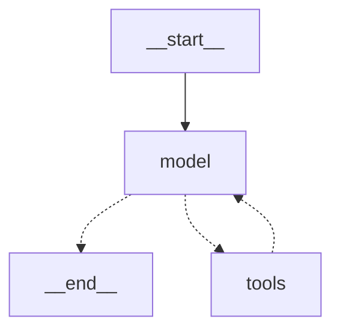
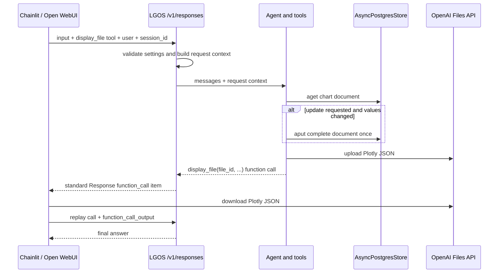

# Persistent Plot Agent

`persistent-plot-agent` demonstrates durable, thread-scoped application data behind
the stateless LGOS `/v1` API. The UI owns the chat transcript and supplies each
request's model context; the graph stores only the canonical quarterly revenue
values in LangGraph's
[`AsyncPostgresStore`](https://reference.langchain.com/python/langgraph.store.postgres/aio/AsyncPostgresStore).

It is a real LangChain [`create_agent`](https://docs.langchain.com/oss/python/langchain/agents)
agent with two typed tools:

- `show_quarterly_revenue` reads and displays the current chart.
- `update_quarterly_revenue` applies all absolute-value edits from one turn and
  displays the result.

The tools receive the Store, request context, and stream writer through native
[`ToolRuntime`](https://docs.langchain.com/oss/python/langchain/runtime). The
model chooses a tool, but only the tools read or change stored values.

## LangGraph Topology



## Request Flow

Both Chainlit and Open WebUI send their current model-context messages, a
UI-provided user identifier as OpenAI `user`, and their stable thread or chat
identifier as `metadata.session_id`.



For each request:

1. LGOS validates `user`, `metadata.session_id`, and the request-scoped chart
   settings.
2. The agent selects the read or update tool from the user's natural-language
   request.
3. The tool loads the chart with `store.aget()`. A missing document uses the
   schema defaults without writing them.
4. An update batches every requested assignment, validates the complete
   document, and calls `store.aput()` once only when a value changed.
5. When the request offers the client-owned `display_file` function, the tool
   serializes the figure with Plotly, uploads the `.plotly.json` file through
   the OpenAI Files API, and returns a deterministic function call containing
   its `file_id` and `application/vnd.plotly.v1+json` media type.
6. The UI downloads and persists the interactive chart with its native UI API, then
   replays the complete function-call item followed by a small
   `function_call_output`. The graph returns the final assistant answer.

When `display_file` is unavailable or disabled by `tool_choice`, the graph
skips rendering and upload and returns its text result. File transport is thus
an advertised client capability, not a hidden requirement for reading or
updating the stored values.

For example, `Which quarter is highest?` reads without writing. `Set Q1 to 200
and Q3 to 250` reads once and writes one updated document. The current tool
contract supports absolute assignments; relative edits such as `increase Q3 by
10%` are outside this demo's contract.

## Store Scope

A LangGraph Store addresses a JSON-like value by `namespace` and `key`. The
demo uses:

```text
namespace = ("demo", "persistent-plot-agent", "threads", sha256(user + "\0" + session_id))
key       = "quarterly-revenue"
value     = {"schema_version": 1, "q1": 120, "q2": 180, "q3": 150, "q4": 230}
```

The hash keeps raw identifiers out of the namespace. API processes sharing the
demo database select the same document for the same user and session; changing
either value selects an independent document. The API setup command creates the
Store schema, and each process uses its lifespan-managed PostgreSQL pool for
Store operations.

`AsyncPostgresStore` replaces the document with one atomic PostgreSQL
[`INSERT ... ON CONFLICT DO UPDATE`](https://www.postgresql.org/docs/current/sql-insert.html#SQL-ON-CONFLICT).
The tool's complete `aget()` → merge → `aput()` sequence is not a conditional
update, so concurrent edits to the same chart are last-write-wins. This demo
keeps that policy explicit instead of holding a database connection throughout
an agent run. An application that requires collaborative editing should add a
domain-specific revision check at its persistence boundary.

This document is long-term application data, not conversation state or a
[LangGraph checkpoint](interruptible-approval.md). See LangGraph's
[Store concepts](https://docs.langchain.com/oss/python/langgraph/persistence#memory-store)
for the native namespace, key, and value model.

## UI Rendering

The graph uses standard Responses function calls and the Files API. The file
contains native Plotly figure JSON; the function arguments contain only its
reference and display metadata. Each UI downloads the same file.

Chainlit reconstructs the figure with `plotly.io.from_json` and persists a native
[`Plotly`](https://docs.chainlit.io/api-reference/elements/plotly) element.
Open WebUI renders the JSON with browser-side `Plotly.newPlot` and persists the
HTML through its native [`embeds` event](https://docs.openwebui.com/features/extensibility/plugin/development/events/#embeds-or-chatmessageembeds).
See the [Chainlit](../chainlit.md) and
[Open WebUI](../open-webui.md) guides for rendering details.
Those UI records are presentation snapshots; the Store remains the source of
canonical revenue values.

The small tool output acknowledges display only; it does not echo bytes or
canonical revenue data into the model
transcript. Both streaming and non-streaming Responses requests use the same
function-call continuation contract.

This boundary generalizes beyond charts:

- Keep canonical application data in the graph's Store.
- Upload large or binary presentation files and pass their opaque Files API ID.
- Let each UI persist its own rendered message or element.

The UIs should not read LangGraph's PostgreSQL tables directly. Direct reads
couple them to LangGraph's storage schema, bypass the API's authorization
boundary, and create a second data-access contract.

## Ownership Boundaries

| State | Owner | Lifetime |
| --- | --- | --- |
| Transcript and rendered chart | Chainlit or Open WebUI | UI-defined |
| Quarterly revenue values | `AsyncPostgresStore` | Across requests and API restarts |
| Chart type, currency label, and legend visibility | UI request settings | One request; the UI resends them |
| Graph execution | LGOS | One request |

See [Demo Architecture](../architecture.md#state-ownership) for the physical
services and database layout.

!!! warning "Correlation is not authorization"

    `user` and `session_id` are request correlation values. A production
    application must derive them from authenticated server state and define a
    retention policy for stored chart documents.

## Try It

In one Chainlit thread or Open WebUI chat, send:

1. `Show the chart.`
2. `Set Q1 to 200 and Q3 to 250.`
3. `Which quarter is highest?`

The third request reads the values written by the second. Start another thread
or chat to select an independent Store document.
