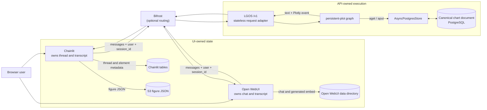

# Persistent Plot

`persistent-plot` demonstrates thread-level application data without making
the otherwise stateless LGOS API own chat history. It uses LangGraph's
[`AsyncPostgresStore`](https://reference.langchain.com/python/langgraph.store.postgres/aio/AsyncPostgresStore)
for one canonical chart document and emits a fresh Plotly artifact on every
invocation.

## Store Model

A LangGraph Store addresses a JSON-like value by `namespace` and `key`. The
demo maps each request to:

```text
namespace = ("demo", "persistent-plot", "threads", sha256(user + "\0" + session_id))
key       = "quarterly-revenue"
value     = {"schema_version": 1, "q1": 120, "q2": 180, "q3": 250, "q4": 230}
```

Both the OpenAI `user` and `metadata.session_id` fields are required. Their hash
keeps raw identifiers out of the namespace; a different user or session
selects a different document.

For each graph call:

1. `store.aget(namespace, key)` loads the document, or the graph creates the
   default values when no item exists.
2. The graph applies a recognized quarter update.
3. `store.aput(namespace, key, value)` writes the complete document when it is
   new or changed.
4. The graph derives the Plotly figure and streams it as a client event.

The API setup command runs the Store's schema setup. Each API process then
creates one `AsyncPostgresStore` over its lifespan-managed PostgreSQL pool.
The app compiles the graph with that Store, and the node accesses it through
`runtime.store`. Because API workers use the same database, a later invocation
can load a value written by another process. This is long-term application
data, not a [LangGraph checkpoint](interruptible-approval.md).

See LangGraph's [Store persistence concepts](https://docs.langchain.com/oss/python/langgraph/persistence#memory-store)
for the package-level namespace, key, and value model.

## Ownership Boundaries

The physical PostgreSQL server may be shared, but the data has separate owners
and schemas.

| Component | Owns | Does not own |
| --- | --- | --- |
| Chainlit | Login identity, threads, transcript, steps, feedback, and rendered Plotly element | Canonical chart values |
| Open WebUI | Chat transcript, Chat Variables, and the rendered chart embed in its bind-mounted data directory | Canonical chart values |
| LGOS | OpenAI request adaptation and the current graph invocation | Conversation history or UI records |
| `persistent-plot` graph | Canonical chart document in `AsyncPostgresStore` | UI transcript or rendered-element persistence |
| Bifrost | Optional routing between client and API | Graph, chat, or chart state |

Both UIs resend their conversation history on every OpenAI request. They also
map their stable thread/chat identifier to `metadata.session_id` and send their
user identifier as OpenAI `user`. The graph uses both values to build the Store
namespace; this does not transfer transcript ownership to LGOS.

Chainlit saves thread and element metadata through its
[official data layer](https://docs.chainlit.io/data-layers/official) and saves
native [Plotly](https://docs.chainlit.io/api-reference/elements/plotly) figure
JSON in the configured S3-compatible bucket. Open WebUI renders the same event
with Plotly.js and persists the embed with the conversation through its native
[`embeds` event](https://docs.openwebui.com/features/extensibility/plugin/development/events/#embeds-or-chatmessageembeds).
These rendered copies do not replace the graph's canonical Store document.



!!! warning "Correlation is not authorization"

    `user` and `session_id` are caller-provided correlation values. A production
    application must derive user scope from authenticated server state and
    define retention for stored chart documents.

Chart type, currency, and legend visibility are request-scoped client settings.
They are resent by the UI and never written to the canonical document.
