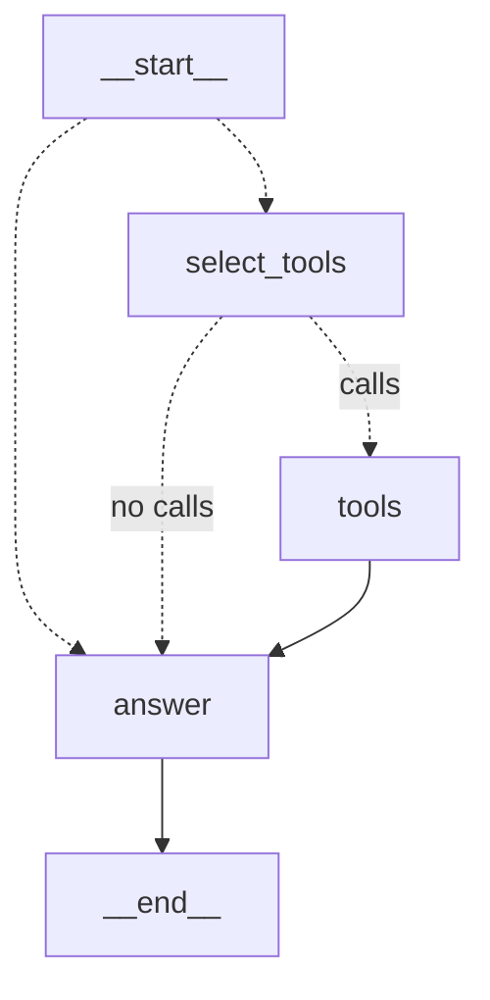
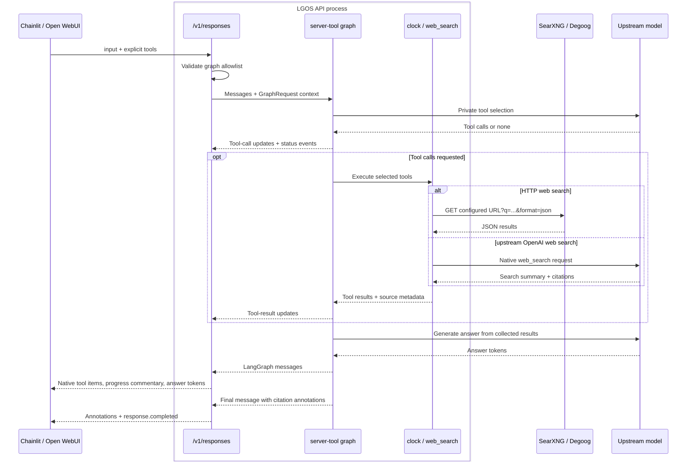

# Server Tool

`server-tool` demonstrates two client-selected, server-executed tools through
one standard Responses request:

- `lgos_current_time` uses the Responses custom-tool shape but is executed by
  LGOS rather than the client. Its free-form input is an IANA timezone string.
- `web_search` always uses the standard OpenAI declaration. The graph can run
  it through a self-managed SearXNG or Degoog endpoint, or use an upstream
  OpenAI Responses model's native search as its backend.

The graph is a model-backed workflow with no persistence. Clients own
conversation history and opt in to either tool on each request.

## LangGraph Topology



The `StateGraph` separates private tool selection from public answer generation.
Its `tools` node delegates execution to a native `ToolNode` containing only the
tools selected for this request. Both search backends return text and source
metadata through the same tool. The `answer` node streams text and then adds
citation annotations for exact source links retained in that text.

## Request Flow



1. The client includes `{"type":"custom","name":"lgos_current_time"}` and/or
   `{"type":"web_search"}` in `tools`. There is no tool discovery through the
   model endpoint and no automatic server-side enablement.
2. LGOS recognizes registered custom names as server selectors. Unregistered
   functions remain client-owned; this demo rejects those because it handles
   only its configured tools. `auto` lets the model decide, `required` requires
   a supplied tool, and a named custom choice can force the clock. Omitting a
   tool, or using `tool_choice="none"`, leaves it unavailable.
3. The graph binds the selected LangChain `@custom_tool` and `@tool` objects in
   `select_tools` and supplies the same selection to `ToolNode` for execution.
   The model selects every needed tool in one turn; `ToolNode` executes parallel
   calls using LangGraph's normal behavior. Requests without enabled tools go
   directly to `answer`.
4. Clock use returns `custom_tool_call`, `custom_tool_call_output`, and a message.
   Search use returns `web_search_call` followed by a message with standard
   URL-citation annotations. Clients replay the complete output and execute only
   `function_call` items. Backend-specific search payloads remain private.

Streaming combines native LangGraph `updates` for completed tool calls/results,
`custom` for existing `status_event()` progress, and `messages` for answer tokens.
Only `answer` is streamable. Private selection calls use `stream=False` and the
`nostream` tag, so intermediate model text never enters the public answer.
The graph declares `GraphFeature.CLIENT_EVENTS`; progress appears as Responses
commentary. Non-streaming responses omit this transient commentary.

The selection stage only gathers information; the answer stage has no bound
tools. Citations are attached after generation without changing or buffering
the streamed text. Clients rendering the transcript select
`phase="final_answer"` messages and present commentary separately.

The `http` backend is one JSON `GET` implemented with the demo's existing
`httpx` dependency. Both SearXNG and Degoog return the small `results` shape the
adapter consumes, so there are no provider classes. The adapter validates
HTTP(S) result URLs, removes duplicates, limits the result set, and gives the
model compact title, URL, and snippet text. Search content is treated as
untrusted data. The `openai` backend makes a private model call with
`{"type":"web_search"}` and `tool_choice="required"`. Its cited URLs become
the same source metadata consumed by the answer node. Internal provider calls
stay private; the outer response records the graph's `web_search` invocation.

## Try It

Start the [demo API](../api.md#start-postgresql-and-the-api). The default
`DEMO_API_WEB_SEARCH_BACKEND=http` uses the URL in
`DEMO_API_WEB_SEARCH_URL`. Point it at either endpoint:

```dotenv
# SearXNG (JSON output must be enabled)
DEMO_API_WEB_SEARCH_URL=https://searxng.example.com/search

# Degoog
DEMO_API_WEB_SEARCH_URL=https://degoog.example.com/api/search
```

To use an upstream OpenAI Responses model's native search instead:

```dotenv
DEMO_API_WEB_SEARCH_BACKEND=openai
```

The URL is ignored in `openai` mode. The configured upstream model or gateway
must support the OpenAI Responses `web_search` tool.

```python
from openai import OpenAI

client = OpenAI(base_url="http://localhost:3004/v1", api_key="DUMMY")
response = client.responses.create(
    model="server-tool",
    input="What time is it in Istanbul and Tokyo?",
    store=False,
    tools=[{"type": "custom", "name": "lgos_current_time"}],
    tool_choice="required",
    parallel_tool_calls=True,
)
for item in response.output:
    print(item.type)
print(response.output_text)
```

For web search, change the request fields to:

```python
tools=[{"type": "web_search"}],
tool_choice="required",
```

With only `web_search` supplied, `required` forces a search. In Chainlit, select
the `server-tool` profile and enable either tool in chat settings. The generated
Open WebUI Workspace Model exposes the same choices as Chat Variable checkboxes.
The declarations are fixed client knowledge; neither UI discovers tool names
from the server.

!!! note "One public contract"

    The clock's name selects its server-owned implementation and input contract.
    It uses standard Responses custom-tool items, while LGOS deliberately owns
    execution instead of returning the call for client execution.
    `web_search` uses the standard built-in declaration and output shape with
    every backend. The LGOS graph chooses where search runs; the client never
    names SearXNG, Degoog, or OpenAI as a provider. See the
    [server-tool contract](../../explanation/openai-compatibility.md#server-tools).

The implementation uses standard [OpenAI custom-tool call and output shapes](https://developers.openai.com/api/docs/guides/function-calling#custom-tools),
[web-search response shapes](https://developers.openai.com/api/docs/guides/tools-web-search?api-mode=responses),
LangGraph [`ToolNode` and tool routing](https://docs.langchain.com/oss/python/langchain/tools#toolnode),
LangChain's [OpenAI built-in tools](https://docs.langchain.com/oss/python/integrations/chat/openai#web-search),
the [SearXNG Search API](https://docs.searxng.org/dev/search_api.html),
[Degoog Search API](https://degoog-org.github.io/docs/api.html), and
[Python `zoneinfo`](https://docs.python.org/3/library/zoneinfo.html).
