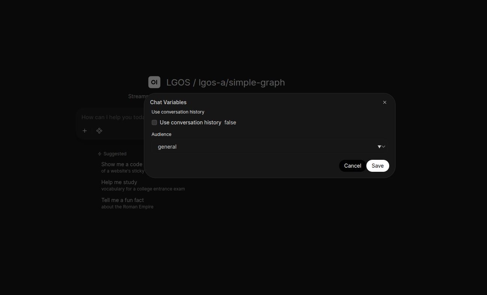

# Open WebUI Functions

The demo includes two Open WebUI Functions over LGOS APIs registered in Bifrost:

- `demo/ui/openwebui/src/lgos_openwebui/functions/generic.py` is a
  [manifold Pipe](https://docs.openwebui.com/features/extensibility/plugin/functions/pipe/#creating-multiple-models-with-pipes)
  for all registered graphs. It handles streaming, citations, and interrupt
  approval, and forwards graph-specific runtime settings.
- `demo/ui/openwebui/src/lgos_openwebui/functions/uservalves_simple.py` keeps
  a static `UserValves` design as a small single-model example.

The sync command also generates one Open WebUI Workspace Model per discovered
LGOS model. Each Workspace Model wraps the corresponding manifold model and
projects its LGOS settings schema into the pinned release's native Chat
Variables form.

## Setup

Start the official Open WebUI image:

```bash
cd demo
cp .env.example .env
docker compose -f docker/compose/demo.yml up --wait lgos-openwebui
```

Then run the independent synchronization project locally:

```bash
make sync-openwebui
```

The sync command signs in through `/api/v1/auths/signin`, creates or updates the
bundled Functions, lists provider-qualified LGOS models from Bifrost's `/v1`
catalog, retrieves detailed metadata through `/openai_passthrough/v1`, and
bulk-imports each generated Workspace Model with an active, public, hidden
override for its manifold base. Run it again after changing the Function,
Bifrost provider catalog, or a graph's client settings schema.

Generated Workspace Model descriptions come from the selected graph's required
`GraphConfig.description`. The sync marks a model as **Limited functionality**
when the API omits a description.

After importing the current catalog, sync deletes obsolete generated `lgos.*`
Workspace Models and `generic.*` base visibility records. It does not delete
bundled Functions or unrelated user-managed Workspace Models. New generated
Workspace Models are public; later syncs preserve their access grants and
active state. The sync owns the generated bases' hidden, public, and active
state.

The command discovers every top-level `.py` file in that directory except files
whose names start with `_`. The filename stem is the Function ID, and the
required Open WebUI frontmatter `title` is its display name. Function
filenames must be lowercase Python identifiers.

The typed `demo/ui/openwebui/src/lgos_openwebui/settings.py` model defines its
environment names, defaults, and descriptions. The shared
`.env.example` configures the local sync command. Set secrets in the environment
rather than passing them on the command line. Point the sync client and the
Function valve below at the same deployment; their hostnames differ when one
runs on the host and the other runs inside Compose.

Choose a generated entry such as `LGOS / lgos-a/simple-graph` to use Chat
Variables. Its Workspace Model ID is `lgos.lgos-a/simple-graph`, and its base
model is `generic.lgos-a/simple-graph`. The raw `Generic / ...` manifold entry
remains active and public but is hidden from the chat selector, following Open
WebUI's
[curated-interface guidance](https://docs.openwebui.com/features/workspace/models/#recommended-a-hidden-public-base-model-with-a-curated-model-on-top).
`UserValves-Simple / simple-graph` remains available as the static alternative.

Configure `OPENAI_API_BASE_URL`, `OPENAI_CATALOG_BASE_URL`, `OPENAI_API_KEY`,
and `OPENAI_API_TIMEOUT` in the generic Function's admin valves. The Pydantic
valve model in the Function is the source of truth for their defaults and
descriptions. The Function lists the Bifrost catalog once, keeps models owned by
`langgraph-openai-serve`, and exposes Bifrost's existing `provider/model` IDs.
For detailed retrieval and inference, it removes the provider prefix from the
model and sends it as `x-model-provider` through Bifrost pass-through. The
static UserValves Function accepts one provider-qualified `MODEL` and uses the
same routing rule. Open WebUI stores Function code in its database, so a bind
mount of the Python file does not update it.

The generic manifold uses only Bifrost's catalog for discovery. It retrieves
detailed LGOS metadata after a model is selected for chat, when settings and
capability checks need it. The sync command performs the same detailed
retrieval before it generates Workspace Models and their Chat Variables.

## Limited Functionality

Every generated model remains visible when its pass-through detail response
lacks the required `langgraph_openai_serve` extension. Its name and description
say **Limited functionality**. At chat time both bundled Pipes also emit an Open
WebUI
[`notification`](https://docs.openwebui.com/features/extensibility/plugin/development/events/#notification)
with warning severity. Standard assistant text may still work; runtime settings,
client events, and interrupts are not assumed.

## Runtime Settings

LGOS remains the schema and default-value source of truth. The sync command
uses the same deliberately small JSON Schema subset as the Chainlit demo:

- boolean with a boolean default becomes a checkbox;
- string enum with a valid string default becomes a selector;
- string with a string default becomes a text input;
- nested objects, arrays, numbers, and unsupported schemas are omitted.

Open WebUI stores Chat Variable values on the conversation. Select a generated
LGOS model, then use the Chat Variables control beside the message input. Since
LGOS supplies defaults for every setting, the form does not block the first
message merely to confirm them.



*Runtime settings synchronized from `lgos-a/simple-graph` and rendered as
native Open WebUI Chat Variables.*

When a chat has values, the Pipe retrieves the selected model's current LGOS
metadata, ignores names no longer present, removes values equal to current
defaults, and sends only changes as
`metadata.langgraph_runtime_settings`. LGOS performs the authoritative runtime
validation.

Both bundled Functions also map Open WebUI's stable `chat_id` to
`metadata.session_id` on every completion. Langfuse can therefore group the
chat's independent request traces into one session, while Open WebUI continues
to own and resend the conversation history. The generic Pipe also forwards the
opaque Open WebUI user ID as the standard OpenAI `user`; `persistent-plot` uses
both values to scope its chart document. Interrupt resumes reuse the same
conversation value. See the
[persistent plot ownership flow](graphs/persistent-plot.md#ownership-boundaries)
for the API Store and Open WebUI persistence boundaries.

The Workspace Model schema is a generated projection, not a second
configuration source. Open WebUI does not fetch a remote schema when the model
selector changes, so rerun `make sync-openwebui` after an LGOS schema change.
Model selection then switches among the already-synchronized native forms.

### Static Alternative

`uservalves_simple.py` remains useful for one fixed graph when settings are
intentionally hand-maintained per user and dynamic discovery or per-chat values
are unnecessary. Its fields are illustrative; generated Workspace Models still
take their schemas only from LGOS.

!!! note "Pinned Open WebUI contract"

    The demo pins Open WebUI v0.11.0. The sync imports its native
    `meta.chat_variables_schema` model metadata directly instead of putting
    form declarations in a system prompt. This preserves JSON booleans and
    ensures UI configuration never becomes graph prompt content. This behavior
    is version-specific; rerun the Open WebUI sync and model tests before
    changing the image pin.

## Streaming, Status, And Citations

The general manifold Pipe honors Open WebUI's requested Chat Completions mode.
Streaming requests yield assistant content, while non-streaming requests return
the full Chat Completion object. In both modes, the Pipe translates final OpenAI
citation annotations to native Open WebUI source events. Non-streaming requests
do not replay status or artifact events. The static example streams assistant
text only.

The manifold Pipe opts into LGOS client stream events only when model retrieval
advertises `client_events`, and maps every portable status update to Open
WebUI's native
[`status` events](https://docs.openwebui.com/features/extensibility/plugin/development/events/#status).
Open WebUI saves each update in the assistant message's `statusHistory`;
`done=False` displays an active shimmer, `done=True` stops it, and `hidden=True`
keeps the history entry out of the current display. Persisted statuses survive
a reload or closed tab. The Pipe renders the demo's versioned Plotly artifact
with the official versioned Plotly.js CDN and Open WebUI's persistent
[`embeds` event](https://docs.openwebui.com/features/extensibility/plugin/development/events/#embeds-or-chatmessageembeds).
The browser needs access to `cdn.plot.ly`; no same-origin iframe setting is
required. Other `progress` and artifact kinds remain ignored. Shared prompts
and graph behavior are documented under
[Events And Citations](graphs/events-and-citations.md#try-it) and
[Persistent Plot](graphs/persistent-plot.md#try-it).

The adapter deliberately does not turn status updates into OpenAI tool calls.
Open WebUI treats a tool call as work it must execute, but LGOS has already
started the backend work. The passive status mapping keeps execution in the
graph and avoids an unknown-tool or duplicate-execution path.

Proxy requirements are documented under
[proxy compatibility](../how-to-guides/openai-proxies.md#client-event-compatibility).

## Interrupt Approval

The Pipe implements the
[canonical batch replay](../explanation/openai-compatibility.md#canonical-batch-replay)
for the [interruptible-approval graph](graphs/interruptible-approval.md),
keeps only the current assistant/tool exchange in each resume request, and
sends no partial batch. Compose bounds an unanswered Open WebUI confirmation to
30 seconds with `WEBSOCKET_EVENT_CALLER_TIMEOUT`.

!!! warning "Approval recovery is live-only in this demo"

    Open WebUI persists its conversation, but this Function keeps the exact
    assistant/tool resume ledger only inside the active Pipe invocation. If the
    request is cancelled, the tab reloads, or the worker is lost before the
    resume reaches LGOS, the confirmation fails within 30 seconds and the
    PostgreSQL checkpoint remains pending. This demo cannot reconstruct it from
    visible chat history.

    A production Pipe must durably store the complete assistant tool-call
    message and its result for every call before resuming. It must also own an
    expiry policy for abandoned pending runs; the demo does not run a
    checkpoint reaper.

See the core [citation contract](../explanation/openai-compatibility.md#citation-ownership)
and [interrupt protocol](../explanation/openai-compatibility.md#tool-calls-and-interrupts)
for the API behavior beneath the adapter.
