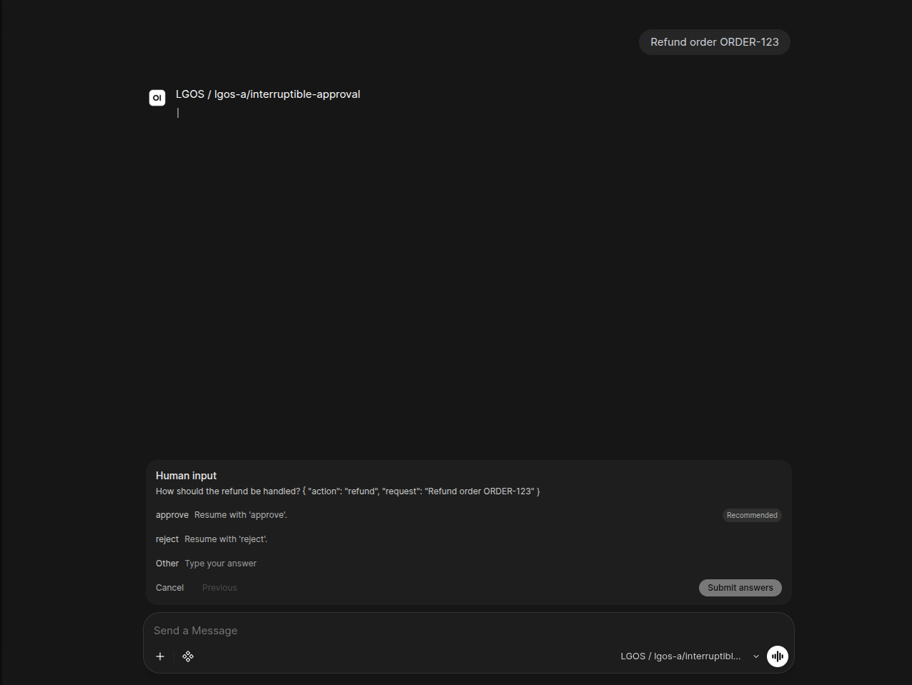

# Open WebUI Integration

Start with **UserValves Simple / simple-graph** to try static per-user runtime
settings. Its small
[`uservalves_simple.py`](https://github.com/ilkersigirci/langgraph-openai-serve/blob/main/demo/ui/openwebui/src/lgos_openwebui/functions/uservalves_simple.py)
Filter declares two settings and passes their values to the shared Responses
Pipe. Open WebUI owns the settings form and persistence.

The demo includes two Open WebUI Functions:

- `functions/uservalves_simple.py` demonstrates a fixed `UserValves` schema
  for one graph, using Open WebUI's native
  [Filter and UserValves support](https://docs.openwebui.com/features/extensibility/plugin/development/valves/).

- `demo/ui/openwebui/src/lgos_openwebui/functions/generic/` is the modular source
  for a
  [manifold Pipe](https://docs.openwebui.com/features/extensibility/plugin/functions/pipe/#creating-multiple-models-with-pipes)
  for all registered graphs. It uses OpenAI Responses, graph-specific runtime
  settings, and the standard Files API, and adapts LGOS
  interrupts to Open WebUI's native question UI.

The sync command also generates one Open WebUI Workspace Model per discovered
LGOS model. Each Workspace Model wraps the corresponding manifold model and
projects its LGOS settings schema into the pinned release's native Chat
Variables form.
When `lgos-a/simple-graph` is available with valid metadata, sync also creates
the dedicated UserValves example over the same manifold base.

## Simple Per-User Settings

After setup below, select **UserValves Simple / simple-graph**. Open
**Controls → Valves**, select **Functions → UserValves Simple**, and choose
`use_history` and `audience`. These preferences belong to the user and apply across chats
using this example. The field definitions are static; their values are editable.

The Filter supplies those values through Open WebUI's request metadata
`chat_variables` slot. The shared Pipe serializes them into
`metadata.langgraph_runtime_settings`; LGOS validates and applies them.
The example has no Chat Variables form, so there is only one settings control.

The Filter is enabled only on the dedicated Workspace Model
`lgos.uservalves_simple`. Keep it attached there rather than enabling it globally.
It depends on the Generic Pipe for Responses transport. The generated
**LGOS / ...** models below demonstrate schema-driven per-chat settings.

!!! info "Select one first-class gateway"

    Set `OPENAI_GATEWAY_TYPE=litellm|bifrost` once for both demo UIs. LiteLLM
    uses managed Responses; Bifrost uses native Responses. Files also use the
    selected gateway's normal route. Pass-through is limited to catalog detail
    so LGOS descriptions and settings survive gateway normalization. Neither
    the Function nor the sync logic connects directly to LGOS.

## Setup

Start the official Open WebUI image:

```bash
cd demo
cp .env.example .env
docker compose -f docker/compose/demo.yml up --wait lgos-openwebui
```

Then run the independent synchronization project locally:

```bash
make sync-openwebui
```

The sync command signs in through `/api/v1/auths/signin`, creates or updates the
bundled Functions, lists LGOS models through the selected gateway, retrieves
their detailed metadata, and bulk-imports each generated Workspace Model with
an active, public, hidden override for its manifold base. Run it again after
changing a Function, the configured model catalog, or a graph's client settings
schema.

Generated Workspace Model descriptions come from the selected graph's required
`GraphConfig.description`. The sync marks a model as **Limited functionality**
when the API omits a description.

LiteLLM's managed `/v1/models` response is not the UI catalog. The sync instead
merges `/v1/lgos-a/models` and `/v1/lgos-b/models`, and retrieves details
through the matching catalog pass-through. Bifrost uses aggregate `/v1/models`
for discovery and its pass-through only for provider-specific detail. This
preserves LGOS descriptions, features, and detailed client-settings schemas
without a direct connection to LGOS. Inference still uses the selected
gateway's normal Responses route.

After importing the current catalog, sync deletes obsolete generated `lgos.*`
Workspace Models and `generic.*` base visibility records. It does not delete
unrelated user-managed Functions or Workspace Models. New generated
Workspace Models are public; later syncs preserve their access grants and
active state. The sync owns the generated bases' hidden, public, and active
state.

The command discovers every top-level `.py` file and directory-backed Function
in that directory, except entries whose names start with `_`. A modular
Function directory contains `function.py` for its frontmatter and entrypoint;
the Generic Function's modules are flattened into one executable source string
at sync time because Open WebUI stores each Function directly in its database.
The filename stem or directory name is the Function ID, and the required Open
WebUI frontmatter `title` is its display name. Function IDs must be lowercase
Python identifiers.

The typed `demo/ui/openwebui/src/lgos_openwebui/settings.py` model defines its
environment names, defaults, and descriptions. The shared
`.env.example` configures the local sync command. Set secrets in the environment
rather than passing them on the command line. Point the sync client and the
Function valve below at the same deployment; their hostnames differ when one
runs on the host and the other runs inside Compose.

Choose a generated entry such as `LGOS / lgos-a/simple-graph` to use Chat
Variables. Its Workspace Model ID is `lgos.lgos-a/simple-graph`, and its base
model is `generic.lgos-a/simple-graph`. The raw `Generic / ...` manifold entry
remains active and public but is hidden from the chat selector, following Open
WebUI's
[curated-interface guidance](https://docs.openwebui.com/features/workspace/models/#recommended-a-hidden-public-base-model-with-a-curated-model-on-top).

Configure `OPENAI_GATEWAY_TYPE`, optional `OPENAI_GATEWAY_BASE_URL`,
`OPENAI_API_KEY`, and `OPENAI_API_TIMEOUT` in the generic Function's admin
valves. The Pydantic valve model in the Function is the source of truth for
their defaults and descriptions. Compose supplies `DEMO_LITELLM_MASTER_KEY` as
`OPENAI_API_KEY`; replace the demo-only value in shared deployments. LiteLLM
keeps `lgos-a/` or `lgos-b/` on the managed-routing model ID. Bifrost removes
that provider prefix and sends it as `x-model-provider` to native Responses.
Open WebUI stores Function code in its database, so a bind mount of the Python
file does not update it.

The generic manifold lists the selected gateway's aggregate UI catalog. The
sync command additionally retrieves detailed LGOS metadata before it generates
Workspace Models, their Chat Variables, and file-upload capability.

## File Input

Generated models enable Open WebUI's native file-upload control only when the
graph advertises `file_inputs`. Select `file-input` to process an attachment.
Selecting Bifrost also exposes provider-qualified equivalents. The Generic
Function receives non-image attachments through Open WebUI's documented
[`__files__`](https://docs.openwebui.com/features/extensibility/plugin/development/reserved-args/#__files__)
argument and image bytes from their base64 `image_url` content. In the pinned
release, `__metadata__["user_message"]` identifies the message that started this
turn. Because `__files__` also includes files from earlier turns, the Function
intersects it with that current message, uploads each current attachment's
original bytes with `purpose="user_data"`, and appends the returned OpenAI
`file_id` to the message. It never reuploads historical chat attachments or
moves them to the latest message. Images use `input_file.file_id` too; the
current LGOS Responses subset does not accept `input_image` items.

The generated Workspace Model is the upload-capability boundary. The raw
manifold entry is intended for diagnostics and does not add a second remote
metadata check to every Responses request.

Compose sends file uploads through the selected gateway's normal `/v1` Files
route. Bifrost assigns the request to `lgos-files`; LiteLLM assigns it to
`litellm_proxy`. Both providers target the central Files API. Neither UI uses a
Files pass-through.

The Compose service mounts a small ASGI wrapper that forces `process=false` on
Open WebUI's native file-upload endpoint. Open WebUI therefore stores the
original bytes without extracting or embedding their content before the Pipe
runs. The generated Workspace Model also disables chat-time file-context
retrieval and its built-in file tools while preserving other built-in tools,
including `ask_user`.

Open WebUI still owns its raw upload copy because its native attachment UI
requires an Open WebUI file record. The central Files API is the only processing
source of truth and owns the separate inference copy referenced by `file_id`.
The policy applies to every file uploaded through this demo Open WebUI instance,
not only to generated LGOS models.

!!! note "Temporary upstream workaround"

    Open WebUI v0.11.3 always requests processing for non-image chat uploads,
    before a Pipe or Filter can run. The wrapper exists only to change that
    upload request to `process=false`; a Filter can control later retrieval but
    cannot prevent the earlier extraction.

    Remove `upload_policy.py`, its Compose mount, and the custom Uvicorn command
    when the pinned Open WebUI release provides native per-model control for raw
    uploads. See the related
    [upstream issue](https://github.com/open-webui/open-webui/issues/12228) and
    the
    [unmerged File Processing capability PR](https://github.com/open-webui/open-webui/pull/27627).

## Limited Functionality

Every generated model remains visible when its native detail response
lacks the required `langgraph_openai_serve` extension. Its name and description
say **Limited functionality**. Standard assistant text may still work; runtime
settings and file-upload controls are not assumed.

## Runtime Settings

LGOS remains the schema and default-value source of truth. The sync command
uses the same deliberately small JSON Schema subset as the Chainlit demo:

- boolean with a boolean default becomes a checkbox;
- string enum with a valid string default becomes a selector;
- string with a string default becomes a text input;
- nested objects, arrays, numbers, and unsupported schemas are omitted.

Open WebUI stores Chat Variable values on the conversation. Select a generated
LGOS model, then use the Chat Variables control beside the message input. Since
LGOS supplies defaults for every setting, the form does not block the first
message merely to confirm them.


*Runtime settings synchronized from `lgos-a/simple-graph` and rendered as
native Open WebUI Chat Variables.*

When a chat has values, the Pipe serializes Open WebUI's generated Chat
Variables and sends them as
`metadata.langgraph_runtime_settings`. LGOS performs the authoritative runtime
validation.

The shared Pipe maps Open WebUI's stable `chat_id` to
`metadata.session_id` on every Responses request, including the UserValves example.
Langfuse can therefore group the
chat's independent request traces into one session, while Open WebUI continues
to own and resend the conversation history. The generic Pipe also forwards the
opaque Open WebUI user ID as the standard OpenAI `user`; `persistent-plot-agent` uses
both values to scope its chart document. Interrupt resumes reuse the same
conversation value. See the
[persistent plot agent ownership flow](graphs/persistent-plot-agent.md#ownership-boundaries)
for the API Store and Open WebUI persistence boundaries.

The Workspace Model schema is a generated projection, not a second
configuration source. Open WebUI does not fetch a remote schema when the model
selector changes, so rerun `make sync-openwebui` after an LGOS schema change.
Model selection then switches among the already-synchronized native forms.

!!! note "Pinned Open WebUI contract"

    The demo pins Open WebUI v0.11.3. The sync imports its native
    `meta.chat_variables_schema` model metadata directly instead of putting
    form declarations in a system prompt. This preserves JSON booleans and
    ensures UI configuration never becomes graph prompt content. This behavior
    is version-specific; rerun the Open WebUI sync and model tests before
    changing the image pin.

## Streaming, Status, And Citations

The general manifold Pipe uses OpenAI Responses for every model. The SDK stream
manager owns event accumulation and supplies the terminal `Response`; the Pipe
adapts final-answer deltas to Open WebUI's native stream interface and maps
completed commentary messages to native status history. It translates standard
answer URL annotations from the completed Response into persistent native
source events, with each cited span as the source excerpt. The SDK owns the
complete annotation objects; the Pipe does not rebuild them from deltas.
Both modes exclude commentary and accept answer messages without the optional
`phase` field. Transcript replay labels assistant answers as `final_answer` and
preserves explicit phase values, following OpenAI's
[assistant phase guidance](https://developers.openai.com/api/docs/guides/reasoning#phase-parameter).
Inline citation markers remain part of assistant content.

!!! note "Keep streaming enabled"

    In Open WebUI v0.11.3, native citation sources, tool calls, and `ask_user`
    use its streaming middleware. The UI does not render equivalent native
    controls from non-streaming adapter output.

The persistent plot graph returns a standard `display_file` function call. The
Pipe downloads the Plotly JSON through the OpenAI Files API and embeds the
figure in a small HTML document. The browser renders it with the native
[`Plotly.newPlot`](https://plotly.com/javascript/plotlyjs-function-reference/#plotlynewplot)
API; the Open WebUI backend needs no Python Plotly package.
It emits the native persistent [`embeds` event](https://docs.openwebui.com/features/extensibility/plugin/development/events/#embeds-or-chatmessageembeds)
to render an interactive chart in Open WebUI's sandboxed iframe, then returns
the matching `function_call_output` before requesting the final answer.
The HTML uses Plotly's versioned CDN script, so browsers must be able to reach
`cdn.plot.ly`. Open WebUI saves the embed with the message for chat reloads;
HTML and chart bytes stay out of the upstream model transcript. Image files
still use authenticated Open WebUI file storage and the native `files` event. Each continuation retains the original input, including instructions
and file references, then appends complete Response output items and matching
tool results. Final-answer text from every call is retained in both modes.

The Pipe returns plain text for non-streaming answers and uses the OpenAI SDK's
typed chunk schema for streamed text. Open WebUI JSON-encodes these chunks, so
literal text such as `data: [DONE]` cannot be mistaken for a stream event.
Open WebUI owns stream termination. The native `ask_user` bridge also uses the
host's tool-call dictionaries to persist question cards and replay answers.
These shapes belong to the UI boundary; inference uses Responses exclusively.
See the pinned
[Pipe host](https://github.com/open-webui/open-webui/blob/v0.11.3/backend/open_webui/functions.py).
Shared prompts and graph behavior are documented under
[Events And Citations](graphs/events-and-citations.md#try-it) and
[Persistent Plot Agent](graphs/persistent-plot-agent.md#try-it).

## Interrupt Input

The Pipe translates each LGOS `langgraph_interrupt` batch into one built-in
Open WebUI `ask_user` call. Open WebUI persists that pending call on the saved
assistant message, so its native question card survives a page reload. The
Pipe keeps the original LGOS calls in the opaque `ask_user` call ID; answering
the card needs no adapter database or live socket callback.

The deliberately small UI profile is an object containing a non-empty
`question`, two or three unique string `choices`, and optional boolean
`allow_other`. When `allow_other` is true, Open WebUI adds its free-form
**Other** input. This is a demo-client presentation convention, not an LGOS
restriction: the LGOS interrupt protocol accepts any JSON resume value, while
this adapter maps Open WebUI choices and free-form answers to strings.

After the user answers, the Pipe decodes the original calls and performs the
[canonical LGOS replay](../explanation/openai-compatibility.md#canonical-batch-replay):
the exact Responses function-call items, including `run_id` and `state_token`,
followed by one `{"resume": ...}` function output per interrupt. One native `ask_user`
call can contain one to three questions, matching Open WebUI's built-in limit.
LGOS itself remains generic and can expose larger atomic batches to clients that
support them.

!!! note "Saved chats restore pending input"

    Open WebUI's built-in `ask_user` persistence requires a saved chat. Refreshing
    the page restores the unanswered card; the LangGraph checkpoint remains
    pending until the answer reaches LGOS. **Cancel** ends the Open WebUI turn
    without resuming the graph, so its checkpoint remains pending. The demo has
    no expiry worker; production deployments must reap abandoned runs.

The refund demo offers **approve**, **reject**, and a custom response. Approval
executes the simulated refund and notification, rejection stops the workflow,
and custom text is returned as reviewer feedback without executing an action.



*Open WebUI renders the interrupt as a native `ask_user` card with choices and
an optional free-form answer.*

LGOS still owns the pending graph checkpoint and its retention policy. See
[Interruptible Human Review](graphs/interruptible-approval.md#postgresql-runtime)
for server-side checkpoint retention.

See the core [citation contract](../explanation/openai-compatibility.md#citation-ownership)
and [interrupt protocol](../explanation/openai-compatibility.md#tool-calls-and-interrupts)
for the API behavior beneath the adapter.
