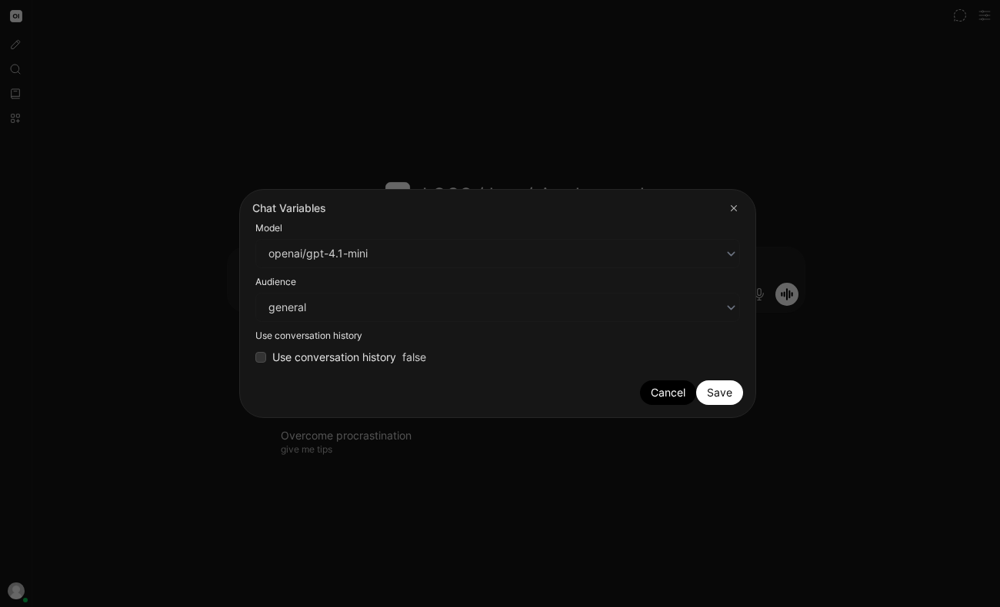
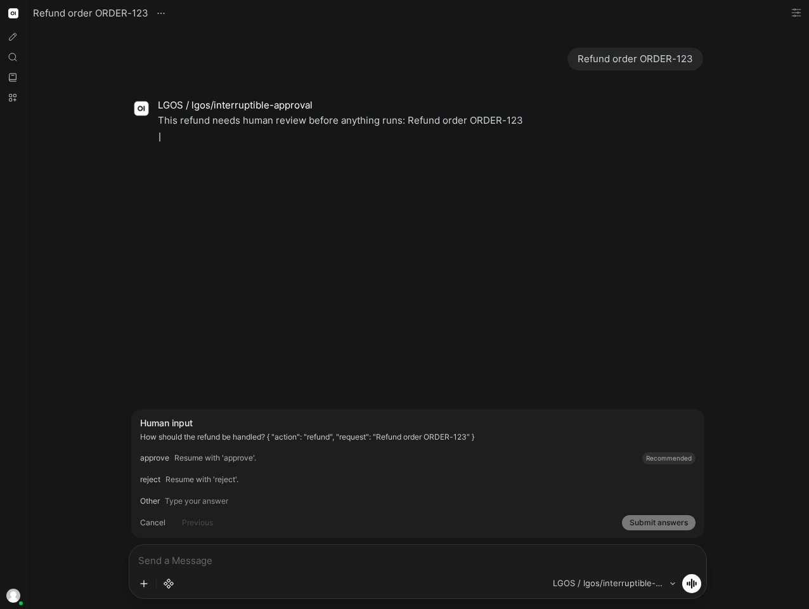

# Open WebUI Integration

Start with **UserValves Simple / simple-graph** to try static per-user runtime
settings. Its small
[`uservalves_simple.py`](https://github.com/ilkersigirci/langgraph-openai-serve/blob/main/demo/ui/openwebui/src/lgos_openwebui/functions/uservalves_simple.py)
Filter declares two settings and passes their values to the shared Responses
Pipe. Open WebUI owns the settings form and persistence.

The demo includes two Open WebUI Functions:

- `functions/uservalves_simple.py` demonstrates a fixed `UserValves` schema
  for one graph, using Open WebUI's native
  [Filter and UserValves support](https://docs.openwebui.com/features/extensibility/plugin/development/valves/).

- `demo/ui/openwebui/src/lgos_openwebui/functions/generic/` is the modular source
  for a
  [manifold Pipe](https://docs.openwebui.com/features/extensibility/plugin/functions/pipe/#creating-multiple-models-with-pipes)
  for all registered graphs. It uses OpenAI Responses, graph-specific runtime
  settings, and the standard Files API, and adapts LGOS
  interrupts to Open WebUI's native question UI.

The sync command also generates one Open WebUI Workspace Model per discovered
LGOS model. Each Workspace Model wraps the corresponding manifold model and
declares its LGOS settings as native Chat Variables, which Open WebUI renders
as a per-chat form.
The generated `server-tool` models add fixed **Package version** and **Web
search** Chat Variable checkboxes. Generated `advanced-graph` models add only
the **Web search** checkbox; their gateway MCP tools are attached separately
from the discovered `mcp_tools` capability. The Pipe maps enabled tool boxes to
a name-only `{"type":"custom","name":"lgos_package_version"}` declaration or
`{"type":"web_search"}`; it keeps them out of `metadata.lgos_settings`. The
names are client constants, not discovered metadata. The server registry
determines which names execute in LGOS. Asking the advanced graph to remember or
save something triggers its note-review flow without a graph-specific setting.
The Pipe executes only native `function_call` items. Server custom calls and
searches have distinct native types and are already complete.
When `lgos-a/simple-graph` is available with valid metadata, sync also creates
the dedicated UserValves example over the same manifold base.

## Server Tool Switches

Select **LGOS / ... / server-tool**, open the Chat Variables control beside the
chat input, and enable **Package version**, **Web search**, or both. The
checkboxes default to off and their values belong to the chat. LGOS executes
the selected tools server-side without a client-tool continuation.

The OpenAI SDK in the pinned Open WebUI image omits
`custom_tool_call_output` from one generated response union. The Function adds
that existing SDK model to the affected response annotations at load time. The
shim is feature-detected, changes no installed package files, and becomes a
no-op when Open WebUI updates to an SDK containing the corrected union.

For **LGOS / ... / advanced-graph**, the same control contains **Web search**.
Search is sent as a standard Responses tool. Note saving is an intent expressed
in the user's message.

## Simple Per-User Settings

After setup below, select **UserValves Simple / simple-graph**. Open
**Controls → Valves**, select **Functions → UserValves Simple**, and choose
`use_history` and `audience`. These preferences belong to the user and apply across chats
using this example. The field definitions are static; their values are editable.

The Filter adds those values to Open WebUI's request metadata as
`lgos_settings`. The shared Pipe sends them unchanged as
`metadata.lgos_settings`; LGOS validates and applies them.
The example has no Chat Variables form, so there is only one settings control.

The Filter is enabled only on the dedicated Workspace Model
`lgos.uservalves_simple`. Keep it attached there rather than enabling it globally.
It depends on the Generic Pipe for Responses transport. The generated
**LGOS / ...** models below demonstrate schema-driven per-chat settings.

!!! info "Select one first-class gateway"

    Set `OPENAI_GATEWAY_TYPE=litellm|bifrost` once for both demo UIs. LiteLLM
    uses managed Responses; Bifrost uses native Responses. Files also use the
    selected gateway's normal route. Metadata comes from LiteLLM's native
    `/model/info` or Bifrost's catalog-detail pass-through. Neither
    the Function nor the sync logic connects directly to LGOS.

## Gateway MCP

Compose declares one Streamable HTTP connection, `lgos-gateway`, in Open
WebUI's `TOOL_SERVER_CONNECTIONS` environment variable. The sync command
attaches it to each generated Workspace Model whose gateway metadata
advertises `mcp_tools`. The Generic Pipe forwards the gateway tools from
Open WebUI's native `__tools__` map through Responses and returns matching calls
to the native tool loop. `mcp-postgres` adds its fixed report allowlist at the
API boundary, while general-purpose graphs can use the gateway-authorized tool
catalog without knowing which MCP servers provide it.

The connection URL is `OPENAI_GATEWAY_BASE_URL` followed by `/mcp`, the
aggregate endpoint both bundled gateways serve. `OPENAI_GATEWAY_API_KEY` is the
connection's native bearer key. The same values drive model discovery, Responses, and Files. The gateway
credential determines which MCP tools can be discovered, while the downstream
DBHub token remains private to the gateway.

Open WebUI reads `TOOL_SERVER_CONNECTIONS` on every start. Compose disables
Open WebUI's persistent configuration, so changes made to the connection in
the admin settings last only until the container restarts.

Keep streaming enabled because Open WebUI's native tool middleware consumes the
streamed tool-call shape. The current database example is
[PostgreSQL Through Native MCP](graphs/mcp-postgres.md); see it for the complete
flow and security boundaries, and Open WebUI's official
[MCP documentation](https://docs.openwebui.com/features/extensibility/mcp/)
for its native server administration and access controls.

## Setup

Start the pinned official Open WebUI slim image unchanged:

```bash
cp demo/.env.example demo/.env
just demo/up lgos-openwebui --wait
```

!!! info "Slim image"

    The demo pins the official Open WebUI slim image. It omits local
    embedding, reranking, speech, and document-extraction models, the headless
    browser, and keyless DDGS search. The demo uses none of them: speech runs
    through the gateway, uploads stay raw for the central Files API, and graphs
    own retrieval and web search. Open WebUI's own Knowledge and Memory
    features need PostgreSQL with pgvector on this image and are not
    configured. Deleting a stored Open WebUI file therefore removes it but
    reports an error while cleaning up the absent vector index.

For independently started components, first [sync LGOS model
metadata](litellm-sync.md) when using LiteLLM. Then run the locked
synchronization project on the host:

```bash
just demo/sync-openwebui
```

The command discovers models through `DEMO_GATEWAY_HOST_URL` with the same
credential as the Open WebUI runtime. For a standalone Open WebUI deployment,
run `uv run --directory demo/ui/openwebui --locked lgos-openwebui-sync` from an
environment where `DEMO_OPENWEBUI_URL` and the gateway are reachable; without
`DEMO_GATEWAY_HOST_URL`, discovery uses `OPENAI_GATEWAY_BASE_URL`. Configure
that deployment's `lgos-gateway` MCP connection as the Compose service does.

The full-stack `just demo/compose [--dev] [--otel]` variants handle
synchronization automatically after their dependencies are healthy.

The sync command signs in through `/api/v1/auths/signin` and reads LGOS metadata
from the selected gateway before changing Functions or Workspace Models.
An unavailable or malformed catalog stops the command without modifying them.
It then updates the bundled Functions and bulk-imports each generated Workspace
Model with an active, public, hidden override for its manifold base. Run it again
after changing a Function, the configured model catalog, or a graph's client
settings schema.

Generated Workspace Model descriptions come from the selected graph's required
`GraphConfig.description`. The sync marks a model as **Limited functionality**
when the API omits a description.

LiteLLM's managed `/v1/models` response is not the UI catalog. Both the Generic
Pipe and Workspace Model sync read native `GET /model/info` using their
configured gateway key. Entries with `model_info.lgos` supply descriptions,
features, and complete settings; `model_name` remains the inference ID.
No provider allowlist, per-provider catalog URL, or LGOS fallback is used.
Bifrost uses aggregate `/v1/models`
for discovery and its pass-through only for provider-specific detail. This
preserves LGOS descriptions, features, and detailed client-settings schemas
without a direct connection to LGOS. Inference still uses the selected
gateway's normal Responses route.

After importing the current catalog, sync deletes obsolete generated `lgos.*`
Workspace Models and `generic.*` base visibility records. It does not delete
unrelated user-managed Functions or Workspace Models. New generated
Workspace Models are public; later syncs preserve their access grants and
active state. The sync owns the generated bases' hidden, public, and active
state.

The command installs the two Functions under
`demo/ui/openwebui/src/lgos_openwebui/functions/`: `generic` and
`uservalves_simple`. The Generic Function's `function.py` holds its
frontmatter, and its modules are flattened into one executable source string at
sync time because Open WebUI stores each Function directly in its database.

The shared `demo/.env` supplies the sync credentials and gateway selection. See
[sync settings](reference.md#open-webui-sync-settings) for their purposes. Set
secrets in the environment rather than passing them on the command line.

Choose a generated entry such as `LGOS / lgos-a/simple-graph` to use Chat
Variables. Its Workspace Model ID is `lgos.lgos-a/simple-graph`, and its base
model is `generic.lgos-a/simple-graph`. The raw `Generic / ...` manifold entry
remains active and public but is hidden from the chat selector, following Open
WebUI's
[curated-interface guidance](https://docs.openwebui.com/features/workspace/models/#recommended-a-hidden-public-base-model-with-a-curated-model-on-top).

Configure the required `OPENAI_GATEWAY_TYPE`, `OPENAI_GATEWAY_BASE_URL`, and
`OPENAI_GATEWAY_API_KEY` values, plus `OPENAI_API_TIMEOUT`, in the generic
Function's admin valves. Compose initializes the required values from
`demo/.env`; use a key issued by the selected gateway. LiteLLM
sends the catalog's `model_name` unchanged for managed routing. Bifrost also
receives the provider-qualified catalog ID unchanged on native Responses and
selects the provider from its prefix.
Open WebUI stores Function code in its database, so a bind mount of the Python
file does not update it.

## File Input

Generated models enable Open WebUI's native file-upload control only when the
graph advertises `file_inputs`. Select `LGOS / lgos-a/file-input` in the bundled
demo to process an attachment. In the pinned release,
`__metadata__["user_message"]` lists the files attached to the message that
started this turn, images included. The Generic Function reads each file's
original bytes through Open WebUI's authenticated
`/api/v1/files/{id}/content` endpoint with the caller's credentials, uploads
them with `purpose="user_data"`, and appends the returned OpenAI `file_id` to
the message. It never reuploads historical chat attachments or moves them to
the latest message. Images use `input_file.file_id` too; the current LGOS
Responses subset does not accept `input_image` items.

This local file bridge uses the HTTPX shipped by the pinned Open WebUI runtime;
it will move to HTTPX2 when Open WebUI adopts OpenAI v3.

The generated Workspace Model is the upload-capability boundary. The raw
manifold entry is intended for diagnostics and does not add a second remote
metadata check to every Responses request.

Compose sends file uploads through the selected gateway's normal `/v1` Files
route. Bifrost assigns the request to `lgos-files`; LiteLLM assigns it to
`litellm_proxy`. Both providers target the central Files API. Neither UI uses a
Files pass-through.

The Compose service mounts a small ASGI wrapper that forces `process=false` on
Open WebUI's native file-upload endpoint. Open WebUI therefore stores the
original bytes without extracting or embedding their content before the Pipe
runs. The generated Workspace Model also disables chat-time file-context
retrieval and its built-in file tools while preserving other built-in tools,
including `ask_user`.

Open WebUI still owns its raw upload copy because its native attachment UI
requires an Open WebUI file record. The central Files API is the only processing
source of truth and owns the separate inference copy referenced by `file_id`.
The policy applies to every file uploaded through this demo Open WebUI instance,
not only to generated LGOS models.

!!! note "Temporary upstream workaround"

    The pinned Open WebUI release always requests processing for non-image
    chat uploads before a Pipe or Filter can run. The wrapper exists only to
    change that upload request to `process=false`; a Filter can control later
    retrieval but cannot prevent the earlier extraction.

    Remove `upload_policy.py`, its Compose mount, and the custom Uvicorn command
    when the pinned Open WebUI release provides native per-model control for raw
    uploads. See the related
    [upstream issue](https://github.com/open-webui/open-webui/issues/12228) and
    the
    [unmerged File Processing capability PR](https://github.com/open-webui/open-webui/pull/27627).

## Voice

Compose configures Open WebUI's native
[speech-to-text and text-to-speech](https://docs.openwebui.com/features/chat-conversations/audio/)
with its `openai` engines. Both engines call the selected gateway's `/v1` audio
routes with `OPENAI_GATEWAY_API_KEY`, `DEMO_AUDIO_STT_MODEL`,
`DEMO_AUDIO_TTS_MODEL`, and `DEMO_AUDIO_TTS_VOICE`. The Pipe and LGOS stay
text-only.

- **Voice mode**, the headphones button in an empty chat input, is the
  hands-free loop. Open WebUI ends a turn after two seconds of silence,
  transcribes it, and submits the text to the selected model as a normal chat
  message. It then speaks the answer sentence by sentence.
- The **microphone** button dictates into the input box for editing before
  sending.
- **Read aloud** under an answer speaks it on demand.

Open WebUI always shows these controls to admins, including the demo
account. `USER_PERMISSIONS_CHAT_STT`, `USER_PERMISSIONS_CHAT_TTS`, and
`USER_PERMISSIONS_CHAT_CALL` hide them only from regular users. Without working
speech models, the controls fail with Open WebUI's own error toasts.

In voice mode, Open WebUI adds its own concise-voice-assistant system prompt,
which the Pipe forwards to LGOS like any other system message. Set
`ENABLE_VOICE_MODE_PROMPT=false` on the Open WebUI service to send only the
transcript.

!!! note "Set the audio URLs explicitly"

    Open WebUI does not derive its audio base URLs from any other
    connection setting; without `AUDIO_*_OPENAI_API_BASE_URL`, speech goes to
    `api.openai.com`. The slim image carries no local Whisper engine or voices,
    so both engines must use an external service.

## Limited Functionality

Every generated model remains visible when its native detail response
lacks the required `lgos` extension. Its name and description
say **Limited functionality**. Standard assistant text may still work; runtime
settings, file-upload controls, and gateway tools are not assumed.

## Runtime Settings

LGOS remains the schema and default-value source of truth. The sync command
uses the same deliberately small JSON Schema subset as the Chainlit demo:

- boolean with a boolean default becomes a checkbox;
- string enum with a valid string default becomes a selector;
- string with a string default becomes a text input;
- integer with an integer default becomes a number input, keeping its
  `minimum` and `maximum` as bounds;
- nested objects, arrays, non-integer numbers, and unsupported schemas are
  omitted.

Open WebUI's declaration syntax cannot represent text containing `"`, `\`, or
`}`, and a line break would hide the end of the rendered declarations from the
Pipe. A string default or option with one of these characters omits its
setting; such a title falls back to a label derived from the setting name.

Open WebUI stores Chat Variable values on the conversation. Select a generated
LGOS model, then use the Chat Variables control beside the message input. Since
LGOS supplies defaults for every setting, the form does not block the first
message merely to confirm them.



*Runtime settings synchronized from `lgos-a/simple-graph` and rendered as
native Open WebUI Chat Variables.*

When a chat has values, the Pipe serializes Open WebUI's generated Chat
Variables and sends them as
`metadata.lgos_settings`. A chat keeps the values of every model selected in
it, so the Pipe sends only the variables the selected Workspace Model declares.
Open WebUI keeps an untouched declared default as
text, so the Pipe restores checkbox and number values to JSON booleans and
integers. It omits empty values so LGOS applies its defaults, and LGOS performs
the authoritative runtime validation.

Models advertising `background` also receive an opt-in **Run in
background** checkbox. The Pipe keeps this client-owned value out of
`lgos_settings`, polls the non-streaming Response, and publishes native status
events until the normal answer renderer takes over. Interrupt answers follow
the same checkbox.

The shared Pipe maps Open WebUI's stable `chat_id` to
`metadata.conversation_id` on every Responses request, including the UserValves example.
Langfuse can therefore group the
chat's independent request traces into one session, while Open WebUI continues
to own and resend the conversation history. The generic Pipe also forwards the
opaque Open WebUI user ID as the standard OpenAI `user`; `persistent-plot-agent` uses
both values to scope its chart document. Interrupt resumes reuse the same
conversation value. See the
[persistent plot agent ownership flow](graphs/persistent-plot-agent.md#ownership-boundaries)
for the API Store and Open WebUI persistence boundaries.

The Workspace Model declarations are a generated projection, not a second
configuration source. Open WebUI does not fetch a remote schema when the model
selector changes, so rerun `just demo/sync-openwebui` after an LGOS
schema change. Model selection then switches among the already-synchronized
native forms.

!!! note "Pinned Open WebUI contract"

    The pinned Open WebUI release derives the Chat Variables form only from
    `{{chat.variables.*}}` declarations in a Workspace Model's system prompt.
    The sync writes a declaration-only system prompt between
    `<lgos-chat-variables>` delimiter lines. Before a Pipe runs, Open WebUI
    renders it with the chat's values and prepends the result to the first
    system message. The Generic Pipe removes that leading block, including the
    copy each native tool-loop continuation adds, and keeps any chat-level
    system prompt that follows. Settings therefore reach LGOS only as metadata,
    never as graph prompt content. This behavior is version-specific; rerun the
    Open WebUI sync and model tests before changing the image pin.

## Streaming, Status, And Citations

The general manifold Pipe uses OpenAI Responses for every model. The SDK stream
manager owns event accumulation and supplies the terminal `Response`; the Pipe
adapts final-answer deltas to Open WebUI's native stream interface and maps
completed commentary messages to native status history. It translates standard
answer URL annotations from the completed Response into persistent native
source events, with each cited span as the source excerpt. The SDK owns the
complete annotation objects; the Pipe does not rebuild them from deltas.
Both modes exclude commentary and accept answer messages without the optional
`phase` field. Transcript replay labels assistant answers as `final_answer` and
preserves explicit phase values, following OpenAI's
[assistant phase guidance](https://developers.openai.com/api/docs/guides/reasoning#phase-parameter).
Inline citation markers remain part of assistant content.

Status descriptions remain active while the Responses/tool loop runs and are
finalized when it completes or stops, using Open WebUI's native
[`status` events](https://docs.openwebui.com/features/extensibility/plugin/development/events/#status).
Both response modes display native refusals. Failed and incomplete streaming
events are handled directly so their reason remains visible; incomplete
responses never trigger client functions.

!!! note "Keep streaming enabled"

    In Open WebUI, native citation sources, tool calls, and `ask_user`
    use its streaming middleware. The UI does not render equivalent native
    controls from non-streaming adapter output.

The persistent plot graph returns a standard `display_file` function call. The
Pipe downloads the Plotly JSON through the OpenAI Files API and embeds the
figure in a small HTML document. The browser renders it with the native
[`Plotly.newPlot`](https://plotly.com/javascript/plotlyjs-function-reference/#plotlynewplot)
API; the Open WebUI backend needs no Python Plotly package.
It emits the native persistent [`embeds` event](https://docs.openwebui.com/features/extensibility/plugin/development/events/#embeds-or-chatmessageembeds)
to render an interactive chart in Open WebUI's sandboxed iframe, then returns
the matching `function_call_output` before requesting the final answer.
The HTML uses Plotly's versioned CDN script, so browsers must be able to reach
`cdn.plot.ly`. Open WebUI saves the embed with the message for chat reloads;
HTML and chart bytes stay out of the upstream model transcript. Image files
still use authenticated Open WebUI file storage and the native `files` event. Each continuation retains the original input, including instructions
and file references, then appends complete Response output items and matching
tool results. Final-answer text from every call is retained in both modes.

Server custom call/result items have already been executed by LGOS; the Pipe does
not execute them or send another result. The chat displays their final assistant
answer.

The Pipe returns plain text for non-streaming answers and yields Chat
Completions chunk objects for streamed text. Open WebUI JSON-encodes these
chunks, so literal text such as `data: [DONE]` cannot be mistaken for a stream
event.
Open WebUI owns stream termination. The native `ask_user` bridge also uses the
host's tool-call dictionaries to persist question cards and submit answers.
These shapes belong to the UI boundary; inference uses Responses exclusively.
See the pinned
[Pipe host](https://github.com/open-webui/open-webui/blob/main/backend/open_webui/functions.py).
Shared prompts and graph behavior are documented under
[Events And Citations](graphs/events-and-citations.md#try-it) and
[Persistent Plot Agent](graphs/persistent-plot-agent.md#try-it).

## Interrupt Input

The Pipe translates each LGOS `lgos_interrupt` batch into one built-in
Open WebUI `ask_user` call. Open WebUI persists that pending call on the saved
assistant message, so its native question card survives a page reload. The
`ask_user` call ID carries the paused Response ID, and each question ID is an
LGOS interrupt call ID; answering the card needs no adapter database or live
socket callback.

The deliberately small UI profile is an object containing a non-empty
`question`, two or three unique string `choices`, and optional boolean
`allow_other`. When `allow_other` is true, Open WebUI adds its free-form
**Other** input. This is a demo-client presentation convention, not an LGOS
payload restriction. Responses carries each resume value as a string: the
chosen option's label or the free-form text. Open WebUI trims option labels and
truncates them to 80 characters, so the Pipe rejects choices it would change.

The [advanced graph](graphs/advanced-graph.md) includes exact note bytes in its
review payload after the user explicitly asks to save something. Open WebUI
truncates question text to 500 characters, so when the question and its details
exceed that limit, the Pipe renders them in full above the question card.
Knowledge citations remain ordinary answer text with filenames and
provider file IDs. The Pipe does not add a knowledge-base selector or bridge the
demo S3 Files namespace.

After the user answers, the Pipe sends the Response ID from the card as
`previous_response_id` with one `function_call_output` item per answered
question. LGOS rejects the resume unless the answers cover its complete pending
interrupt set. One native `ask_user`
call can contain one to three questions, matching Open WebUI's built-in limit.
LGOS itself remains generic and can expose larger atomic batches to clients that
support them.

!!! note "Saved chats restore pending input"

    Open WebUI's built-in `ask_user` persistence requires a saved chat. Refreshing
    the page restores the unanswered card; the LangGraph checkpoint remains
    pending until the answer reaches LGOS. **Cancel** ends the Open WebUI turn
    without resuming the graph, so its checkpoint remains pending. The demo has
    no expiry worker; production deployments must reap abandoned runs.

The refund demo offers **approve**, **reject**, and a custom response. Approval
executes the simulated refund and notification, rejection stops the workflow,
and custom text is returned as reviewer feedback without executing an action.



*Open WebUI renders the interrupt as a native `ask_user` card with choices and
an optional free-form answer.*

LGOS still owns the pending graph checkpoint and its retention policy. See
[Interruptible Human Review](graphs/interruptible-approval.md#postgresql-runtime)
for server-side checkpoint retention.

See the core [citation contract](../explanation/openai-compatibility.md#citation-ownership)
and [interrupt protocol](../explanation/openai-compatibility.md#tool-calls-and-interrupts)
for the API behavior beneath the adapter.
