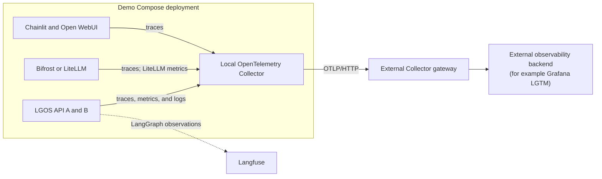

# Demo OpenTelemetry Overlay

The optional `demo/docker/compose/otel.yml` overlay instruments the demo
deployment. It does not add telemetry behavior to the
`langgraph-openai-serve` package.

The demo applications send standard OTLP signals to one local OpenTelemetry
Collector. That Collector filters, enriches, batches, and forwards them to the
gateway selected by the deployment. The remote gateway and observability
backend are intentionally not bundled.

## Signal Path



The local Collector handles standard OTLP signals. Langfuse remains a separate
native export path from the API processes.

## Run The Overlay

Copy `demo/.env.example` to `demo/.env`, then configure the required values:

```dotenv
OTEL_COLLECTOR_GATEWAY_ENDPOINT=https://otel-gateway.example.com
OTEL_HOST_NAME=demo-host-1
```

`OTEL_COLLECTOR_GATEWAY_ENDPOINT` is an OTLP/HTTP base URL, not an observability
UI URL. The Collector appends `/v1/traces`, `/v1/metrics`, and `/v1/logs`.
Use `https://` unless the gateway deliberately accepts cleartext traffic.

=== "Published images"

    ```bash
    just demo/compose --otel
    ```

=== "Current checkout"

    ```bash
    just demo/compose --dev --otel
    ```

Generate a provider-free request after the stack becomes healthy:

```bash
curl -i http://localhost:3004/v1/models \
  -H 'X-Request-ID: lgos-otel-e2e'
```

Exact environment settings are listed in
[Demo Settings And Commands](reference.md#opentelemetry-settings).

## Signal Ownership

| Producer | Exported signals | Demo integration |
| --- | --- | --- |
| LGOS API processes | Traces, metrics, and logs | Python auto-instrumentation plus explicit instrumentation of the mounted `/v1` app |
| Chainlit | Traces | Python auto-instrumentation; long-lived Socket.IO traffic and prompt-recording OpenAI instrumentors are excluded |
| Open WebUI | Traces | Open WebUI's native OpenTelemetry settings |
| Bifrost | Traces | Bifrost's OpenTelemetry plugin with content logging disabled |
| LiteLLM | Traces and GenAI metrics | LiteLLM's native OpenTelemetry v2 integration with message-content capture disabled |
| Local Collector | Its own metrics | Direct OTLP/HTTP export to the configured gateway |

The package itself remains instrumentation-neutral. The demo API instruments
the mounted FastAPI application so spans retain LGOS route templates without
duplicate host-application spans. W3C trace context connects requests across
the UI, proxy, gateway, and API when every hop preserves `traceparent`.

Bifrost's managed Responses route forwards `Idempotency-Key`, `traceparent`,
`tracestate`, and `user-agent` through the explicit client header allowlist in
`demo/docker/configs/bifrost/config.json`. The API receives `lgos-chainlit` or
`lgos-openwebui` as the user agent, which allows dashboards to distinguish the
originating UI. The Collector removes Bifrost's high-cardinality idempotency
header attribute before export; the header does not replace or alter W3C trace
context.

LiteLLM continues an incoming W3C `traceparent` and forwards it to its bundled
LGOS model targets, so its HTTP, authentication, database, and model-call spans
stay in the same UI-to-LGOS trace. Do not copy that forwarding setting to a
deployment whose models target third-party APIs without confirming they accept
the header. LiteLLM's native GenAI histograms cover operation duration, token
usage, cost, time to first token, time per output token, and provider response
duration. The bundled configuration limits metric labels to operation and
provider; requested model remains on model-call spans. LiteLLM adds token type
and error type where applicable. This keeps the Prometheus series bounded while
retaining the dimensions used by gateway dashboards.

Prompt and response bodies remain excluded from spans through
`OTEL_INSTRUMENTATION_GENAI_CAPTURE_MESSAGE_CONTENT=no_content`. LiteLLM's
database spend-log setting is independent of this OTLP policy.

!!! note "LiteLLM exception events remain disabled"

    The bundled image can create correlated OpenTelemetry log events for failed
    model operations, but its pinned OTLP encoder drops the current body-less
    events. The overlay therefore leaves event export disabled while the
    upstream [bug](https://github.com/BerriAI/litellm/issues/36863) remains.
    Operational LiteLLM logs remain available on stdout.

Use these values when querying Responses telemetry for `lgos-demo-api`:

| Signal | Attribute or span name |
| --- | --- |
| HTTP request metrics | `http.route=/responses` (`http_route` in Prometheus) |
| API request span | `POST /responses` |
| Graph execution span | `lgos.graph_run` |
| UI identity on the API span | `user_agent.original` |
| Conversation correlation | `gen_ai.conversation.id`, supplied through `metadata.conversation_id` |

Graph spans and Langfuse's `session.id` come from the optional Langfuse callback;
HTTP spans and metrics come from FastAPI instrumentation. For `lgos-demo-api`,
the Collector copies `session.id` to `gen_ai.conversation.id` when the latter is
absent. Here the value identifies a UI conversation, not a browser session.
Langfuse's original attribute is preserved, and no fallback ID is generated.

The mounted API's route template omits `/v1`; the actual request URL remains
`/v1/responses`. The `/v1/models` diagnostic above verifies export, but does not
populate Responses request panels. Send a message from either UI to verify
those panels and conversation links.

The API also keeps structured JSON logs on stdout. Enabling OTLP logs adds a
second delivery path for those standard-library records; it does not remove
container diagnostics. `X-Request-ID`, background `Idempotency-Key`, the LGOS
interrupt operation ID, and the OpenTelemetry trace ID remain separate
correlation values. See
[Production Logging](../how-to-guides/production-logging.md) for their ownership.

## Collector Behavior

The local Collector:

- accepts OTLP/gRPC and OTLP/HTTP only on its internal ingest network;
- removes streamed ASGI transport spans and known prompt/response payload
  attributes before data reaches its persistent queue;
- adds the configured service namespace, environment, and host identity;
- retries and batches export through a file-backed queue capped at 256 MiB;
  and
- forwards traces, metrics, and logs over OTLP/HTTP.

These filters reduce accidental payload export but are not a complete
redaction boundary. Exceptions, tracebacks, and caller-controlled values can
still contain sensitive data.

To verify the pipeline, locate service `lgos-demo-api` in the configured
backend and correlate the request with `lgos-otel-e2e`. The two API replicas
share `service.name` and have different SDK-generated `service.instance.id`
values. Monitor the Collector's exporter queue, capacity, send-failure, and
rejected-data metrics in that backend.

## Langfuse Remains Separate

When `LGOS_ENABLE_LANGFUSE=True`, LGOS adds the Langfuse callback to graph runs.
Langfuse exports its observations through its native integration; the local
Collector is not a Langfuse proxy. Do not add a second Langfuse exporter unless
the deployment intentionally owns and tests that additional path.

The Collector removes known Langfuse and GenAI payload attributes only from the
general OTLP pipeline. Configure Langfuse's own masking and retention policy
before enabling it for sensitive workloads.

## Deployment Responsibilities

The overlay does not choose the remote backend or its authentication,
retention, sampling, access-control, and capacity policies. It also does not
replace ingress access logs or add manual spans to LGOS. Before production use,
the deployment must:

- secure the OTLP gateway and validate TLS and authentication;
- measure representative trace volume and size backend retention accordingly;
- define payload minimization and redaction rules; and
- monitor the Collector queue and remote-export failures.

The OpenTelemetry [Collector](https://opentelemetry.io/docs/collector/) and
[sensitive-data](https://opentelemetry.io/docs/security/handling-sensitive-data/)
guides define the upstream operational boundaries.
