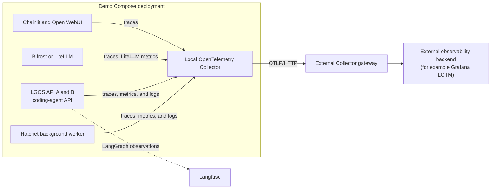

# Demo OpenTelemetry Overlay

The optional `demo/docker/compose/otel.yml` overlay instruments the demo
deployment. It does not add telemetry behavior to the
`langgraph-openai-serve` package.

The demo applications send standard OTLP signals to one local OpenTelemetry
Collector. That Collector filters, enriches, batches, and forwards them to the
gateway selected by the deployment. The remote gateway and observability
backend are intentionally not bundled.

## Signal Path


```mermaid
flowchart LR
  subgraph demo["Demo Compose deployment"]
    direction TB
    clients["Chainlit and Open WebUI"]
    gateways["Bifrost or LiteLLM"]
    apis["LGOS API A and B<br/>coding-agent API"]
    worker["Hatchet background worker"]
    collector["Local OpenTelemetry Collector"]

    clients -->|"traces"| collector
    gateways -->|"traces; LiteLLM metrics"| collector
    apis -->|"traces, metrics, and logs"| collector
    worker -->|"traces, metrics, and logs"| collector
  end

  collector -->|"OTLP/HTTP"| gateway["External Collector gateway"]
  gateway --> backend["External observability backend<br/>(for example Grafana LGTM)"]
  apis -.->|"LangGraph observations"| langfuse["Langfuse"]
```

The local Collector handles standard OTLP signals. Langfuse remains a separate
native export path from the API and worker processes.

## Run The Overlay

Copy `demo/.env.example` to `demo/.env`, then configure the required values:

```dotenv
OTEL_COLLECTOR_GATEWAY_ENDPOINT=https://otel-gateway.example.com
OTEL_HOST_NAME=demo-host-1
```

`OTEL_COLLECTOR_GATEWAY_ENDPOINT` is an OTLP/HTTP base URL, not an observability
UI URL. The Collector appends `/v1/traces`, `/v1/metrics`, and `/v1/logs`.
Use `https://` unless the gateway deliberately accepts cleartext traffic.

=== "Published images"

    ```bash
    just demo/compose --otel
    ```

=== "Current checkout"

    ```bash
    just demo/compose --dev --otel
    ```

Generate a provider-free request after the stack becomes healthy:

```bash
curl -i http://localhost:3004/v1/models \
  -H 'X-Request-ID: lgos-otel-e2e'
```

Exact environment settings are listed in
[Demo Settings And Commands](reference.md#opentelemetry-settings).

## Signal Ownership

| Producer | Exported signals | Demo integration |
| --- | --- | --- |
| LGOS API processes | Traces, metrics, and logs | Python auto-instrumentation, FastAPI's native request telemetry, LGOS workflow telemetry, and Hatchet's native producer spans |
| Coding-agent API | Traces, metrics, and logs | Python auto-instrumentation, FastAPI's native request telemetry, and LGOS workflow telemetry |
| Files API | Traces, metrics, and logs | Python auto-instrumentation and FastAPI's native request telemetry |
| Hatchet background worker | Traces, metrics, and logs | Python auto-instrumentation, LGOS workflow telemetry, and Hatchet's native task spans |
| Chainlit | Traces | Python auto-instrumentation and FastAPI's native request telemetry; the long-lived Socket.IO connection and prompt-recording OpenAI instrumentors are excluded |
| Open WebUI | Traces | Open WebUI's native OpenTelemetry settings |
| Bifrost | Traces | Bifrost's OpenTelemetry plugin with content logging disabled |
| LiteLLM | Traces and GenAI metrics | LiteLLM's native OpenTelemetry v2 integration with message-content capture disabled |
| Local Collector | Its own metrics | Direct OTLP/HTTP export to the configured gateway |

LGOS reports each graph run as a GenAI workflow span and duration metric; see
the package [OpenTelemetry reference](../reference.md#opentelemetry).
`opentelemetry-instrument` configures each demo process's providers, OTLP
export, logging, and client instrumentation. Each demo FastAPI application
records its own requests with [FastAPI's native
OpenTelemetry](https://fastapi.tiangolo.com/advanced/opentelemetry/) through
those providers and sets `auto_configure` to `False`, so FastAPI adds no second
export. Health checks and Chainlit's Socket.IO connection are not traced. Routes
include the mount, for example `http.route=/v1/responses`. Commands that Codex
runs inside its own process are progress statuses, not spans. W3C trace context
connects requests across the UI, proxy, gateway, and API when every hop
preserves `traceparent`.

Bifrost's managed Responses route forwards `Idempotency-Key`, `traceparent`,
and `tracestate` through the explicit client header allowlist in
`demo/docker/configs/bifrost/config.json`. The trace's root service,
`lgos-chainlit` or `lgos-openwebui`, identifies the originating UI. Each UI also
sends its name as `User-Agent`, which the gateway's request span records. The
Collector removes Bifrost's high-cardinality idempotency header attribute before
export; the header does not replace or alter W3C trace context.

LiteLLM continues an incoming W3C `traceparent` and forwards it to its bundled
LGOS model targets, so its HTTP, authentication, database, and model-call spans
stay in the same UI-to-LGOS trace. Do not copy that forwarding setting to a
deployment whose models target third-party APIs without confirming they accept
the header. LiteLLM's native GenAI histograms cover operation duration, token
usage, cost, time to first token, time per output token, and provider response
duration. The bundled configuration limits metric labels to operation and
provider; requested model remains on model-call spans. LiteLLM adds token type
and error type where applicable. This keeps the Prometheus series bounded while
retaining the dimensions used by gateway dashboards.

Prompt and response bodies remain excluded from spans through
`OTEL_INSTRUMENTATION_GENAI_CAPTURE_MESSAGE_CONTENT=no_content`. LiteLLM's
database spend-log setting is independent of this OTLP policy.

!!! note "LiteLLM exception events remain disabled"

    The bundled image can create correlated OpenTelemetry log events for failed
    model operations, but its pinned OTLP encoder drops the current body-less
    events. The overlay therefore leaves event export disabled while the
    upstream [bug](https://github.com/BerriAI/litellm/issues/36863) remains.
    Operational LiteLLM logs remain available on stdout.

Use these values when querying LGOS Responses telemetry:

| Signal | Attribute or span name |
| --- | --- |
| HTTP request metrics | `http.route=/v1/responses` (`http_route` in Prometheus) |
| API request span | `POST /v1/responses` |
| Graph execution span | `invoke_workflow {model}`, with `gen_ai.operation.name=invoke_workflow` |
| Graph run metric | `gen_ai.invoke_workflow.duration` (`gen_ai_invoke_workflow_duration_seconds` in Prometheus) |
| Failed graph run | `error.type` on the workflow span and metric |
| Originating UI | The trace's root service: `lgos-chainlit` or `lgos-openwebui` |
| Conversation correlation | `gen_ai.conversation.id`, supplied through `metadata.conversation_id` |

LGOS records the workflow span and metric; HTTP spans and metrics come from
FastAPI. A run that raised an exception or stopped before its output, through a
Stop click, a closed stream, or a cancelled background Response, carries
`error.type`, so failure panels include cancellations. Its value, such as
`asyncio.exceptions.CancelledError` or `GeneratorExit`, tells them apart.

The `/v1/models` diagnostic above verifies export, but does not populate
Responses request panels. Send a message from either UI to verify
those panels and conversation links.

The API also keeps structured JSON logs on stdout. Enabling OTLP logs adds a
second delivery path for those standard-library records; it does not remove
container diagnostics. `X-Request-ID`, background `Idempotency-Key`, the LGOS
interrupt operation ID, and the OpenTelemetry trace ID remain separate
correlation values. See
[Production Logging](../how-to-guides/production-logging.md) for their ownership.

## Hatchet Background Runs

Enable the [background worker](docker.md) and run the same
`just demo/compose --dev --otel` command. The worker uses service name
`lgos-background-worker` and sends telemetry to the local Collector alongside
the API replicas.

Both processes use the SDK's
[`HatchetInstrumentor`](https://docs.hatchet.run/v1/opentelemetry). The API's
`hatchet.run_workflow` span continues the HTTP request trace. Hatchet carries
its W3C `traceparent` through native task metadata, so the worker's
`hatchet.start_step_run` span continues that trace after the request finishes.
The worker span includes `hatchet.workflow_run_id` for correlation with Hatchet.

`opentelemetry-instrument` configures the shared provider, exporters, and exit
flush in each process. The demo passes `enable_hatchet_otel_collector=False`
to the Hatchet instrumentor so all spans follow the existing Collector path.
Instrumentation is enabled when `OTEL_TRACES_EXPORTER` selects an exporter.
Hatchet's native `otel` extra supplies its instrumentation dependencies.

The API and worker route Hatchet SDK logs through the shared JSON and OTel root
handlers. The worker also sets the root level to `INFO`, which Hatchet uses as
the threshold for forwarding task logs to its own log viewer.

Keep this setting from `demo/.env.example` in `demo/.env`:

```dotenv
HATCHET_CLIENT_OPENTELEMETRY_EXCLUDED_ATTRIBUTES='["payload","additional_metadata"]'
```

The SDK excludes task inputs and caller metadata from span attributes while
preserving trace propagation. Hatchet still stores task inputs and results as
part of normal execution. To verify tracing without an LLM provider, submit a
background Response to `background-mock` and find its producer and
worker spans under the same trace ID.

### Query Foreground And Background Runs

In background mode, the API span ends after submission; the worker's workflow
span and measurement carry the execution duration and `gen_ai.conversation.id`.
Requiring a conversation ID on `POST /v1/responses` omits these runs. Only graph
services emit the workflow metric, so graph run, failure, and duration panels
need no service filter:

```promql
sum(increase(gen_ai_invoke_workflow_duration_seconds_count{service_namespace="lgos", error_type!=""}[$__range]))
```

For a Chainlit conversation table, query the workflow span in both execution
modes:

```traceql
{ resource.service.namespace = "lgos" && resource.deployment.environment.name = "$environment" && resource.service.name = "lgos-chainlit" }
>> { resource.service.namespace = "lgos" && resource.deployment.environment.name = "$environment" && span.gen_ai.operation.name = "invoke_workflow" && span.gen_ai.conversation.id != nil }
| select(span.gen_ai.conversation.id)
```

Use `lgos-openwebui` for the other client. The descendant operator preserves
client attribution through the gateway and Hatchet. Durations exclude Hatchet
queue time, and graph rows appear after the span finishes.

HTTP request metrics need a service filter because LiteLLM also reports
`http.route=/v1/responses`. Fill it from the services that emit the workflow
metric rather than a fixed list, for example with a Grafana variable:

```promql
label_values(gen_ai_invoke_workflow_duration_seconds_count{service_namespace="lgos"}, service_name)
```

Adding a graph service then needs no dashboard change.

Graph-run counters start when a process records its first run. Prometheus 3.7
and later counts that first value in `increase()` and `rate()` only with
`--enable-feature=created-timestamp-zero-ingestion`, which writes each OTLP
series' start time as a zero sample. Without it, low-traffic panels undercount.

## Collector Behavior

The local Collector:

- accepts OTLP/gRPC and OTLP/HTTP only on its internal ingest network;
- removes Open WebUI's streamed ASGI transport spans and known prompt/response
  payload attributes before data reaches its persistent queue;
- adds the configured service namespace, environment, and host identity;
- retries and batches export through a file-backed queue capped at 256 MiB;
  and
- forwards traces, metrics, and logs over OTLP/HTTP.

These filters reduce accidental payload export but are not a complete
redaction boundary. Exceptions, tracebacks, and caller-controlled values can
still contain sensitive data.

To verify the pipeline, locate service `lgos-demo-api` in the configured
backend and correlate the request with `lgos-otel-e2e`. The two API replicas
share `service.name` and have different SDK-generated `service.instance.id`
values. Monitor the Collector's exporter queue, capacity, send-failure, and
rejected-data metrics in that backend.

## Langfuse Remains Separate

When `LGOS_ENABLE_LANGFUSE=True`, LGOS adds the Langfuse callback to graph runs.
Langfuse exports its observations through its native integration; the local
Collector is not a Langfuse proxy. LGOS keeps its workflow span out of Langfuse,
so each Langfuse trace starts at the callback's `lgos.graph_run` observation. Do
not add a second Langfuse exporter unless the deployment intentionally owns and
tests that additional path.

The Collector removes known Langfuse and GenAI payload attributes only from the
general OTLP pipeline. Configure Langfuse's own masking and retention policy
before enabling it for sensitive workloads.

## Deployment Responsibilities

The overlay does not choose the remote backend or its authentication,
retention, sampling, access-control, and capacity policies. It also does not
replace ingress access logs. Before production use,
the deployment must:

- secure the OTLP gateway and validate TLS and authentication;
- measure representative trace volume and size backend retention accordingly;
- define payload minimization and redaction rules; and
- monitor the Collector queue and remote-export failures.

The OpenTelemetry [Collector](https://opentelemetry.io/docs/collector/) and
[sensitive-data](https://opentelemetry.io/docs/security/handling-sensitive-data/)
guides define the upstream operational boundaries.
