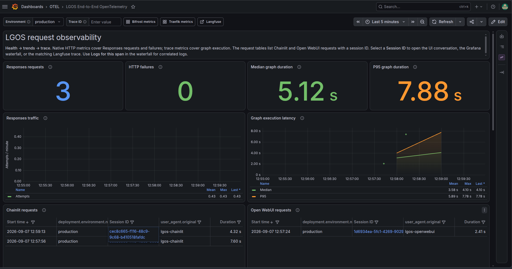

# Self-hosted Service References

The demo application stack is intentionally kept small. It speaks standard
OpenAI and OTLP contracts, so deployment-specific infrastructure can live in a
separate Docker Compose/IaC repository.

For the surrounding self-hosted infrastructure, use
[ilkersigirci/homeserver-docker](https://github.com/ilkersigirci/homeserver-docker).
That repository contains the service manifests, host-level Compose entrypoints,
runtime configuration, and persistence layout for the surrounding services.

## Service Map

| Infrastructure role | Service manifest | Supporting configuration | Host entrypoint and profile |
| --- | --- | --- | --- |
| HTTP edge and native OTLP export | [`apps/traefik.yml`](https://github.com/ilkersigirci/homeserver-docker/blob/main/apps/traefik.yml) | [`configs/traefik3/`](https://github.com/ilkersigirci/homeserver-docker/tree/main/configs/traefik3) | [`compose/gpu_coding.yml`](https://github.com/ilkersigirci/homeserver-docker/blob/main/compose/gpu_coding.yml) (`core`) |
| S3-compatible object storage | [`apps/versitygw.yml`](https://github.com/ilkersigirci/homeserver-docker/blob/main/apps/versitygw.yml) | POSIX and versioning paths, root-credential variables, and gateway settings are declared by the manifest | [`compose/nas.yml`](https://github.com/ilkersigirci/homeserver-docker/blob/main/compose/nas.yml) (`media`) |
| Traces, metrics, logs, and Grafana dashboards | [`apps/grafana-lgtm.yml`](https://github.com/ilkersigirci/homeserver-docker/blob/main/apps/grafana-lgtm.yml) | [`configs/grafana-lgtm/`](https://github.com/ilkersigirci/homeserver-docker/tree/main/configs/grafana-lgtm) | [`compose/gpu.yml`](https://github.com/ilkersigirci/homeserver-docker/blob/main/compose/gpu.yml) (`monitoring`) |
| Langfuse web/worker and dependencies | [`apps/langfuse.yml`](https://github.com/ilkersigirci/homeserver-docker/blob/main/apps/langfuse.yml) | [`configs/clickhouse-optimized/`](https://github.com/ilkersigirci/homeserver-docker/tree/main/configs/clickhouse-optimized) | [`compose/gpu_coding.yml`](https://github.com/ilkersigirci/homeserver-docker/blob/main/compose/gpu_coding.yml) (`programming` or `langfuse`) |
| Per-host OTLP relay used by Traefik and other host services | [`apps/otel-collector-agent.yml`](https://github.com/ilkersigirci/homeserver-docker/blob/main/apps/otel-collector-agent.yml) | [`configs/otel-collector/`](https://github.com/ilkersigirci/homeserver-docker/tree/main/configs/otel-collector) | [`compose/gpu_coding.yml`](https://github.com/ilkersigirci/homeserver-docker/blob/main/compose/gpu_coding.yml) (`core`) |

The Grafana configuration includes the [LGOS end-to-end dashboard](https://github.com/ilkersigirci/homeserver-docker/blob/main/configs/grafana-lgtm/grafana/provisioning/dashboards/OTEL/LGOS-End-to-End-Tracing.json)
and the [Traefik OpenTelemetry dashboard](https://github.com/ilkersigirci/homeserver-docker/blob/main/configs/grafana-lgtm/grafana/provisioning/dashboards/OTEL/Traefik-Opentelemetry.json).

The LGOS dashboard contains deployment-specific Chainlit, Open WebUI, and
Langfuse URLs, so update those links and the Langfuse project path before using
it on another domain. Its queries also assume the demo's `lgos` service
namespace and service names; keep the OTEL resource attributes aligned or edit
the dashboard queries.

!!! warning "The upstream stack is split across hosts"

    This is an implementation reference, not a portable installer. The host
    Compose files include unrelated homelab services and depend on an
    operator-owned `.env`, networks, directories, DNS, and authentication.
    Extract the linked service manifests and configuration into infrastructure
    that matches your environment. The upstream [Running The Stack guide](https://github.com/ilkersigirci/homeserver-docker/blob/main/docs/RUNNING.md)
    applies when operating that repository directly; its [observability guide](https://github.com/ilkersigirci/homeserver-docker/blob/main/docs/OBSERVABILITY.md)
    explains the cross-host LGTM and Collector topology.

The service manifests above are the source of truth; this repository does not
duplicate them or their credentials.

## Connect This Demo

After the infrastructure is running, copy `demo/.env.example` to `demo/.env`
and connect these three integration paths.

=== "Object storage"

    Point the [Files API settings](reference.md#files-api-settings) and
    [Chainlit element-storage settings](chainlit.md#settings-reference) at
    VersityGW. Provision their buckets and least-privilege identities
    separately; the reference manifest expects root credentials but does not
    create application IAM identities or credentials.

    The reference VersityGW API route is protected by the upstream Traefik
    configuration. A browser-facing hostname is not automatically a suitable
    server-to-server SDK endpoint: use a shared internal network or a
    dedicated route that permits the demo's S3 requests, and configure CORS
    for the browser origins that receive signed URLs.

=== "Langfuse"

    Enable the native callback with the package's
    [Langfuse settings](../reference.md#langfuse-tracing), setting
    `LANGFUSE_BASE_URL` to an ingestion endpoint reachable by the API
    containers. The reference browser route uses interactive authentication,
    so SDK requests may need an internal or dedicated machine-to-machine route.
    This direct integration does not replace the standard OTLP pipeline.

=== "OpenTelemetry"

    Follow the [OpenTelemetry overlay guide](opentelemetry.md#run-the-overlay),
    using `https://grafana-rpc.$DOMAINNAME` as the OTLP/HTTP gateway when the
    demo can reach it and its allowlist permits the demo host. The demo overlay
    runs its own local Collector. The reference `otel-collector-agent` serves
    the infrastructure host and is reachable on port `4318` only through its
    Compose networks unless that port is published.

Start the demo itself from `demo/` with `make compose` or
`make compose-otel`, depending on whether the OTEL overlay is enabled. The
application services remain owned by this repository; the referenced project
owns the edge, storage, Langfuse, and observability services.

## Deployment Boundary

The homeserver repository is a homelab reference and may include host-specific
networks, DNS, TLS, authentication, profiles, and storage paths. Review those
assumptions before adapting it to a new machine. In particular:

- replace example credentials and provider keys;
- create the `langfuse`, Files API, and Chainlit buckets and least-privilege
  identities before starting their clients;
- ensure the public S3 URL can be reached by browsers when clients return
  signed URLs;
- expose OTLP only through the intended internal or authenticated route; and
- define backup, upgrade, and retention policies from each service's
  documentation.

This page is a navigation and integration contract, not a second deployment
implementation.
