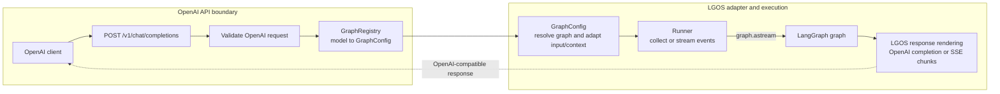

# Architecture

LangGraph OpenAI Serve mounts an OpenAI-compatible FastAPI sub-application on a
host FastAPI app and routes OpenAI chat requests to registered LangGraph graphs.

## Components

`LanggraphOpenaiServe` is the boundary between your FastAPI app and the
OpenAI-compatible sub-application. It mounts the sub-application at the
configured prefix and can add CORS middleware when requested.

The mounted OpenAI app owns the public HTTP surface: model listing, chat
completions, health checks, request validation, response schemas, and
OpenAI-shaped error handling.

`GraphRegistry` maps each OpenAI `model` value to a `GraphConfig`. `GraphConfig`
then resolves the graph, applies custom input/context/output adapters when
present, and tells the runner which optional `GraphFeature` values are enabled.

The runner is the only layer that calls LangGraph. It executes the prepared run
and returns graph output or stream events for OpenAI response rendering.

Endpoint paths and settings live in [Reference](../reference.md).

## Request Flow

1. An OpenAI-compatible client sends a chat completion request.
2. FastAPI validates the request schema.
3. The requested `model` is resolved from `GraphRegistry`.
4. OpenAI messages are converted to LangChain messages.
5. `GraphConfig` builds graph input and typed runtime context. Run preparation
   separately builds `RunnableConfig` from callbacks and an optional checkpoint
   thread ID.
6. The runner passes input, runtime context, and runnable config as separate
   LangGraph arguments.
7. The runner consumes `graph.astream` in both response modes. It either collects
   root values and custom events before returning a complete response, or passes
   message, custom, and interrupt events to the SSE response service.
8. LGOS renders the result as an OpenAI chat completion or SSE chunk sequence.

See [LangGraph Integration](langgraph-integration.md) for adapter and runner
details, [OpenAI compatibility](openai-compatibility.md#tool-calls-and-interrupts)
for the interrupt protocol, and [Docker Compose](../demo/docker.md) for the
demo's durable checkpointer setup.
