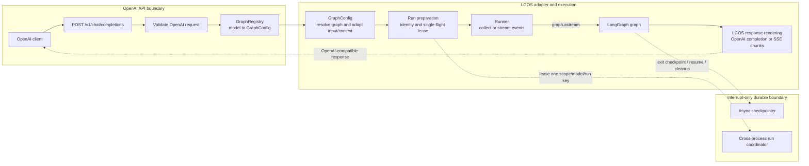

# Architecture

LangGraph OpenAI Serve mounts an OpenAI-compatible FastAPI sub-application on a
host FastAPI app and routes OpenAI chat requests to registered LangGraph graphs.

```mermaid
flowchart LR
  subgraph api["OpenAI API boundary"]
    direction TB
    A["OpenAI client"] --> B["POST /v1/chat/completions"]
    B --> C["Validate OpenAI request"]
    C --> D["GraphRegistry<br/>model to GraphConfig"]
  end

  subgraph execution["LGOS adapter and execution"]
    direction TB
    E["GraphConfig<br/>resolve graph and adapt input/context"]
    E --> F["Run preparation<br/>identity and single-flight lease"]
    F --> G["Runner<br/>collect or stream events"]
    G -->|graph.astream| H["LangGraph graph"]
    H --> I["LGOS response rendering<br/>OpenAI completion or SSE chunks"]
  end

  subgraph durable["Interrupt-only durable boundary"]
    direction TB
    J["Async checkpointer"]
    K["Cross-process run coordinator"]
  end

  D --> E
  F -.->|lease one scope/model/run key| K
  H -.->|exit checkpoint / resume / cleanup| J
  I -.->|OpenAI-compatible response| A
```

## Components

`LanggraphOpenaiServe` is the boundary between your FastAPI app and the
OpenAI-compatible sub-application. It mounts the sub-application at the
configured prefix and can add CORS middleware when requested.

The mounted OpenAI app owns the public HTTP surface: model listing, chat
completions, health checks, request validation, response schemas, and
OpenAI-shaped error handling.

`GraphRegistry` maps each OpenAI `model` value to a `GraphConfig`. `GraphConfig`
then resolves the graph, applies custom input/context/output adapters when
present, and tells the runner which optional `GraphFeature` values are enabled.

The runner is the only layer that calls LangGraph. It executes the prepared run
and returns graph output or stream events for OpenAI response rendering.

Ordinary chats remain request-scoped and rely on the UI's message history.
Interrupt-enabled graphs add a narrow durable boundary: an asynchronous
checkpointer stores paused workflow state, while a run coordinator serializes
inspection and execution for the same scope/model/run key across replicas. PostgreSQL
can provide both roles; Redis is not required by this design. The demo uses a
PostgreSQL checkpointer and session advisory locks through one shared pool per
API process.

Endpoint paths and settings live in [Reference](../reference.md).

## Request Flow

1. FastAPI validates the chat request and resolves its `model` through
   `GraphRegistry`.
2. `GraphConfig` converts messages and builds graph input, runtime context, and
   runnable configuration.
3. Interrupt preparation derives the scoped operation key, acquires its
   coordinator lease, and validates any resume against durable state.
4. The runner consumes `graph.astream`, collecting a complete response or
   forwarding eligible message and custom events to the SSE service.
5. After execution quiesces, pending interrupts become one durable OpenAI
   tool-call batch; terminal or unsurfaced failed runs delete their checkpoint.
6. LGOS releases the lease and renders an OpenAI completion or SSE sequence.

The tool-call assistant message is part of the client-owned chat ledger. A UI
that supports reconnectable approvals persists that exact message and the
matching tool results; the backend does not become a general chat-history
database.

See [LangGraph Integration](langgraph-integration.md) for adapter and runner
details, [OpenAI compatibility](openai-compatibility.md#tool-calls-and-interrupts)
for the interrupt protocol, and [Docker Compose](../demo/docker.md) for the
demo's durable checkpointer setup.
