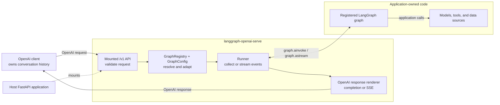
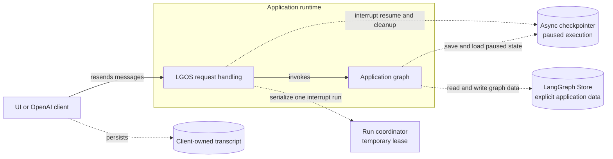

# Architecture

LangGraph OpenAI Serve mounts an OpenAI-compatible FastAPI sub-application on a
host FastAPI app. It adapts OpenAI requests to application-owned LangGraph
graphs and adapts their output back to OpenAI responses.

## Request Path

```mermaid
flowchart LR
  client["OpenAI client<br/>owns conversation history"]
  host["Host FastAPI application"]

  subgraph lgos["langgraph-openai-serve"]
    direction TB
    api["Mounted /v1 API<br/>validate request"]
    config["GraphRegistry + GraphConfig<br/>resolve and adapt"]
    runner["Runner<br/>collect or stream events"]
    render["OpenAI response renderer<br/>completion or SSE"]

    api --> config --> runner --> render
  end

  subgraph application["Application-owned code"]
    direction TB
    app_graph["Registered LangGraph graph"]
    dependencies["Models, tools, and data sources"]
    app_graph -->|"application calls"| dependencies
  end

  client -->|"OpenAI request"| api
  host -.->|"mounts"| api
  runner <-->|"graph.ainvoke / graph.astream"| app_graph
  render -->|"OpenAI response"| client
```

The package owns the `/v1` transport and adaptation boundary. The host
application owns graph behavior and every model, tool, store, or data source
used by that graph.

## State Ownership

Ordinary conversations are stateless from LGOS's perspective: the client owns
the transcript and sends the messages needed by each request. Optional graph
features add narrowly scoped state without turning LGOS into a chat database.

```mermaid
flowchart LR
  client["UI or OpenAI client"]
  transcript[("Client-owned transcript")]

  subgraph runtime["Application runtime"]
    lgos["LGOS request handling"]
    app_graph["Application graph"]
  end

  checkpointer[("Async checkpointer<br/>paused execution")]
  coordinator["Run coordinator<br/>temporary lease"]
  store[("LangGraph Store<br/>explicit application data")]

  client -->|"resends messages"| lgos
  client -.->|"persists"| transcript
  lgos -->|"invokes"| app_graph
  lgos -.->|"interrupt resume and cleanup"| checkpointer
  lgos -.->|"serialize one interrupt run"| coordinator
  app_graph -.->|"save and load paused state"| checkpointer
  app_graph -.->|"read and write graph data"| store
```

## Components

`LanggraphOpenaiServe` is the boundary between your FastAPI app and the
OpenAI-compatible sub-application. It mounts the sub-application at the
configured prefix. The host application owns middleware such as CORS,
authentication, and telemetry.

The mounted OpenAI app owns the public HTTP surface: model listing, chat
completions, health checks, request validation, response schemas, and
OpenAI-shaped error handling.

`GraphRegistry` maps each OpenAI `model` value to a `GraphConfig`. `GraphConfig`
then resolves the graph, applies custom input/context/output adapters when
present, and tells the runner which optional `GraphFeature` values are enabled.

The runner is the only layer that calls LangGraph. It executes the prepared run
and returns graph output or stream events for OpenAI response rendering.

Interrupt-enabled graphs add a narrow durable boundary: an asynchronous
checkpointer stores paused workflow state. A run coordinator serializes one
interrupt run across replicas. Application graphs may independently use a
LangGraph Store for explicit data.
PostgreSQL can provide all three roles; Redis is not required by this design.
The demo shares one PostgreSQL pool per API process among them.

Endpoint paths and settings live in [Reference](../reference.md).

## Request Flow

1. FastAPI validates the chat request and resolves its `model` through
   `GraphRegistry`.
2. `GraphConfig` converts messages and builds graph input, runtime context, and
   runnable configuration.
3. For an interrupt graph, preparation derives the scoped operation key,
   acquires its coordinator lease, and validates any resume against durable
   state.
4. The runner calls `graph.ainvoke` for a complete response or consumes
   `graph.astream` to forward eligible message and custom events to the SSE
   service.
5. After execution quiesces, pending interrupts become one durable OpenAI
   tool-call batch; terminal or unsurfaced failed runs delete their checkpoint.
6. LGOS releases any interrupt lease and renders an OpenAI completion or SSE
   sequence.

The tool-call assistant message is part of the client-owned chat ledger. A UI
that supports reconnectable approvals persists that exact message and the
matching tool results; the backend does not become a general chat-history
database.

See [LangGraph Integration](langgraph-integration.md) for adapter and runner
details, [OpenAI compatibility](openai-compatibility.md#tool-calls-and-interrupts)
for the interrupt protocol, and [Demo Architecture](../demo/architecture.md)
for the complete example deployment.
