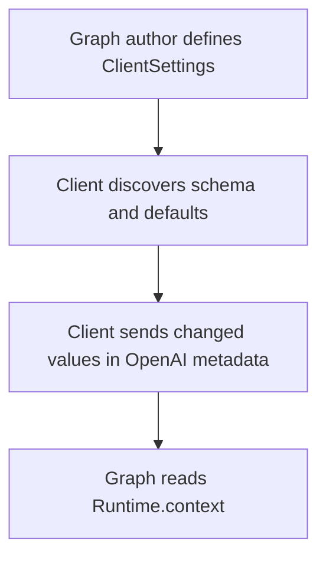

# Configure LangGraph Runtime Settings

Runtime settings let an OpenAI client choose a small, safe part of a graph's
behavior for one request.



## Graph Setup

Define the public options with `ClientSettings`. When those settings are the
complete runtime context, use the same type as the graph's context schema.
Register the type as `client_settings`:

```python
from typing import Literal

from langgraph.graph import MessagesState, StateGraph
from langgraph.runtime import Runtime

from langgraph_openai_serve import ClientSettings, GraphConfig


class ChatSettings(ClientSettings):
    use_history: bool = False
    audience: Literal["general", "beginner", "expert"] = "general"


async def answer(state: MessagesState, runtime: Runtime[ChatSettings]):
    settings = runtime.context
    # Use settings.use_history and settings.audience in the node.
    return {}


builder = StateGraph(MessagesState, context_schema=ChatSettings)
builder.add_node("answer", answer)
builder.set_entry_point("answer")
builder.set_finish_point("answer")

graph_config = GraphConfig(
    graph=builder.compile(),
    client_settings=ChatSettings,
)
```

Every public field needs a default. `client_settings` is an explicit allowlist;
LGOS never exposes the graph's complete context schema automatically.

## Client Discovery

`GET /v1/models/{model}` includes
`langgraph_openai_serve.client_settings` when the graph has public settings. It
contains:

- `json_schema` for field names, types, choices, and UI labels.
- `defaults` used when the client sends no changes.
- `schema_version` for the descriptor format.

The descriptor's `defaults` object is the authoritative validated baseline.
Pydantic-generated `default` keywords inside `json_schema` are
[annotations](https://json-schema.org/understanding-json-schema/reference/annotations)
and may show a declared value before field validators normalize it. Clients
should use `defaults`, not those annotations, when initializing values or
computing changes.

If the descriptor is missing or its version is unsupported, the client should
omit runtime settings and use server defaults.

## Client Request

Send changed values as JSON text in `metadata.langgraph_runtime_settings`:

=== "Python"

    ```python
    import json

    response = client.chat.completions.create(
        model="simple-graph",
        messages=[{"role": "user", "content": "Explain LangGraph."}],
        metadata={"langgraph_runtime_settings": json.dumps({"use_history": True})},
    )
    ```

=== "JavaScript"

    ```javascript
    const response = await openai.chat.completions.create({
      model: "simple-graph",
      messages: [{ role: "user", content: "Explain LangGraph." }],
      metadata: {
        langgraph_runtime_settings: JSON.stringify({ use_history: true }),
      },
    });
    ```

The metadata value is a string containing a JSON object, not a nested metadata
object. It is limited to 512 characters, so send only values that differ from
the discovered defaults.

## Request Behavior

For every request, LGOS:

1. Starts with the registered defaults.
2. Applies the supplied top-level values as a shallow override.
3. Validates the complete settings.
4. Passes them to `Runtime.context` or to `context_factory`.

LGOS generates the advertised JSON Schema and validates the complete default
object when `GraphConfig` is registered. When settings become runtime context
directly, the resolved graph must use the settings model as `context_schema`.
Factories may return `None`; every non-null result requires a context schema.
LGOS leaves server-owned factory results intact and relies on LangGraph's native
context coercion when the graph runs.

Runtime settings are not persisted. Resend non-default values on every request
that needs them, including interrupt-resume requests. Omitting
`langgraph_runtime_settings` on a later request uses the registered defaults
again.

Keep identity, authorization, secrets, and service clients out of
`ClientSettings`. Use `context_factory(request, settings)` to combine public
settings with server-owned context; in that case, the graph's context schema
describes the combined value.

See [OpenAI clients](../tutorials/openai-clients.md#model-discovery-and-runtime-settings)
for discovery code. The included Chainlit client automates descriptor discovery,
Chat Settings, and metadata serialization; see the
[Chainlit integration](../integrations/chainlit.md#runtime-settings). The
[Open WebUI integration](../integrations/open-webui.md#runtime-settings) uses a
separate, static `UserValves` Function for the `simple-graph` demo.
