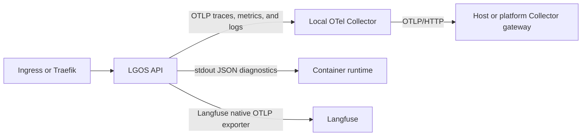

# Production OpenTelemetry

Use the optional `demo/docker/compose/otel.yml` overlay when the deployment owns
an OpenTelemetry Collector. It keeps the application integration small:



The repository does not add a backend-specific exporter to the Collector. The
Collector forwards standard OTLP signals to the gateway owned by the host
deployment over OTLP/HTTP. Langfuse's existing LangChain callback remains
responsible for Langfuse observations and uses the shared OpenTelemetry
provider when one is already configured. This preserves the trace relationship
without exporting the same Langfuse observations twice.

This follows the OpenTelemetry [Python instrumentation
model](https://opentelemetry.io/docs/languages/python/instrumentation/): the
application configures the SDK, while libraries remain instrumentation-neutral.
The [Collector documentation](https://opentelemetry.io/docs/collector/)
recommends a Collector for production batching, retries, filtering, and
network-boundary concerns. The deployment can place the gateway on the host,
per node, or in a separate platform service; a per-API sidecar is not required
for this Compose deployment.

## Run the overlay

From `demo/`, copy `.env.example` to `.env` and set
`OTEL_COLLECTOR_GATEWAY_ENDPOINT` to the OTLP/HTTP base URL of the host's
gateway. Use the Traefik OTLP router rather than the Grafana UI URL:

```dotenv
OTEL_COLLECTOR_GATEWAY_ENDPOINT=https://grafana-rpc.example.com
OTEL_COLLECTOR_GATEWAY_INSECURE=false
```

The Collector appends `/v1/traces`, `/v1/metrics`, and `/v1/logs` to this base
URL. The remote Traefik OTLP/HTTP router handles those paths. The Grafana UI
is available at `https://grafana.example.com`. Provide an authorization header
through the environment only when the gateway requires one.

Validate and start the published-image stack:

```bash
cd demo
docker compose -f docker/compose/demo.yml -f docker/compose/otel.yml config --quiet
make compose-otel
```

For a checkout-local image that includes the current API lockfile, use the
development build overlay as well:

```bash
docker compose -f docker/compose/demo.yml -f docker/compose/development.yml -f docker/compose/otel.yml up --build
```

Generate a request after the stack is healthy:

```bash
curl -i http://localhost:3004/v1/models \
  -H 'X-Request-ID: lgos-otel-e2e'
```

This exercises the FastAPI server span and request metrics without calling an
upstream model. A graph invocation can be used afterward when you also want
to inspect LangGraph and Langfuse observations.

The overlay:

- starts one `lgos-otel-collector` on the internal `lgos-network`;
- wraps both API workers with the official `opentelemetry-instrument` launcher;
- exports API traces, metrics, and standard-library logs to the local Collector
  over OTLP/gRPC;
- forwards those signals from the local Collector to the configured gateway
  over OTLP/HTTP;
- gives both replicas the same `service.name` and different
  `service.instance.id` values;
- enables parent-based trace sampling, configurable with
  `OTEL_TRACES_SAMPLE_RATE`; and
- uses a persistent Collector sending queue under
  `demo/docker/volumes/otel-collector/`.

The local Collector accepts OTLP/gRPC on `4317` and OTLP/HTTP on `4318` for
other services on the same network. It does not publish either port to the
host. If an external Traefik instance must send signals to this Collector,
attach both deployments to a deliberately shared Docker network or send
Traefik to the host's gateway instead. In the remote deployment inspected for
this guide, Traefik and the edge Collector already send directly to the local
LGTM Collector over the private `t3_proxy` network.

## Verify in Grafana

Open [Grafana](https://grafana.example.com), select **Explore**, and
choose the relevant built-in datasource:

- **Loki:** `{service_name="lgos-demo-api"}`
- **Prometheus:** `{service_name="lgos-demo-api"}`
- **Tempo:** search for service `lgos-demo-api`, or use TraceQL
  `{ resource.service.name = "lgos-demo-api" }`

The two API replicas share `service_name` and can be separated with
`service_instance_id`. The log records carry the OTel trace and span IDs, so a
request can be followed from a Traefik span to an API span and its application
log record. The HTTP request ID and LangGraph `thread_id`/`run_id` remain
application-level correlation fields; they are not replaced by OTel.


## Logs and correlation

The API keeps its structured JSON logs on stdout for container diagnostics. The
overlay also sets `OTEL_LOGS_EXPORTER=otlp` and enables the official Python
logging auto-instrumentation, so the same standard-library records are sent to
the Collector as native OpenTelemetry logs. `OTEL_PYTHON_LOG_CORRELATION=true`
adds fields such as `otelTraceID` and `otelSpanID` to the records, while the
OpenTelemetry log record context carries the trace/span relationship.

OpenTelemetry currently marks Python logs as [Development
status](https://opentelemetry.io/docs/languages/python/). This deployment opts
into that native signal deliberately; pin the instrumentation and Collector
versions and review changes when upgrading them.

The request `X-Request-ID`, LangGraph `run_id`, LangGraph `thread_id`, and
OpenTelemetry `trace_id` remain different identifiers. Use the trace context
for distributed timing, the request ID for HTTP-log lookup, and LangGraph's
thread/run identifiers for graph execution state. See [Production Logging and
Request Correlation](production-logging.md) for the ownership boundaries.

## Langfuse

When `LGOS_ENABLE_LANGFUSE=true`, the API's existing Langfuse callback creates
Langfuse observations. Langfuse documents using a [shared global provider with
its Langfuse span processor and an OTLP exporter](https://langfuse.com/faq/all/existing-otel-setup)
when an application already uses OpenTelemetry. That is the behavior provided
by this overlay: the Collector receives the standard application spans, while
the Langfuse SDK exports its Langfuse-shaped observations through its native
OTLP endpoint.

Do not add a second Collector exporter to Langfuse unless the deployment has a
specific requirement to centralize that export. If you do, remove the direct
Langfuse exporter deliberately and verify sampling and billing; forwarding both
paths creates duplicate observations. Langfuse also recommends reviewing
[sensitive-data handling](https://opentelemetry.io/docs/security/handling-sensitive-data/)
before exporting application attributes or payloads.

## What the overlay does not do

The overlay does not:

- replace the ingress proxy's access logs or latency metrics;
- remove stdout diagnostics when OTLP log export is enabled;
- add manual spans to the LGOS library;
- capture prompts, completions, credentials, or full HTTP headers; or
- turn the local Collector into a backend.

The upstream gateway is a required environment setting so the deployment must
choose its own network, TLS, authorization, retention, sampling, and backend
policy instead of silently sending telemetry to an example endpoint.
