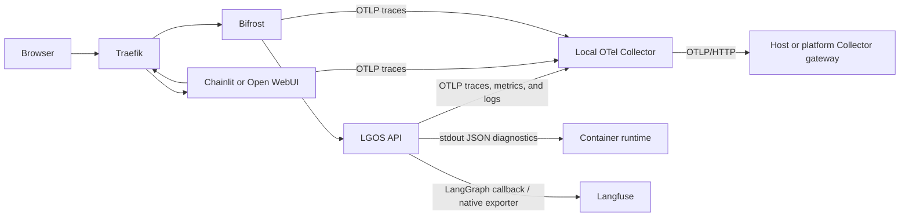

# Production OpenTelemetry

Use the optional `demo/docker/compose/otel.yml` overlay when the deployment owns
a local OpenTelemetry Collector. It keeps the application integration small:



The repository does not add a backend-specific exporter to the Collector. The
Collector forwards the application's standard OTLP signals to the gateway
owned by the host deployment over OTLP/HTTP. Langfuse remains a separate native
export path for LangGraph observations.

This follows the OpenTelemetry [Python instrumentation
model](https://opentelemetry.io/docs/languages/python/instrumentation/): the
application configures the SDK, while libraries remain instrumentation-neutral.
The [Collector documentation](https://opentelemetry.io/docs/collector/)
recommends a Collector for production batching, retries, filtering, and
network-boundary concerns. The deployment can place the gateway on the host,
per node, or in a separate platform service; a per-API sidecar is not required
for this Compose deployment.

## Run the overlay

From `demo/`, copy `.env.example` to `.env` and set
`OTEL_COLLECTOR_GATEWAY_ENDPOINT` to the OTLP/HTTP base URL of the host's
gateway. Use the Traefik OTLP router rather than the Grafana UI URL:

```dotenv
OTEL_COLLECTOR_GATEWAY_ENDPOINT=https://grafana-rpc.example.com
```

The Collector appends `/v1/traces`, `/v1/metrics`, and `/v1/logs` to this base
URL. The remote Traefik OTLP/HTTP router handles those paths. The Grafana UI
is available at `https://grafana.example.com`. This example relies on the
gateway's trusted LAN/VPN boundary and does not configure authentication
headers. If that boundary changes, add and validate matching authentication
in both the exporter and gateway as part of that deployment; an unvalidated
header does not provide security. The endpoint scheme controls TLS: use
`https://` for a TLS gateway and `http://` only for an intentionally cleartext
connection.

Validate and start the published-image stack:

```bash
cd demo
make compose-config
make compose-otel
```

For local source changes, use `make compose-otel-dev` instead.

Generate a request after the stack is healthy:

```bash
curl -i http://localhost:3004/v1/models \
  -H 'X-Request-ID: lgos-otel-e2e'
```

This exercises the FastAPI server span and request metrics without calling an
upstream model. A graph invocation can be used afterward when you also want
to inspect LangGraph and Langfuse observations.

The overlay:

- starts one `lgos-otel-collector` on separate ingest and egress networks;
- runs the published API and Chainlit applications;
- wraps both API workers and Chainlit with the official
  `opentelemetry-instrument` launcher;
- disables automatic FastAPI instrumentation for the API workers and
  instruments only the mounted OpenAI app so endpoint spans retain their route
  templates without duplicate server spans;
- excludes Chainlit's long-lived Socket.IO transport from FastAPI server spans,
  while HTTPX instrumentation traces outbound OpenAI-compatible calls;
- disables Chainlit's transitively installed OpenAI instrumentors so the UI
  does not duplicate prompt and response content in the system trace;
- enables Open WebUI's native tracing with the shared sampling, resource, HTTP
  semantic-convention, and W3C propagation settings, and connects the demo
  Bifrost [OTel plugin](https://docs.getbifrost.ai/features/observability/otel)
  to the local Collector;
- disables Bifrost prompt and response content logging;
- exports API traces, metrics, and standard-library logs to the local Collector
  over OTLP/gRPC;
- forwards those signals from the local Collector to the configured gateway
  over OTLP/HTTP;
- gives both replicas the same `service.name` and different
  SDK-generated `service.instance.id` values;
- opts into stable HTTP semantic conventions;
- aligns Go's memory limit and the Collector memory limiter with the 1 GiB
  container limit;
- enables parent-based trace sampling, configurable with
  `OTEL_TRACES_SAMPLE_RATE`;
- requires the per-machine `OTEL_HOST_NAME` value and adds it to incoming
  signals at the local Collector;
- removes FastAPI `send`/`receive` transport leaf spans before queueing; and
- removes Langfuse/GenAI payload attributes from the general Grafana trace
  pipeline while leaving Langfuse's direct exporter unchanged;
- batches at the Collector export queue and persists that queue under
  `demo/docker/volumes/otel-collector/`, with each queue database capped at
  256 MiB; and
- exports the Collector's own operational metrics directly to the gateway so
  queue pressure, rejected data, and send failures can be monitored without a
  self-referential pipeline.

The current Bifrost transport preserves an inbound W3C trace by forwarding its
original `traceparent` to LGOS. Consequently, the Bifrost request span and LGOS
server span can appear as siblings under the proxy span. They remain correlated
in one trace, but this is not a direct Bifrost-to-LGOS parent relationship. The
Bifrost OTel plugin owns this propagation; no client header allowlist is needed
for W3C trace headers.

Chainlit serves REST endpoints with FastAPI but delivers chat messages over one
mounted Socket.IO connection. Tracing that connection as a server span would
make unrelated prompts share a long-lived parent. The overlay therefore
excludes `/ws/socket.io` from FastAPI instrumentation. The OpenAI client's
auto-instrumented HTTPX request creates each prompt trace and injects the W3C
context propagated through Traefik, Bifrost, and LGOS. Browser login, page-load,
and WebSocket connection traces remain separate from prompt execution traces.
The UI's transitive OpenAI instrumentors are disabled because they capture
prompt and response bodies by default; Langfuse remains responsible for the
intentional LangGraph-level observations.

The API container health check uses `/v1/health`, and the overlay excludes that
endpoint from FastAPI instrumentation so routine probes do not dominate HTTP
traces and metrics. The Collector remains fail-open for the application: its
SDK exporters retry startup races and temporary telemetry outages.

The local Collector accepts OTLP/gRPC on `4317` and OTLP/HTTP on `4318` only on
the dedicated ingest network. The overlay attaches the API replicas; attach
other producers deliberately. It does not publish either port to the host. If
an external Traefik instance must send signals to this Collector, attach it to
the ingest network or send Traefik to the host's gateway instead.

## Verify in Grafana

Open [Grafana](https://grafana.example.com), select **Explore**, and
choose the relevant built-in datasource:

- **Loki:** `{service_name="lgos-demo-api"}`
- **Prometheus:** `{service_name="lgos-demo-api"}`
- **Tempo:** search for service `lgos-demo-api`, or use TraceQL
  `{ resource.service.name = "lgos-demo-api" }`

The two API replicas share `service_name` and can be separated with
`service_instance_id`. The log records carry the OTel trace and span IDs, so a
request can be followed from a Traefik span to an API span and its application
log record. The HTTP request ID and LGOS interrupt operation ID remain
application-level correlation fields; they are not replaced by OTel.

The overlay opts into stable HTTP semantic conventions with
`OTEL_SEMCONV_STABILITY_OPT_IN=http`. Existing dashboards that use experimental
names such as `http_server_duration_milliseconds` must migrate to the stable
HTTP metric and attribute names.

Monitor the `lgos-otel-collector` service for
`otelcol_exporter_queue_size`, `otelcol_exporter_queue_capacity`, and the
`otelcol_exporter_*_failed_*` counters. Alert before the persistent queue or
file-storage budget is exhausted.

## Logs and correlation

The API keeps its structured JSON logs on stdout for container diagnostics. The
overlay also sets `OTEL_LOGS_EXPORTER=otlp` and enables the official Python
logging auto-instrumentation, so the same standard-library records are sent to
the Collector as native OpenTelemetry logs. `OTEL_PYTHON_LOG_CORRELATION=true`
adds fields such as `otelTraceID` and `otelSpanID` to the records, while the
OpenTelemetry log record context carries the trace/span relationship.
`OTEL_PYTHON_LOG_HANDLER_LEVEL=info` keeps the OTLP handler's severity floor
aligned with the demo's stdout handler.

The Collector removes streamed ASGI transport spans and payload attributes
before the persistent queue. This keeps the Grafana trace tree useful and
prevents a temporary gateway outage from placing prompt content on local queue
storage. Langfuse's direct processor still receives its intentional observation
payloads.

OpenTelemetry currently marks Python logs as [Development
status](https://opentelemetry.io/docs/languages/python/). This deployment opts
into that native signal deliberately; pin the instrumentation and Collector
versions and review changes when upgrading them.

The request `X-Request-ID`, LGOS interrupt operation ID, and OpenTelemetry
`trace_id` remain different identifiers. The interrupt protocol exposes the
operation ID as `run_id`; logs and callback metadata call it `operation_id` to
avoid collision with LangChain execution run IDs. See [Production Logging and
Request Correlation](production-logging.md) for the ownership boundaries.

## Langfuse

When `LGOS_ENABLE_LANGFUSE=true`, the API's existing Langfuse callback creates
Langfuse observations through Langfuse's native integration. The local
Collector remains the OTLP path for Grafana telemetry; it is not configured as
a Langfuse gateway. The application can share OpenTelemetry context for
correlation, while the Langfuse processor sends its observations to Langfuse
independently. See Langfuse's
[existing OpenTelemetry setup](https://langfuse.com/faq/all/existing-otel-setup)
for the shared-versus-isolated provider behavior.

The overlay and Langfuse share the application's global tracer provider.
Consequently, `OTEL_TRACES_SAMPLE_RATE` is applied before either span processor
and also samples Langfuse observations. Use an isolated Langfuse provider only
when independent sampling is required, accepting the separate trace hierarchy
described in Langfuse's guidance.

Langfuse's LangChain callback records chain and model inputs and outputs. With a
shared application context, those observations can also carry correlation
attributes into the Grafana trace. This overlay removes the known payload
attributes before Grafana export while leaving Langfuse's native observation
payloads intact. Configure Langfuse
[masking](https://langfuse.com/docs/observability/features/masking) before
enabling it on sensitive workloads.

Do not add a Langfuse exporter to the Collector unless the deployment has a
specific requirement to centralize that export. The native callback already
owns Langfuse delivery; adding a second path can create duplicate observations
and complicate sampling and billing. Review OpenTelemetry's
[sensitive-data guidance](https://opentelemetry.io/docs/security/handling-sensitive-data/)
before exporting application attributes or payloads.

## What the overlay does not do

The overlay does not:

- replace the ingress proxy's access logs or latency metrics;
- remove stdout diagnostics when OTLP log export is enabled;
- add manual spans to the LGOS library;
- instrument application payloads by itself (optional integrations such as
  Langfuse can add them); or
- turn the local Collector into a backend.

The upstream gateway is a required environment setting so the deployment must
choose its own network, TLS, authorization, retention, sampling, and backend
policy instead of silently sending telemetry to an example endpoint.
Exception messages, tracebacks, and caller-controlled correlation values can
still contain sensitive data. Apply minimization or redaction in the
application or Collector before remote export; the example pipeline does not
claim a content-safety boundary.
